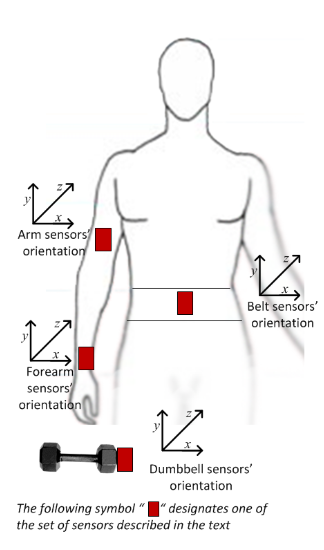

# Introduction    

Using devices such as Jawbone Up, Nike FuelBand, and Fitbit it is now possible to collect a large amount of data about personal activity relatively inexpensively. These type of devices are part of the quantified self movement – a group of enthusiasts who take measurements about themselves regularly to improve their health, to find patterns in their behavior, or because they are tech geeks. One thing that people regularly do is quantify how much of a particular activity they do, but they rarely quantify how well they do it. In this project, your goal will be to use data from accelerometers on the belt, forearm, arm, and dumbell of 6 participants. They were asked to perform barbell lifts correctly and incorrectly in 5 different ways.  
Six young health participants were asked to perform one set of 10 repetitions of the Unilateral Dumbbell Biceps Curl in five different fashions: exactly according to the specification (Class A), throwing the elbows to the front (Class B), lifting the dumbbell only halfway (Class C), lowering the dumbbell only halfway (Class D) and throwing the hips to the front (Class E).  
Class A corresponds to the specified execution of the exercise, while the other 4 classes correspond to common mistakes. Participants were supervised by an experienced weight lifter to make sure the execution complied to the manner they were supposed to simulate. The exercises were performed by six male participants aged between 20-28 years, with little weight lifting experience. It was made sure that all participants could easily simulate the mistakes in a safe and controlled manner by using a relatively light dumbbell (1.25kg).  
My goal here is to predict the *"class"* with the help of other predictors. This project is a part of Coursera Practical Machine Learning Week 4 - Peer-graded Assignment: Prediction Assignment Writeup.  

```{r,warning=FALSE,message=FALSE,include=FALSE,echo=FALSE}
# loading libraries
# if the below libraries are not installed in your system, please install them
library(dplyr)
library(ggplot2)
library(DT)
library(caret)
library(knitr)
library(corrplot)
library(plotly)
library(correlationfunnel)
library(GGally)
library(e1071)
#library(rattle)
```


# Data   

## Load the data  

Let's load the data. I have downloaded the data already on my local system. Please download the data from here : [Training](https://d396qusza40orc.cloudfront.net/predmachlearn/pml-training.csv) and [Testing](https://d396qusza40orc.cloudfront.net/predmachlearn/pml-testing.csv). And run this code on the same directory as the data.  

```{r}
dfTrain <- read.csv("pml-training.csv", stringsAsFactors = F,na.strings = c("","NA","#DIV/0!"))
dfTest <- read.csv("pml-testing.csv", stringsAsFactors = F,na.strings = c("","NA","#DIV/0!"))
dim(dfTrain); dim(dfTest)
```
  
Let's create a validation for model tuning:  

```{r}
#for reproducability
set.seed(101)
inTrain <- createDataPartition(dfTrain$classe, p = 0.8, list = F)
dfVal <- dfTrain[-inTrain,]
dfTrain <- dfTrain[inTrain,]
dim(dfTrain); dim(dfVal)
```
  
Now 3 partition of our data is ready, lets dive into analysis but first lets look at the proportion of different "classe":

```{r}
table(dfTrain$classe)/nrow(dfTrain)
```
  
From the above it is clear that there are not that much bias in the data in term of different "classe".  

## Column overview  

The data has 160 columns and for training data 15699 rows. Data was collected with the help of 4 sensors, shown in the diagram below.  

```{r out.width = "50%", fig.align = "center", echo=FALSE}

```

Few Key points about the columns:  

* *"X"* is primary key for the data.
* *"user_name"* is the id of the users. This may help us see interesting patterns for each activity for different users.
* *"classe"* is the target for prediction.
* Column - *3 to 7* is not necessary for this project. (5 features)
* As mentioned above there are 4 different sensors used for data collection. For each sensor there are 38 different features.
* Each sensor("belt","arm","forearm","dumbbell") has raw accelerometer, gyroscope and magnetometer readings for x, y and z axis. (4 sensor * 3 feature * 3 axis = 36 features)
* Each sensor("belt","arm","forearm","dumbbell") has Euler angles (roll, pitch and yaw) feature.(4 sensor * 3 euler angles  = 12 features)
* For the Euler angles of each of the four sensors eight features were calculated: mean, variance, standard deviation, max, min, amplitude, kurtosis and skewness. (4 sensor * 3 feature * 8 measures = 96 features)
* For accelerometer we also have "total" and "variance of total" feature for the 4 sensors. But for "belt", "variance of total" is given as "var_total_accel_belt", for the other sensors it is given as ("var_accel_arm","var_accel_dumbbell","var_accel_forearm"). So I am considering the "belt" one as a typo. (4 sensor * 2 feature = 8 features)
* There is another thing to note here. For "belt" Euler angles feature skewness is given as "skewness_roll_belt", "skewness_roll_belt.1" and "skewness_yaw_belt". I am also considering "skewness_roll_belt.1" as a typo and considering it as "skewness_pitch_belt".  

## Missingness in the data  

Let's take a quick look at the missing values of the data. As the no. of features is large, its better to see them by the 4 sensors:  

### Belt  

For Belt sensor:  

```{r}
belt_miss <- sapply(select(dfTrain,names(dfTrain)[grepl("_belt",names(dfTrain))]),
                    function(x) sum(is.na(x)))
belt_miss
```

### Arm  

For Arm sensor:  

```{r}
arm_miss <- sapply(select(dfTrain,names(dfTrain)[grepl("_arm",names(dfTrain))]),
                   function(x) sum(is.na(x)))
arm_miss
```  

### Forearm  

For Forearm sensor:  

```{r}
forearm_miss <- sapply(select(dfTrain,
                              names(dfTrain)[grepl("_forearm",names(dfTrain))]),
                       function(x) sum(is.na(x)))
forearm_miss
```  

### Dumbbell  

For Dumbbell sensor:  

```{r}
dumbbell_miss <- sapply(select(dfTrain,
                               names(dfTrain)[grepl("_dumbbell",names(dfTrain))]),
                        function(x) sum(is.na(x)))
dumbbell_miss
``` 

So it is very interesting to see that few of the features are over 90% missing, I would drop those columns for further analysis. But the interesting thing is that all of those columns have same no. of NA values.  

```{r}
column_2drop <- c(names(belt_miss[belt_miss != 0]), 
                  names(arm_miss[arm_miss != 0]),
                  names(forearm_miss[forearm_miss != 0]),
                  names(dumbbell_miss[dumbbell_miss != 0]))
length(column_2drop)
```

So we can drop 100 column as they are mostly missing. After we drop these column there will be 52 predictors left.  

# Analysis  

Now lets get into analysis, first let's look at the correlation among the predictors.  

```{r}
#dropping the cols
dfAnalize <- tbl_df(dfTrain %>% 
                      select(-column_2drop,
                             -c(X,user_name, raw_timestamp_part_1, 
                                raw_timestamp_part_2, cvtd_timestamp, 
                                new_window,num_window)))
dfAnalize$classe <- as.factor(dfAnalize$classe)
dfAnalize[,1:52] <- lapply(dfAnalize[,1:52],as.numeric)
dim(dfAnalize)
```

## Correlation among predictors  

```{r,fig.height=10,fig.width=10}
corr_col <- cor(select(dfAnalize, -classe))
diag(corr_col) <- 0
corr_col <- which(abs(corr_col)>0.8,arr.ind = T)
corr_col <- unique(row.names(corr_col))
corrplot(cor(select(dfAnalize,corr_col)),
         type="upper", order="hclust",method = "number")
```

Here I have subsetted the data to show only the columns for which absolute correlation is higher than 0.8 with at least one other column. From Correlation plot it is clear that there is lot of columns that are highly correlated. That might be an issue when we will be in modeling phase. Either we can drop those columns or we can perform PCA(Principal Components Analysis). One important thing to note from this graph is that high correlation is only seen between the same sensor i.e. "belt","arm","forearm" and "dumbbell".   

## Correlation with the target  

As the target is a categorical variable, we cannot check correlation with the other variables directly. But we can use **correlationfunnel::correlate** to see the correlation with each level of"classe" and other features. Lets go by them one by one.  

```{r}
# binarizing data
corr_funl_df <- dfAnalize %>% binarize(n_bins = 4, thresh_infreq = 0.01)
```

### classe__A  

```{r,fig.align="center",fig.width=8,fig.height=10}
corr_a <- corr_funl_df %>% correlate(target = classe__A) 
corr_a %>% plot_correlation_funnel(interactive = T,limits = c(-0.5,0.5))
```

For *classe__A* it seems that the "Arm and Forearm" sensors are more important.  

```{r, echo=FALSE, eval=FALSE}
# this section is to find the top features for this classe which are not correlated with others
temp_a <- head(corr_a %>% mutate(corr = abs(correlation)) %>% 
  arrange(desc(corr)) %>% select(feature) %>% unique(),20)
temp_a$feature[which(temp_a$feature %in% corr_col)]
```

* "accel_arm_x" is correlated with "magnet_arm_x", so wont consider.
* "gyros_arm_y" is correlated with "gyros_arm_x", so wont consider.
* So top 5 significant features for "classe__A" are - (magnet_arm_x, pitch_forearm , magnet_dumbbell_y, roll_forearm, gyros_dumbbell_y)  

### classe__B  

```{r,fig.align="center",fig.width=8,fig.height=10}
corr_b <- corr_funl_df %>% correlate(target = classe__B)
corr_b %>% plot_correlation_funnel(interactive = T,limits = c(-0.5,0.5))
```

For *classe__B* it seems that the "Dumbbell and Belt" sensors are more important.  

```{r, echo=FALSE, eval=FALSE}
# this section is to find the top features for this classe which are not correlated with others
temp_b <- head(corr_b %>% mutate(corr = abs(correlation)) %>% 
  arrange(desc(corr)) %>% select(feature) %>% unique(),20)
temp_b$feature[which(temp_b$feature %in% corr_col)]
```

* So top 5 significant features for "classe__A" are - (magnet_dumbbell_y, magnet_dumbbell_x , roll_dumbbell , magnet_belt_y , accel_dumbbell_x )   

### classe__C  

```{r,fig.align="center",fig.width=8,fig.height=10}
corr_c <- corr_funl_df %>% correlate(target = classe__C)
corr_c %>% plot_correlation_funnel(interactive = T,limits = c(-0.5,0.5))
```

For *classe__C* it seems that the "Dumbbell" sensors are more important.  

```{r, echo=FALSE, eval=FALSE}
# this section is to find the top features for this classe which are not correlated with others
temp_c <- head(corr_c %>% mutate(corr = abs(correlation)) %>% 
  arrange(desc(corr)) %>% select(feature) %>% unique(),20)
temp_c$feature[which(temp_c$feature %in% corr_col)]
```

* So top 5 significant features for "classe__A" are - (magnet_dumbbell_y, roll_dumbbell , accel_dumbbell_y , magnet_dumbbell_x, magnet_dumbbell_z)   

### classe__D  

```{r,fig.align="center",fig.width=8,fig.height=10}
corr_d <- corr_funl_df %>% correlate(target = classe__D)
corr_d %>% plot_correlation_funnel(interactive = T,limits = c(-0.5,0.5))
```

For *classe__D* it seems that the "Forearm, Arm and Dumbbell" sensors are more important.  

```{r, echo=FALSE, eval=FALSE}
# this section is to find the top features for this classe which are not correlated with others
temp_d <- head(corr_d %>% mutate(corr = abs(correlation)) %>% 
  arrange(desc(corr)) %>% select(feature) %>% unique(),20)
temp_d$feature[which(temp_d$feature %in% corr_col)]
```

* So top 5 significant features for "classe__A" are - (pitch_forearm , magnet_arm_y , magnet_forearm_x, accel_dumbbell_y, accel_forearm_x)  

### classe__E  

```{r,fig.align="center",fig.width=8,fig.height=10}
corr_e <- corr_funl_df %>% correlate(target = classe__E)
corr_e %>% plot_correlation_funnel(interactive = T,limits = c(-0.5,0.5))
```

For *classe__E* it seems that the "Belt" sensors are more important.  

```{r, echo=FALSE, eval=FALSE}
# this section is to find the top features for this classe which are not correlated with others
temp_e <- head(corr_e %>% mutate(corr = abs(correlation)) %>% 
  arrange(desc(corr)) %>% select(feature) %>% unique(),20)
temp_e$feature[which(temp_e$feature %in% corr_col)]
```

* "total_accel_belt" is correlated with "roll_belt", so wont consider.
* "yaw_belt" is correlated with "roll_belt", so wont consider.
* "accel_belt_z" is correlated with "roll_belt", so wont consider.
* So top 5 significant features for "classe__A" are - (magnet_belt_y , magnet_belt_z , roll_belt, gyros_belt_z , magnet_dumbbell_y)  

## Let's make some plots  

This document is already too long for a coursera assignment, so for this section I'll work on top 5 features for each class selected in the last section. So lets select only those columns.  

```{r}
#subseting dfAnalize
col_a <- c("magnet_arm_x", "pitch_forearm" , "magnet_dumbbell_y", 
           "roll_forearm", "gyros_dumbbell_y") 
col_b <- c("magnet_dumbbell_y", "magnet_dumbbell_x" , "roll_dumbbell" , 
           "magnet_belt_y" , "accel_dumbbell_x" )
col_c <- c("magnet_dumbbell_y", "roll_dumbbell" , "accel_dumbbell_y" , 
           "magnet_dumbbell_x", "magnet_dumbbell_z")
col_d <- c("pitch_forearm" , "magnet_arm_y" , "magnet_forearm_x",
           "accel_dumbbell_y", "accel_forearm_x")
col_e <- c("magnet_belt_y" , "magnet_belt_z" , "roll_belt", 
           "gyros_belt_z" , "magnet_dumbbell_y")
final_cols <- character()
for(c in c(col_a,col_b,col_c,col_d,col_e)){
  final_cols <- union(final_cols, c)
}
dfAnalize2 <- dfAnalize %>% select(final_cols, classe)
data.frame("arm" = sum(grepl("_arm",final_cols)), 
           "forearm" = sum(grepl("_forearm",final_cols)),
           "belt" = sum(grepl("_belt",final_cols)),
           "dumbbell" = sum(grepl("_dumbbell",final_cols)))
```

One interesting thing to note here is that the dumbbell sensor turned out to be the most important sensor among the 4. I would like to explore that in future works.  

### Pairs plot  

```{r, fig.align="center",fig.height=15,fig.width=15}
my_dens <- function(data, mapping, ...) {
  ggplot(data = data, mapping=mapping) +
    geom_density(..., alpha = 0.3)+scale_fill_brewer(palette="Set2") 
}
my_point <- function(data, mapping, ...) {
  ggplot(data = data, mapping=mapping) +
    geom_point(..., alpha = 0.1)+ scale_fill_brewer(palette="Set2") 
}
ggpairs(dfAnalize2, columns = 1:5,aes(color = classe),
        lower = list(continuous = my_point),diag = list(continuous = my_dens))
```

```{r,fig.align="center",fig.height=15,fig.width=15}
ggpairs(dfAnalize2, columns = 6:10,aes(color = classe),
        lower = list(continuous = my_point),diag = list(continuous = my_dens))
```

```{r,fig.align="center",fig.height=15,fig.width=15}
ggpairs(dfAnalize2, columns = 11:17,aes(color = classe),
        lower = list(continuous = my_point),diag = list(continuous = my_dens))
```

So we can see that most of the features are very skewed, so as a preprocessing step we have to "center", "rescale" and use "BoxCox" the features.  
Some of the features have very interesting scatter plot. But as I am in a time constrain for this project I'll revisit this later.  

# Its model time  

In the above section we have narrowed down to 17 predictors and also we have decided to use 3 preprocessing steps. In this section we will build on the analyzed data to create models for prediction. We will use Classification tree, Random Forest, Generalized Linear regression and SVM , them we will stack it with a Random forest to get the final model.  

```{r}
dfTrainF <- dfTrain %>% select(final_cols,classe)
dfValF <- dfVal %>% select(final_cols,classe)
dfTrainF[,1:17] <- sapply(dfTrainF[,1:17],as.numeric)
dfValF[,1:17] <- sapply(dfValF[,1:17],as.numeric)
levels <- c("A", "B", "C", "D", "E")
preprop_obj <- preProcess(dfTrainF[,-18],method = c("center","scale","BoxCox"))
xTrain <- predict(preprop_obj,select(dfTrainF,-classe))
yTrain <- factor(dfTrainF$classe,levels=levels)
xVal <- predict(preprop_obj,select(dfValF,-classe))
yVal <- factor(dfValF$classe,levels=levels)
trControl <- trainControl(method="cv", number=5)
#CFtree
modelCT <- train(x = xTrain,y = yTrain, 
                 method = "rpart", trControl = trControl)
#RF
modelRF <- train(x = xTrain,y = yTrain, 
                 method = "rf", trControl = trControl,verbose=FALSE, metric = "Accuracy")
#GBM
#taking too long
modelGBM <- train(x = xTrain,y = yTrain, 
                  method = "gbm",trControl=trControl, verbose=FALSE)
#SVM
modelSVM <- svm(x = xTrain,y = yTrain,
                kernel = "polynomial", cost = 10)
```

Let's look the results:  

## Classification Tree  

```{r}
confusionMatrix(predict(modelCT,xVal),yVal)
```

Clearly Classification tree is not performing well, accuracy is very low. One thing to note here is that True classe_A are detected with high accuracy, but other classe are incorrectly predicted as classe_A.  

## Random Forest  

```{r}
confusionMatrix(predict(modelRF,xVal),yVal)
```

```{r}
plot(modelRF$finalModel,main="Error VS no of tree")
```

Random Forest took the lead with 98%+ accuracy.  

## GBM  

```{r}
confusionMatrix(predict(modelGBM,xVal),yVal)
```

Clearly GBM is also doing good but RF is still the best.  

## SVM  

```{r}
confusionMatrix(predict(modelSVM,xVal),yVal)
```

So it clear that SVM is giving good accuracy, though it not as good as random forest.  

# Results  

So from the above analysis it is clear that Random Forest is taking the lead in term of prediction. Now lets see how good it does in the Test set given in the Coursera project.  

```{r}
dfTest2 <- dfTest %>% select(final_cols,problem_id)
xTest <- dfTest2 %>% select(final_cols)
  
result <- data.frame("problem_id" = dfTest$problem_id,
                     "PREDICTION_RF" = predict(modelRF,xTest),
                     "PREDICTION_GBM" = predict(modelGBM,xTest),
                     "PREDICTION_SVM" = predict(modelSVM,xTest))
result
```

# UPDATE  

The validation accuracy is good but some answers were found to be inorrect. Maybe the columns should'nt have been droped  when only 17 features were selected. As Random Forest is doing so good, I'll train one more RF with all the data and see if it helps. But still I dont understand why even after my accuracy on validation is above 95, how it is so bad. Need to look into it.  

So for this update I will use all the predictors. And as there are so many columns I'll make it parallel so it doesnot take that long.  

```{r}
dfTrainF2 <- tbl_df(dfTrain %>% 
                      select(-column_2drop,
                             -c(X,user_name, raw_timestamp_part_1, 
                                raw_timestamp_part_2, cvtd_timestamp, 
                                new_window,num_window)))
xTrain2 <- dfTrainF2 %>% select(-classe)
xTrain2 <- sapply(xTrain2,as.numeric)
yTrain2 <- factor(dfTrainF2$classe,levels=levels)  
dfValF2 <- tbl_df(dfVal %>% 
                      select(-column_2drop,
                             -c(X,user_name, raw_timestamp_part_1, 
                                raw_timestamp_part_2, cvtd_timestamp, 
                                new_window,num_window)))
xVal2 <- dfValF2 %>% select(-classe)
xVal2 <- sapply(xVal2,as.numeric)
yVal2 <- factor(dfValF2$classe,levels=levels) 
dfTestF2 <- tbl_df(dfTest %>% 
                      select(-column_2drop,
                             -c(X,user_name, raw_timestamp_part_1, 
                                raw_timestamp_part_2, cvtd_timestamp, 
                                new_window,num_window)))
xTest2 <- dfTestF2 %>% select(-problem_id)
xTest2 <- sapply(xTest2,as.numeric)
pb_id <- dfValF2$classe
library(doParallel)
ncores <- makeCluster(detectCores() - 1)
registerDoParallel(cores=ncores)
getDoParWorkers() 
modelRF2 <- train(x = xTrain2,y = yTrain2, method = "rf", 
                 metric = "Accuracy", 
                 trControl=trainControl(method = "cv", number = 4, 
                                        p= 0.60, allowParallel = TRUE ))
```

```{r}
#Check the result
result2 <- data.frame("problem_id" = dfTest$problem_id,
                     "PREDICTION_RF" = predict(modelRF,xTest),
                     "PREDICTION_GBM" = predict(modelGBM,xTest),
                     "PREDICTION_SVM" = predict(modelSVM,xTest),
                     "PREDICTION_RF2_ALL_COL"=predict(modelRF2,xTest2))
result2
```

This time I did better. May be because the test size is so small my previous models did so bad because my validation accuracy was ok.

# reference  

* [Data Info](http://groupware.les.inf.puc-rio.br/har#weight_lifting_exercises)
* [Download Training data](https://d396qusza40orc.cloudfront.net/predmachlearn/pml-training.csv)
* [Download Test data](https://d396qusza40orc.cloudfront.net/predmachlearn/pml-testing.csv)
* [Qualitative Activity Recognition of Weight Lifting Exercises - Velloso, E.; Bulling, A.; Gellersen, H.; Ugulino, W.; Fuks, H](http://groupware.les.inf.puc-rio.br/work.jsf?p1=11201)  
