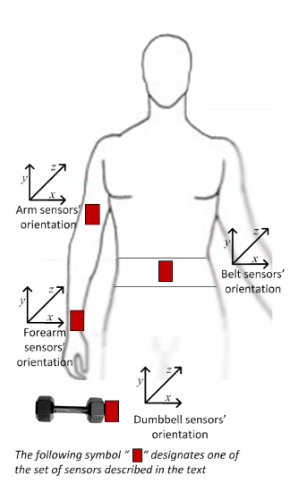

# Introduction    

Using devices such as Jawbone Up, Nike FuelBand, and Fitbit it is now possible to collect a large amount of data about personal activity relatively inexpensively. These type of devices are part of the quantified self movement – a group of enthusiasts who take measurements about themselves regularly to improve their health, to find patterns in their behavior, or because they are tech geeks. One thing that people regularly do is quantify how much of a particular activity they do, but they rarely quantify how well they do it. In this project, your goal will be to use data from accelerometers on the belt, forearm, arm, and dumbell of 6 participants. They were asked to perform barbell lifts correctly and incorrectly in 5 different ways.  
Six young health participants were asked to perform one set of 10 repetitions of the Unilateral Dumbbell Biceps Curl in five different fashions: exactly according to the specification (Class A), throwing the elbows to the front (Class B), lifting the dumbbell only halfway (Class C), lowering the dumbbell only halfway (Class D) and throwing the hips to the front (Class E).  
Class A corresponds to the specified execution of the exercise, while the other 4 classes correspond to common mistakes. Participants were supervised by an experienced weight lifter to make sure the execution complied to the manner they were supposed to simulate. The exercises were performed by six male participants aged between 20-28 years, with little weight lifting experience. It was made sure that all participants could easily simulate the mistakes in a safe and controlled manner by using a relatively light dumbbell (1.25kg).  
My goal here is to predict the *"class"* with the help of other predictors. This project is a part of Coursera Practical Machine Learning Week 4 - Peer-graded Assignment: Prediction Assignment Writeup.  


# Data   

## Load the data  

Let's load the data. I have downloaded the data already on my local system. Please download the data from here : [Training](https://d396qusza40orc.cloudfront.net/predmachlearn/pml-training.csv) and [Testing](https://d396qusza40orc.cloudfront.net/predmachlearn/pml-testing.csv). And run this code on the same directory as the data.  


```r
dfTrain <- read.csv("pml-training.csv", stringsAsFactors = F,na.strings = c("","NA","#DIV/0!"))
dfTest <- read.csv("pml-testing.csv", stringsAsFactors = F,na.strings = c("","NA","#DIV/0!"))
dim(dfTrain); dim(dfTest)
```

```
## [1] 19622   160
```

```
## [1]  20 160
```
  
Let's create a validation for model tuning:  


```r
#for reproducability
set.seed(101)
inTrain <- createDataPartition(dfTrain$classe, p = 0.8, list = F)
dfVal <- dfTrain[-inTrain,]
dfTrain <- dfTrain[inTrain,]
dim(dfTrain); dim(dfVal)
```

```
## [1] 15699   160
```

```
## [1] 3923  160
```
  
Now 3 partition of our data is ready, lets dive into analysis but first lets look at the proportion of different "classe":


```r
table(dfTrain$classe)/nrow(dfTrain)
```

```
## 
##         A         B         C         D         E 
## 0.2843493 0.1935155 0.1744060 0.1638958 0.1838334
```
  
From the above it is clear that there are not that much bias in the data in term of different "classe".  

## Column overview  

The data has 160 columns and for training data 15699 rows. Data was collected with the help of 4 sensors, shown in the diagram below.  



Few Key points about the columns:  

* *"X"* is primary key for the data.
* *"user_name"* is the id of the users. This may help us see interesting patterns for each activity for different users.
* *"classe"* is the target for prediction.
* Column - *3 to 7* is not necessary for this project. (5 features)
* As mentioned above there are 4 different sensors used for data collection. For each sensor there are 38 different features.
* Each sensor("belt","arm","forearm","dumbbell") has raw accelerometer, gyroscope and magnetometer readings for x, y and z axis. (4 sensor * 3 feature * 3 axis = 36 features)
* Each sensor("belt","arm","forearm","dumbbell") has Euler angles (roll, pitch and yaw) feature.(4 sensor * 3 euler angles  = 12 features)
* For the Euler angles of each of the four sensors eight features were calculated: mean, variance, standard deviation, max, min, amplitude, kurtosis and skewness. (4 sensor * 3 feature * 8 measures = 96 features)
* For accelerometer we also have "total" and "variance of total" feature for the 4 sensors. But for "belt", "variance of total" is given as "var_total_accel_belt", for the other sensors it is given as ("var_accel_arm","var_accel_dumbbell","var_accel_forearm"). So I am considering the "belt" one as a typo. (4 sensor * 2 feature = 8 features)
* There is another thing to note here. For "belt" Euler angles feature skewness is given as "skewness_roll_belt", "skewness_roll_belt.1" and "skewness_yaw_belt". I am also considering "skewness_roll_belt.1" as a typo and considering it as "skewness_pitch_belt".  

## Missingness in the data  

Let's take a quick look at the missing values of the data. As the no. of features is large, its better to see them by the 4 sensors:  

### Belt  

For Belt sensor:  


```r
belt_miss <- sapply(select(dfTrain,names(dfTrain)[grepl("_belt",names(dfTrain))]),
                    function(x) sum(is.na(x)))
belt_miss
```

```
##            roll_belt           pitch_belt             yaw_belt 
##                    0                    0                    0 
##     total_accel_belt   kurtosis_roll_belt  kurtosis_picth_belt 
##                    0                15396                15413 
##    kurtosis_yaw_belt   skewness_roll_belt skewness_roll_belt.1 
##                15699                15395                15413 
##    skewness_yaw_belt        max_roll_belt       max_picth_belt 
##                15699                15388                15388 
##         max_yaw_belt        min_roll_belt       min_pitch_belt 
##                15396                15388                15388 
##         min_yaw_belt  amplitude_roll_belt amplitude_pitch_belt 
##                15396                15388                15388 
##   amplitude_yaw_belt var_total_accel_belt        avg_roll_belt 
##                15396                15388                15388 
##     stddev_roll_belt        var_roll_belt       avg_pitch_belt 
##                15388                15388                15388 
##    stddev_pitch_belt       var_pitch_belt         avg_yaw_belt 
##                15388                15388                15388 
##      stddev_yaw_belt         var_yaw_belt         gyros_belt_x 
##                15388                15388                    0 
##         gyros_belt_y         gyros_belt_z         accel_belt_x 
##                    0                    0                    0 
##         accel_belt_y         accel_belt_z        magnet_belt_x 
##                    0                    0                    0 
##        magnet_belt_y        magnet_belt_z 
##                    0                    0
```

### Arm  

For Arm sensor:  


```r
arm_miss <- sapply(select(dfTrain,names(dfTrain)[grepl("_arm",names(dfTrain))]),
                   function(x) sum(is.na(x)))
arm_miss
```

```
##            roll_arm           pitch_arm             yaw_arm     total_accel_arm 
##                   0                   0                   0                   0 
##       var_accel_arm        avg_roll_arm     stddev_roll_arm        var_roll_arm 
##               15388               15388               15388               15388 
##       avg_pitch_arm    stddev_pitch_arm       var_pitch_arm         avg_yaw_arm 
##               15388               15388               15388               15388 
##      stddev_yaw_arm         var_yaw_arm         gyros_arm_x         gyros_arm_y 
##               15388               15388                   0                   0 
##         gyros_arm_z         accel_arm_x         accel_arm_y         accel_arm_z 
##                   0                   0                   0                   0 
##        magnet_arm_x        magnet_arm_y        magnet_arm_z   kurtosis_roll_arm 
##                   0                   0                   0               15446 
##  kurtosis_picth_arm    kurtosis_yaw_arm   skewness_roll_arm  skewness_pitch_arm 
##               15448               15398               15445               15448 
##    skewness_yaw_arm        max_roll_arm       max_picth_arm         max_yaw_arm 
##               15398               15388               15388               15388 
##        min_roll_arm       min_pitch_arm         min_yaw_arm  amplitude_roll_arm 
##               15388               15388               15388               15388 
## amplitude_pitch_arm   amplitude_yaw_arm 
##               15388               15388
```

### Forearm  

For Forearm sensor:  


```r
forearm_miss <- sapply(select(dfTrain,
                              names(dfTrain)[grepl("_forearm",names(dfTrain))]),
                       function(x) sum(is.na(x)))
forearm_miss
```

```
##            roll_forearm           pitch_forearm             yaw_forearm 
##                       0                       0                       0 
##   kurtosis_roll_forearm  kurtosis_picth_forearm    kurtosis_yaw_forearm 
##                   15448                   15449                   15699 
##   skewness_roll_forearm  skewness_pitch_forearm    skewness_yaw_forearm 
##                   15447                   15449                   15699 
##        max_roll_forearm       max_picth_forearm         max_yaw_forearm 
##                   15388                   15388                   15448 
##        min_roll_forearm       min_pitch_forearm         min_yaw_forearm 
##                   15388                   15388                   15448 
##  amplitude_roll_forearm amplitude_pitch_forearm   amplitude_yaw_forearm 
##                   15388                   15388                   15448 
##     total_accel_forearm       var_accel_forearm        avg_roll_forearm 
##                       0                   15388                   15388 
##     stddev_roll_forearm        var_roll_forearm       avg_pitch_forearm 
##                   15388                   15388                   15388 
##    stddev_pitch_forearm       var_pitch_forearm         avg_yaw_forearm 
##                   15388                   15388                   15388 
##      stddev_yaw_forearm         var_yaw_forearm         gyros_forearm_x 
##                   15388                   15388                       0 
##         gyros_forearm_y         gyros_forearm_z         accel_forearm_x 
##                       0                       0                       0 
##         accel_forearm_y         accel_forearm_z        magnet_forearm_x 
##                       0                       0                       0 
##        magnet_forearm_y        magnet_forearm_z 
##                       0                       0
```

### Dumbbell  

For Dumbbell sensor:  


```r
dumbbell_miss <- sapply(select(dfTrain,
                               names(dfTrain)[grepl("_dumbbell",names(dfTrain))]),
                        function(x) sum(is.na(x)))
dumbbell_miss
```

```
##            roll_dumbbell           pitch_dumbbell             yaw_dumbbell 
##                        0                        0                        0 
##   kurtosis_roll_dumbbell  kurtosis_picth_dumbbell    kurtosis_yaw_dumbbell 
##                    15392                    15390                    15699 
##   skewness_roll_dumbbell  skewness_pitch_dumbbell    skewness_yaw_dumbbell 
##                    15391                    15389                    15699 
##        max_roll_dumbbell       max_picth_dumbbell         max_yaw_dumbbell 
##                    15388                    15388                    15392 
##        min_roll_dumbbell       min_pitch_dumbbell         min_yaw_dumbbell 
##                    15388                    15388                    15392 
##  amplitude_roll_dumbbell amplitude_pitch_dumbbell   amplitude_yaw_dumbbell 
##                    15388                    15388                    15392 
##     total_accel_dumbbell       var_accel_dumbbell        avg_roll_dumbbell 
##                        0                    15388                    15388 
##     stddev_roll_dumbbell        var_roll_dumbbell       avg_pitch_dumbbell 
##                    15388                    15388                    15388 
##    stddev_pitch_dumbbell       var_pitch_dumbbell         avg_yaw_dumbbell 
##                    15388                    15388                    15388 
##      stddev_yaw_dumbbell         var_yaw_dumbbell         gyros_dumbbell_x 
##                    15388                    15388                        0 
##         gyros_dumbbell_y         gyros_dumbbell_z         accel_dumbbell_x 
##                        0                        0                        0 
##         accel_dumbbell_y         accel_dumbbell_z        magnet_dumbbell_x 
##                        0                        0                        0 
##        magnet_dumbbell_y        magnet_dumbbell_z 
##                        0                        0
```

So it is very interesting to see that few of the features are over 90% missing, I would drop those columns for further analysis. But the interesting thing is that all of those columns have same no. of NA values.  


```r
column_2drop <- c(names(belt_miss[belt_miss != 0]), 
                  names(arm_miss[arm_miss != 0]),
                  names(forearm_miss[forearm_miss != 0]),
                  names(dumbbell_miss[dumbbell_miss != 0]))
length(column_2drop)
```

```
## [1] 100
```

So we can drop 100 column as they are mostly missing. After we drop these column there will be 52 predictors left.  

# Analysis  

Now lets get into analysis, first let's look at the correlation among the predictors.  


```r
#dropping the cols
dfAnalize <- tbl_df(dfTrain %>% 
                      select(-column_2drop,
                             -c(X,user_name, raw_timestamp_part_1, 
                                raw_timestamp_part_2, cvtd_timestamp, 
                                new_window,num_window)))
```

```
## Warning: `tbl_df()` is deprecated as of dplyr 1.0.0.
## Please use `tibble::as_tibble()` instead.
## This warning is displayed once every 8 hours.
## Call `lifecycle::last_warnings()` to see where this warning was generated.
```

```
## Note: Using an external vector in selections is ambiguous.
## i Use `all_of(column_2drop)` instead of `column_2drop` to silence this message.
## i See <https://tidyselect.r-lib.org/reference/faq-external-vector.html>.
## This message is displayed once per session.
```

```r
dfAnalize$classe <- as.factor(dfAnalize$classe)
dfAnalize[,1:52] <- lapply(dfAnalize[,1:52],as.numeric)
dim(dfAnalize)
```

```
## [1] 15699    53
```

## Correlation among predictors  


```r
corr_col <- cor(select(dfAnalize, -classe))
diag(corr_col) <- 0
corr_col <- which(abs(corr_col)>0.8,arr.ind = T)
corr_col <- unique(row.names(corr_col))
corrplot(cor(select(dfAnalize,corr_col)),
         type="upper", order="hclust",method = "number")
```

```
## Note: Using an external vector in selections is ambiguous.
## i Use `all_of(corr_col)` instead of `corr_col` to silence this message.
## i See <https://tidyselect.r-lib.org/reference/faq-external-vector.html>.
## This message is displayed once per session.
```

<!-- -->

Here I have subsetted the data to show only the columns for which absolute correlation is higher than 0.8 with at least one other column. From Correlation plot it is clear that there is lot of columns that are highly correlated. That might be an issue when we will be in modeling phase. Either we can drop those columns or we can perform PCA(Principal Components Analysis). One important thing to note from this graph is that high correlation is only seen between the same sensor i.e. "belt","arm","forearm" and "dumbbell".   

## Correlation with the target  

As the target is a categorical variable, we cannot check correlation with the other variables directly. But we can use **correlationfunnel::correlate** to see the correlation with each level of"classe" and other features. Lets go by them one by one.  


```r
# binarizing data
corr_funl_df <- dfAnalize %>% binarize(n_bins = 4, thresh_infreq = 0.01)
```

### classe__A  


```r
corr_a <- corr_funl_df %>% correlate(target = classe__A) 
corr_a %>% plot_correlation_funnel(interactive = T,limits = c(-0.5,0.5))
```

<!--html_preserve--><div id="htmlwidget-e61174a348a5383bc52b" style="width:768px;height:960px;" class="plotly html-widget"></div>
<script type="application/json" data-for="htmlwidget-e61174a348a5383bc52b">{"x":{"data":[{"x":[0,0],"y":[0.4,53.6],"text":"","type":"scatter","mode":"lines","line":{"width":1.88976377952756,"color":"rgba(255,0,0,1)","dash":"dash"},"hoveron":"points","showlegend":false,"xaxis":"x","yaxis":"y","hoverinfo":"text","frame":null},{"x":[null,0.317612425952415,-0.30877023971324,0.305283829913104,-0.299156404504816,-0.289716360730683,-0.279080342781894,0.263364955901136,-0.260509712308018,0.234485468525756,-0.23433013686362,0.230823367902839,0.21510106392602,-0.21302911842323,0.200144863249953,0.193442412963028,0.19216187505779,-0.1896956327495,0.186609736739154,-0.186222299352011,-0.178658255461959,-0.176765218964229,0.174382594593696,-0.174327120232616,0.169258891959658,-0.169212655926777,0.168725353577695,0.163850462538143,-0.16257535396543,-0.161340318065465,0.158868230749097,-0.158600674078295,0.153294451551532,-0.150777691281524,0.150379691613453,0.149635040331535,0.149528499099141,0.147665187658873,-0.146920511558345,-0.145626166064454,-0.144321463755023,-0.143718021862301,-0.140672399809512,0.140166184154161,0.139766135842886,-0.138935239580801,0.138085090246883,0.137926317659252,-0.137792677812853,-0.136650206501942,0.134423713421979,-0.1338819610512,0.133534680469163,-0.131873251094874,-0.127613794406245,0.12727810569956,0.126827006319628,-0.123521969120066,0.12194838369962,0.120666778509478,-0.120383670533746,-0.120103948987081,-0.120002168300652,-0.119942878122073,0.119876150023808,0.119480298396159,0.119317849761831,0.119267265819817,-0.11436977944721,-0.113375903017738,-0.113241754629971,-0.109760599765127,-0.109210283872634,0.109138401238326,0.108322237355467,-0.107909357276392,-0.107692651490356,-0.106003414773653,-0.105399339367723,0.104525426885901,0.0999754547212294,-0.0999010210722098,0.0995363706762504,-0.0988827593938193,0.0967606194472096,-0.0964621858286416,-0.0957011681294711,0.0948854888881728,-0.0946496064092922,-0.0945775032516775,-0.09416482168843,0.0929938211704885,-0.0918851082161493,0.0910806474178792,-0.0900533679831647,-0.0880682983028825,0.0879170060554426,-0.0869929584234454,-0.0868492763580782,0.0835099661347096,-0.08271771417726,0.0825241807624711,-0.08051037867606,-0.080294105271739,0.0802115179093628,0.0792174244153994,-0.0790353639331491,0.0766086802014691,-0.0759268786266705,0.0740173578322269,0.0736738429607975,-0.073289055718558,0.073161036992778,-0.0727365382644165,0.0707988082421648,0.0678995360867586,0.0677335241359018,-0.0670902564625202,-0.0665046623838019,-0.0660357229837842,0.0654286016268137,-0.0653033418169039,0.0651419811113129,-0.0631081773703815,-0.0585447214679681,-0.0583938328694251,-0.0583409140126096,-0.0580182938073987,-0.0571519486058788,0.0568403430031397,0.0566045349053821,-0.0559563058736021,0.0556339873316269,-0.0544189394687439,-0.0543583067309367,-0.0518991590672759,-0.0516342194980723,0.05030687402374,0.0501643801188835,-0.0491626937687966,-0.0489935038457682,-0.0471825478323069,-0.0468918354313976,-0.0430976350895262,0.0429689520741746,0.0412730228689843,-0.0401326233719128,0.0399317915184796,-0.0396502334773288,0.0393812021684095,0.0385959330099705,0.0383598146997206,0.0376503763535632,0.0369973582611811,0.0358436262655908,0.0355778567263187,-0.0351427008510787,0.0346519671497626,0.0339820000057037,0.0331104706666905,-0.0329610891762488,0.0326573080635858,0.0326095116860097,-0.0319701502295953,0.030850866137005,0.0298308697948641,0.02956765247099,-0.0288446587192738,-0.0284910310957046,-0.028327917154999,-0.028157514924735,0.0266664338547727,-0.0260546613612507,-0.0258401244256799,-0.025204820761398,0.0244110737845386,0.0225730542388532,-0.0222883387814007,-0.0216648855829554,-0.0216446190026491,0.0209932227718251,0.0204262209284213,-0.0197940956857328,0.0190146417199466,-0.0182983968248416,0.0168224531973797,0.0161873714915687,-0.0160397936114883,-0.0145308012606379,0.0140696030545737,-0.0139634793999243,0.0138605296322918,-0.0127941703367661,-0.0101501319294771,-0.00902144698629705,-0.00871089211140891,-0.00825774371992131,0.00810248750709316,0.00636046944297424,-0.00551822826223917,0.0051479671716206,-0.00473784280612473,0.00458848530298627,0.00455840407531374,0.00412033190943886,0.00356584429030375,-0.00289762176740216,-0.00244232474174765,-0.00132365153710561,0.00082243415832215,0.000719102770746686,-0.000646658736058955,0.000307925281419004],"y":[53,52,53,51,53,53,53,50,49,49,48,47,46,52,48,45,44,50,43,42,47,45,41,40,39,51,38,37,36,51,36,35,49,38,34,40,33,35,32,43,31,30,39,31,29,28,36,27,46,45,26,36,25,24,49,28,42,41,23,22,47,21,43,29,48,45,20,40,38,44,27,26,34,30,32,44,41,19,52,18,17,16,42,34,38,29,37,16,50,40,33,15,14,13,27,48,31,18,12,11,37,10,31,11,43,19,22,29,9,8,19,13,24,20,21,14,9,10,23,15,47,18,27,20,25,8,23,25,17,34,41,22,12,13,7,46,6,5,18,4,33,10,19,39,28,32,42,4,3,30,2,6,4,13,3,6,28,9,10,7,35,24,12,5,21,44,35,26,2,4,17,1,2,9,46,24,7,6,11,51,14,50,8,21,15,37,2,25,17,22,7,39,1,1,5,5,15,33,16,1,3,20,11,23,8,26,3,32,12,30,52,16,14],"text":["classe<br />Bin: A<br />Correlation: 1","magnet_arm_x<br />Bin: -Inf_-302<br />Correlation: 0.318","classe<br />Bin: B<br />Correlation: -0.309","pitch_forearm<br />Bin: -Inf_0<br />Correlation: 0.305","classe<br />Bin: E<br />Correlation: -0.299","classe<br />Bin: C<br />Correlation: -0.29","classe<br />Bin: D<br />Correlation: -0.279","accel_arm_x<br />Bin: -Inf_-242<br />Correlation: 0.263","magnet_dumbbell_y<br />Bin: 391_Inf<br />Correlation: -0.261","magnet_dumbbell_y<br />Bin: 311_391<br />Correlation: 0.234","roll_forearm<br />Bin: 140_Inf<br />Correlation: -0.234","gyros_dumbbell_y<br />Bin: 0.03_0.21<br />Correlation: 0.231","magnet_forearm_x<br />Bin: -76_Inf<br />Correlation: 0.215","magnet_arm_x<br />Bin: 286_636<br />Correlation: -0.213","roll_forearm<br />Bin: 22.2_140<br />Correlation: 0.2","gyros_arm_x<br />Bin: -1.33_0.08<br />Correlation: 0.193","accel_forearm_x<br />Bin: 77_Inf<br />Correlation: 0.192","accel_arm_x<br />Bin: -44_84<br />Correlation: -0.19","gyros_arm_y<br />Bin: -0.24_0.14<br />Correlation: 0.187","roll_dumbbell<br />Bin: 67.489061635_Inf<br />Correlation: -0.186","gyros_dumbbell_y<br />Bin: 0.21_Inf<br />Correlation: -0.179","gyros_arm_x<br />Bin: 1.56_Inf<br />Correlation: -0.177","gyros_forearm_y<br />Bin: -1.46_0.03<br />Correlation: 0.174","magnet_dumbbell_x<br />Bin: -303_Inf<br />Correlation: -0.174","magnet_dumbbell_z<br />Bin: -Inf_-46<br />Correlation: 0.169","pitch_forearm<br />Bin: 28.4_Inf<br />Correlation: -0.169","accel_dumbbell_z<br />Bin: -Inf_-142<br />Correlation: 0.169","gyros_arm_z<br />Bin: -0.07_0.25<br />Correlation: 0.164","magnet_arm_y<br />Bin: -Inf_-8<br />Correlation: -0.163","pitch_forearm<br />Bin: 9.04_28.4<br />Correlation: -0.161","magnet_arm_y<br />Bin: 323_Inf<br />Correlation: 0.159","total_accel_forearm<br />Bin: 41_Inf<br />Correlation: -0.159","magnet_dumbbell_y<br />Bin: 231_311<br />Correlation: 0.153","accel_dumbbell_z<br />Bin: -142_-1<br />Correlation: -0.151","gyros_forearm_z<br />Bin: -0.18_0.08<br />Correlation: 0.15","magnet_dumbbell_x<br />Bin: -535_-479<br />Correlation: 0.15","pitch_arm<br />Bin: 11.4_Inf<br />Correlation: 0.15","total_accel_forearm<br />Bin: 29_36<br />Correlation: 0.148","magnet_arm_z<br />Bin: -Inf_134<br />Correlation: -0.147","gyros_arm_y<br />Bin: -Inf_-0.79<br />Correlation: -0.146","total_accel_dumbbell<br />Bin: 4_10<br />Correlation: -0.144","total_accel_arm<br />Bin: -Inf_17<br />Correlation: -0.144","magnet_dumbbell_z<br />Bin: 95_Inf<br />Correlation: -0.141","total_accel_dumbbell<br />Bin: -Inf_4<br />Correlation: 0.14","yaw_dumbbell<br />Bin: -Inf_-77.6618463<br />Correlation: 0.14","accel_dumbbell_x<br />Bin: 11_Inf<br />Correlation: -0.139","magnet_arm_y<br />Bin: 203_323<br />Correlation: 0.138","accel_forearm_y<br />Bin: 61_202<br />Correlation: 0.138","magnet_forearm_x<br />Bin: -Inf_-617<br />Correlation: -0.138","gyros_arm_x<br />Bin: -Inf_-1.33<br />Correlation: -0.137","accel_arm_z<br />Bin: -142_-46<br />Correlation: 0.134","magnet_arm_y<br />Bin: -8_203<br />Correlation: -0.134","gyros_forearm_x<br />Bin: -0.21_0.05<br />Correlation: 0.134","roll_belt<br />Bin: 123_Inf<br />Correlation: -0.132","magnet_dumbbell_y<br />Bin: -Inf_231<br />Correlation: -0.128","accel_dumbbell_x<br />Bin: -Inf_-51<br />Correlation: 0.127","roll_dumbbell<br />Bin: -19.507508765_48.05254342<br />Correlation: 0.127","gyros_forearm_y<br />Bin: 1.62_Inf<br />Correlation: -0.124","gyros_belt_x<br />Bin: -0.03_0.03<br />Correlation: 0.122","gyros_dumbbell_x<br />Bin: 0.13_0.35<br />Correlation: 0.121","gyros_dumbbell_y<br />Bin: -Inf_-0.14<br />Correlation: -0.12","roll_arm<br />Bin: 76.9_Inf<br />Correlation: -0.12","gyros_arm_y<br />Bin: 0.14_Inf<br />Correlation: -0.12","yaw_dumbbell<br />Bin: -77.6618463_-4.104201821<br />Correlation: -0.12","roll_forearm<br />Bin: -0.565_22.2<br />Correlation: 0.12","gyros_arm_x<br />Bin: 0.08_1.56<br />Correlation: 0.119","total_accel_belt<br />Bin: 3_17<br />Correlation: 0.119","magnet_dumbbell_x<br />Bin: -Inf_-535<br />Correlation: 0.119","accel_dumbbell_z<br />Bin: 39_Inf<br />Correlation: -0.114","accel_forearm_x<br />Bin: -178_-57<br />Correlation: -0.113","accel_forearm_y<br />Bin: 314_Inf<br />Correlation: -0.113","accel_arm_z<br />Bin: 24_Inf<br />Correlation: -0.11","gyros_forearm_z<br />Bin: 0.49_Inf<br />Correlation: -0.109","total_accel_arm<br />Bin: 33_Inf<br />Correlation: 0.109","magnet_arm_z<br />Bin: 545_Inf<br />Correlation: 0.108","accel_forearm_x<br />Bin: -Inf_-178<br />Correlation: -0.108","gyros_forearm_y<br />Bin: -Inf_-1.46<br />Correlation: -0.108","pitch_dumbbell<br />Bin: 17.379289915_Inf<br />Correlation: -0.106","magnet_arm_x<br />Bin: 636_Inf<br />Correlation: -0.105","accel_belt_z<br />Bin: 27_Inf<br />Correlation: 0.105","yaw_belt<br />Bin: -88.3_-12<br />Correlation: 0.1","magnet_belt_x<br />Bin: 9_35<br />Correlation: -0.1","roll_dumbbell<br />Bin: 48.05254342_67.489061635<br />Correlation: 0.1","gyros_forearm_z<br />Bin: -Inf_-0.18<br />Correlation: -0.099","accel_dumbbell_z<br />Bin: -1_39<br />Correlation: 0.097","yaw_dumbbell<br />Bin: -4.104201821_79.90388407<br />Correlation: -0.096","gyros_arm_z<br />Bin: 0.25_0.72<br />Correlation: -0.096","magnet_belt_x<br />Bin: 35_59<br />Correlation: 0.095","accel_arm_x<br />Bin: 84_Inf<br />Correlation: -0.095","magnet_dumbbell_x<br />Bin: -479_-303<br />Correlation: -0.095","pitch_arm<br />Bin: -26_0<br />Correlation: -0.094","accel_arm_y<br />Bin: 139_Inf<br />Correlation: 0.093","gyros_dumbbell_z<br />Bin: 0.03_Inf<br />Correlation: -0.092","accel_forearm_z<br />Bin: -Inf_-182<br />Correlation: 0.091","accel_forearm_y<br />Bin: -Inf_61<br />Correlation: -0.09","roll_forearm<br />Bin: -Inf_-0.565<br />Correlation: -0.088","total_accel_dumbbell<br />Bin: 20_Inf<br />Correlation: 0.088","accel_belt_z<br />Bin: -Inf_-162<br />Correlation: -0.087","magnet_forearm_y<br />Bin: -Inf_19<br />Correlation: -0.087","yaw_arm<br />Bin: -Inf_-43.3<br />Correlation: 0.084","gyros_arm_z<br />Bin: -Inf_-0.07<br />Correlation: -0.083","magnet_belt_y<br />Bin: 610_Inf<br />Correlation: 0.083","total_accel_dumbbell<br />Bin: 10_20<br />Correlation: -0.081","yaw_arm<br />Bin: 0_45.9<br />Correlation: -0.08","gyros_arm_y<br />Bin: -0.79_-0.24<br />Correlation: 0.08","pitch_dumbbell<br />Bin: -40.93057931_-21.12140478<br />Correlation: 0.079","gyros_dumbbell_x<br />Bin: 0.35_Inf<br />Correlation: -0.079","yaw_dumbbell<br />Bin: 79.90388407_Inf<br />Correlation: 0.077","gyros_belt_z<br />Bin: -Inf_-0.2<br />Correlation: -0.076","magnet_forearm_z<br />Bin: 200.5_515<br />Correlation: 0.074","pitch_dumbbell<br />Bin: -Inf_-40.93057931<br />Correlation: 0.074","accel_forearm_z<br />Bin: -40_26<br />Correlation: -0.073","roll_belt<br />Bin: 1.1_114<br />Correlation: 0.073","total_accel_belt<br />Bin: 18_Inf<br />Correlation: -0.073","roll_arm<br />Bin: -Inf_-32.4<br />Correlation: 0.071","gyros_dumbbell_z<br />Bin: -0.13_0.03<br />Correlation: 0.068","gyros_belt_z<br />Bin: -0.1_-0.02<br />Correlation: 0.068","magnet_belt_y<br />Bin: 581_601<br />Correlation: -0.067","gyros_belt_x<br />Bin: -Inf_-0.03<br />Correlation: -0.067","accel_arm_y<br />Bin: -Inf_-54<br />Correlation: -0.066","gyros_dumbbell_y<br />Bin: -0.14_0.03<br />Correlation: 0.065","accel_belt_z<br />Bin: -153_27<br />Correlation: -0.065","accel_forearm_y<br />Bin: 202_314<br />Correlation: 0.065","total_accel_belt<br />Bin: 17_18<br />Correlation: -0.063","gyros_forearm_x<br />Bin: -Inf_-0.21<br />Correlation: -0.059","magnet_forearm_z<br />Bin: -Inf_200.5<br />Correlation: -0.058","gyros_belt_x<br />Bin: 0.11_Inf<br />Correlation: -0.058","gyros_forearm_x<br />Bin: 0.05_0.56<br />Correlation: -0.058","yaw_belt<br />Bin: 13.3_Inf<br />Correlation: -0.057","gyros_forearm_z<br />Bin: 0.08_0.49<br />Correlation: 0.057","gyros_forearm_y<br />Bin: 0.03_1.62<br />Correlation: 0.057","gyros_dumbbell_x<br />Bin: -Inf_-0.03<br />Correlation: -0.056","magnet_forearm_y<br />Bin: 738_Inf<br />Correlation: 0.056","accel_forearm_z<br />Bin: -182_-40<br />Correlation: -0.054","gyros_belt_y<br />Bin: 0.11_Inf<br />Correlation: -0.054","magnet_forearm_x<br />Bin: -380_-76<br />Correlation: -0.052","pitch_belt<br />Bin: -Inf_1.79<br />Correlation: -0.052","magnet_belt_z<br />Bin: -306_Inf<br />Correlation: 0.05","accel_belt_z<br />Bin: -162_-153<br />Correlation: 0.05","accel_dumbbell_y<br />Bin: -Inf_-9<br />Correlation: -0.049","pitch_arm<br />Bin: -Inf_-26<br />Correlation: -0.049","magnet_belt_y<br />Bin: -Inf_581<br />Correlation: -0.047","pitch_dumbbell<br />Bin: -21.12140478_17.379289915<br />Correlation: -0.047","magnet_dumbbell_z<br />Bin: 12_95<br />Correlation: -0.043","accel_dumbbell_x<br />Bin: -9_11<br />Correlation: 0.043","magnet_arm_z<br />Bin: 444_545<br />Correlation: 0.041","roll_dumbbell<br />Bin: -Inf_-19.507508765<br />Correlation: -0.04","accel_dumbbell_y<br />Bin: 41_111<br />Correlation: 0.04","accel_belt_x<br />Bin: -5_Inf<br />Correlation: -0.04","total_accel_arm<br />Bin: 27_33<br />Correlation: 0.039","yaw_forearm<br />Bin: 110_Inf<br />Correlation: 0.039","pitch_belt<br />Bin: 1.79_5.3<br />Correlation: 0.038","accel_dumbbell_y<br />Bin: -9_41<br />Correlation: 0.038","accel_forearm_z<br />Bin: 26_Inf<br />Correlation: 0.037","accel_belt_x<br />Bin: -Inf_-21<br />Correlation: 0.036","pitch_belt<br />Bin: 15.2_Inf<br />Correlation: 0.036","accel_dumbbell_x<br />Bin: -51_-9<br />Correlation: -0.035","gyros_belt_z<br />Bin: -0.2_-0.1<br />Correlation: 0.035","magnet_belt_y<br />Bin: 601_610<br />Correlation: 0.034","gyros_belt_y<br />Bin: -Inf_0<br />Correlation: 0.033","total_accel_forearm<br />Bin: 36_41<br />Correlation: -0.033","roll_belt<br />Bin: 114_123<br />Correlation: 0.033","magnet_forearm_y<br />Bin: 19_594<br />Correlation: 0.033","magnet_belt_z<br />Bin: -Inf_-375<br />Correlation: -0.032","roll_arm<br />Bin: 0_76.9<br />Correlation: 0.031","accel_forearm_x<br />Bin: -57_77<br />Correlation: 0.03","total_accel_forearm<br />Bin: -Inf_29<br />Correlation: 0.03","accel_arm_z<br />Bin: -46_24<br />Correlation: -0.029","yaw_forearm<br />Bin: -68.5_0<br />Correlation: -0.028","accel_dumbbell_y<br />Bin: 111_Inf<br />Correlation: -0.028","yaw_belt<br />Bin: -12_13.3<br />Correlation: -0.028","accel_belt_y<br />Bin: -Inf_3<br />Correlation: 0.027","yaw_forearm<br />Bin: 0_110<br />Correlation: -0.026","gyros_belt_z<br />Bin: -0.02_Inf<br />Correlation: -0.026","magnet_forearm_x<br />Bin: -617_-380<br />Correlation: -0.025","roll_belt<br />Bin: -Inf_1.1<br />Correlation: 0.024","gyros_belt_y<br />Bin: 0_0.02<br />Correlation: 0.023","pitch_belt<br />Bin: 5.3_15.2<br />Correlation: -0.022","yaw_arm<br />Bin: -43.3_0<br />Correlation: -0.022","pitch_forearm<br />Bin: 0_9.04<br />Correlation: -0.022","gyros_dumbbell_z<br />Bin: -0.31_-0.13<br />Correlation: 0.021","accel_arm_x<br />Bin: -242_-44<br />Correlation: 0.02","magnet_forearm_z<br />Bin: 515_654<br />Correlation: -0.02","roll_arm<br />Bin: -32.4_0<br />Correlation: 0.019","accel_arm_y<br />Bin: 13_139<br />Correlation: -0.018","gyros_arm_z<br />Bin: 0.72_Inf<br />Correlation: 0.017","yaw_forearm<br />Bin: -Inf_-68.5<br />Correlation: 0.016","gyros_forearm_x<br />Bin: 0.56_Inf<br />Correlation: -0.016","yaw_belt<br />Bin: -Inf_-88.3<br />Correlation: -0.015","gyros_dumbbell_x<br />Bin: -0.03_0.13<br />Correlation: 0.014","gyros_belt_y<br />Bin: 0.02_0.11<br />Correlation: -0.014","magnet_dumbbell_z<br />Bin: -46_12<br />Correlation: 0.014","accel_belt_y<br />Bin: 36_61<br />Correlation: -0.013","accel_belt_y<br />Bin: 61_Inf<br />Correlation: -0.01","magnet_belt_z<br />Bin: -375_-319<br />Correlation: -0.009","magnet_belt_z<br />Bin: -319_-306<br />Correlation: -0.009","accel_arm_y<br />Bin: -54_13<br />Correlation: -0.008","pitch_arm<br />Bin: 0_11.4<br />Correlation: 0.008","magnet_belt_x<br />Bin: 59_Inf<br />Correlation: 0.006","accel_belt_y<br />Bin: 3_36<br />Correlation: -0.006","accel_belt_x<br />Bin: -15_-5<br />Correlation: 0.005","total_accel_belt<br />Bin: -Inf_3<br />Correlation: -0.005","yaw_arm<br />Bin: 45.9_Inf<br />Correlation: 0.005","gyros_belt_x<br />Bin: 0.03_0.11<br />Correlation: 0.005","magnet_forearm_z<br />Bin: 654_Inf<br />Correlation: 0.004","accel_arm_z<br />Bin: -Inf_-142<br />Correlation: 0.004","accel_belt_x<br />Bin: -21_-15<br />Correlation: -0.003","magnet_arm_z<br />Bin: 134_444<br />Correlation: -0.002","magnet_forearm_y<br />Bin: 594_738<br />Correlation: -0.001","total_accel_arm<br />Bin: 17_27<br />Correlation: 0.001","magnet_arm_x<br />Bin: -302_286<br />Correlation: 0.001","magnet_belt_x<br />Bin: -Inf_9<br />Correlation: -0.001","gyros_dumbbell_z<br />Bin: -Inf_-0.31<br />Correlation: 0"],"type":"scatter","mode":"markers","marker":{"autocolorscale":false,"color":"rgba(44,62,80,1)","opacity":1,"size":5.66929133858268,"symbol":"circle","line":{"width":1.88976377952756,"color":"rgba(44,62,80,1)"}},"hoveron":"points","showlegend":false,"xaxis":"x","yaxis":"y","hoverinfo":"text","frame":null}],"layout":{"margin":{"t":39.37899543379,"r":7.30593607305936,"b":35.7990867579909,"l":142.465753424658},"plot_bgcolor":"rgba(255,255,255,1)","paper_bgcolor":"rgba(255,255,255,1)","font":{"color":"rgba(44,62,80,1)","family":"","size":14.6118721461187},"title":{"text":"Correlation Funnel","font":{"color":"rgba(44,62,80,1)","family":"","size":17.5342465753425},"x":0,"xref":"paper"},"xaxis":{"domain":[0,1],"automargin":true,"type":"linear","autorange":false,"range":[-0.55,0.55],"tickmode":"array","ticktext":["-0.50","-0.25","0.00","0.25","0.50"],"tickvals":[-0.5,-0.25,0,0.25,0.5],"categoryorder":"array","categoryarray":["-0.50","-0.25","0.00","0.25","0.50"],"nticks":null,"ticks":"outside","tickcolor":"rgba(204,204,204,1)","ticklen":3.65296803652968,"tickwidth":0.22139200221392,"showticklabels":true,"tickfont":{"color":"rgba(44,62,80,1)","family":"","size":11.689497716895},"tickangle":-0,"showline":false,"linecolor":null,"linewidth":0,"showgrid":true,"gridcolor":"rgba(204,204,204,1)","gridwidth":0.22139200221392,"zeroline":false,"anchor":"y","title":{"text":"correlation","font":{"color":"rgba(44,62,80,1)","family":"","size":14.6118721461187}},"hoverformat":".2f"},"yaxis":{"domain":[0,1],"automargin":true,"type":"linear","autorange":false,"range":[0.4,53.6],"tickmode":"array","ticktext":["accel_belt_y","yaw_forearm","accel_belt_x","accel_dumbbell_y","magnet_belt_z","pitch_belt","gyros_belt_y","magnet_forearm_z","gyros_belt_z","magnet_belt_y","yaw_arm","magnet_forearm_y","accel_forearm_z","gyros_dumbbell_z","accel_arm_y","magnet_belt_x","yaw_belt","accel_belt_z","pitch_dumbbell","total_accel_belt","roll_arm","gyros_dumbbell_x","gyros_belt_x","roll_belt","gyros_forearm_x","accel_arm_z","accel_forearm_y","accel_dumbbell_x","yaw_dumbbell","total_accel_arm","total_accel_dumbbell","magnet_arm_z","pitch_arm","gyros_forearm_z","total_accel_forearm","magnet_arm_y","gyros_arm_z","accel_dumbbell_z","magnet_dumbbell_z","magnet_dumbbell_x","gyros_forearm_y","roll_dumbbell","gyros_arm_y","accel_forearm_x","gyros_arm_x","magnet_forearm_x","gyros_dumbbell_y","roll_forearm","magnet_dumbbell_y","accel_arm_x","pitch_forearm","magnet_arm_x","classe"],"tickvals":[1,2,3,4,5,6,7,8,9,10,11,12,13,14,15,16,17,18,19,20,21,22,23,24,25,26,27,28,29,30,31,32,33,34,35,36,37,38,39,40,41,42,43,44,45,46,47,48,49,50,51,52,53],"categoryorder":"array","categoryarray":["accel_belt_y","yaw_forearm","accel_belt_x","accel_dumbbell_y","magnet_belt_z","pitch_belt","gyros_belt_y","magnet_forearm_z","gyros_belt_z","magnet_belt_y","yaw_arm","magnet_forearm_y","accel_forearm_z","gyros_dumbbell_z","accel_arm_y","magnet_belt_x","yaw_belt","accel_belt_z","pitch_dumbbell","total_accel_belt","roll_arm","gyros_dumbbell_x","gyros_belt_x","roll_belt","gyros_forearm_x","accel_arm_z","accel_forearm_y","accel_dumbbell_x","yaw_dumbbell","total_accel_arm","total_accel_dumbbell","magnet_arm_z","pitch_arm","gyros_forearm_z","total_accel_forearm","magnet_arm_y","gyros_arm_z","accel_dumbbell_z","magnet_dumbbell_z","magnet_dumbbell_x","gyros_forearm_y","roll_dumbbell","gyros_arm_y","accel_forearm_x","gyros_arm_x","magnet_forearm_x","gyros_dumbbell_y","roll_forearm","magnet_dumbbell_y","accel_arm_x","pitch_forearm","magnet_arm_x","classe"],"nticks":null,"ticks":"outside","tickcolor":"rgba(204,204,204,1)","ticklen":3.65296803652968,"tickwidth":0.22139200221392,"showticklabels":true,"tickfont":{"color":"rgba(44,62,80,1)","family":"","size":11.689497716895},"tickangle":-0,"showline":false,"linecolor":null,"linewidth":0,"showgrid":true,"gridcolor":"rgba(204,204,204,1)","gridwidth":0.22139200221392,"zeroline":false,"anchor":"x","title":{"text":"feature","font":{"color":"rgba(44,62,80,1)","family":"","size":14.6118721461187}},"hoverformat":".2f"},"shapes":[{"type":"rect","fillcolor":"transparent","line":{"color":"rgba(44,62,80,1)","width":0.33208800332088,"linetype":"solid"},"yref":"paper","xref":"paper","x0":0,"x1":1,"y0":0,"y1":1}],"showlegend":false,"legend":{"bgcolor":"rgba(255,255,255,1)","bordercolor":"transparent","borderwidth":1.88976377952756,"font":{"color":"rgba(44,62,80,1)","family":"","size":11.689497716895}},"hovermode":"closest","barmode":"relative"},"config":{"doubleClick":"reset","showSendToCloud":false},"source":"A","attrs":{"31ac2a481f26":{"xintercept":{},"type":"scatter"},"31ac5895921":{"x":{},"y":{},"text":{}}},"cur_data":"31ac2a481f26","visdat":{"31ac2a481f26":["function (y) ","x"],"31ac5895921":["function (y) ","x"]},"highlight":{"on":"plotly_click","persistent":false,"dynamic":false,"selectize":false,"opacityDim":0.2,"selected":{"opacity":1},"debounce":0},"shinyEvents":["plotly_hover","plotly_click","plotly_selected","plotly_relayout","plotly_brushed","plotly_brushing","plotly_clickannotation","plotly_doubleclick","plotly_deselect","plotly_afterplot","plotly_sunburstclick"],"base_url":"https://plot.ly"},"evals":[],"jsHooks":[]}</script><!--/html_preserve-->

For *classe__A* it seems that the "Arm and Forearm" sensors are more important.  


* "accel_arm_x" is correlated with "magnet_arm_x", so wont consider.
* "gyros_arm_y" is correlated with "gyros_arm_x", so wont consider.
* So top 5 significant features for "classe__A" are - (magnet_arm_x, pitch_forearm , magnet_dumbbell_y, roll_forearm, gyros_dumbbell_y)  

### classe__B  


```r
corr_b <- corr_funl_df %>% correlate(target = classe__B)
corr_b %>% plot_correlation_funnel(interactive = T,limits = c(-0.5,0.5))
```

<!--html_preserve--><div id="htmlwidget-9849e007f7dd9f22763b" style="width:768px;height:960px;" class="plotly html-widget"></div>
<script type="application/json" data-for="htmlwidget-9849e007f7dd9f22763b">{"x":{"data":[{"x":[0,0],"y":[0.4,53.6],"text":"","type":"scatter","mode":"lines","line":{"width":1.88976377952756,"color":"rgba(255,0,0,1)","dash":"dash"},"hoveron":"points","showlegend":false,"xaxis":"x","yaxis":"y","hoverinfo":"text","frame":null},{"x":[null,-0.30877023971324,-0.232478412141454,-0.225142428842721,-0.216877038140706,0.204027504613984,0.194805982355498,0.158972671678382,0.156698143068079,0.156186729583328,-0.154792235131727,-0.154221774303364,0.152760302992371,-0.143190181272293,0.142649198408355,0.139395553741557,-0.134863571585024,0.131581451657991,-0.125237885315652,-0.121649698580701,0.120483463845738,0.119497747906876,-0.117687134270586,0.115869146395568,-0.114456176149073,0.113610536077755,0.113574366603568,-0.113036767889391,-0.112159297356893,0.111212752549467,0.108769190623187,0.108672308224719,-0.108299190351332,0.107326485650805,-0.10509628432255,0.104005547628412,0.100914169754483,0.0995076033547356,-0.0982390135362101,-0.0974474798476598,0.0973539535694123,-0.0959343011398286,-0.0953754594428204,-0.0933976251185375,-0.092229678172507,-0.0918626392603065,0.0907251727191462,0.0894806934884518,-0.089366066972085,0.0891958768714484,0.0881187247184671,0.0877813153088178,-0.0867812507450842,-0.0867610426645891,-0.0850602198873125,0.0849797862551299,0.0844963689623798,-0.0844563984755359,-0.0832322561861135,0.0828404564611894,-0.0825497619445187,0.0812410266896204,0.0807901317202032,0.0803043019191392,0.0795671996529976,-0.0772555576525723,0.0761294710833796,-0.0743473713212536,-0.0738190652992625,-0.0738013540447107,-0.0725540106337813,-0.0723332221470932,-0.0722074940938083,-0.0718988347232034,0.0716754182580748,-0.0710749906609692,0.0699977456328609,0.0685515797302595,0.068273708432899,-0.0677593623826662,0.0669807271688957,-0.0668568253698639,-0.065873836388355,0.0655787071662876,-0.0651675178459913,-0.0651540476245677,-0.0646252301492857,-0.0645683247073482,-0.0644482103763286,0.0639952313586204,0.0631681730960501,-0.0626767107616273,-0.0619292254327016,0.0601549462063811,-0.0598650652977647,0.059349022560914,-0.0588802707714351,0.0583347228974164,-0.057983615050549,-0.057025591989391,0.0567203557368199,0.0561744678563511,-0.0556049693118946,0.0542369339176576,-0.0540346805178192,-0.0539415018281016,-0.0538914207395874,-0.0535427455151328,0.0531695617076444,-0.0526769065677789,-0.0514881444667206,0.0498457095524267,-0.049390471216247,-0.0492863320088732,-0.0492859862170912,-0.0489504277646416,-0.0482711357417856,-0.0473294179827117,0.047261603195686,-0.0464811960790586,-0.0464730738008993,0.0455273505629764,0.044430499742952,-0.0435693658603698,-0.0433058966924398,0.0427050092137943,-0.0423483605781088,-0.041696011205412,-0.0400653918158124,0.0393321802958744,-0.0392871984908177,0.0382910996797093,-0.0374401281839888,-0.0373842889470908,-0.037054536106817,0.0368097495080671,0.0364407514644735,-0.0354946075795423,-0.0350948174140566,-0.034461253449107,-0.0319166897952868,0.0318172837225423,-0.0310976472373764,0.0309267699974207,0.0307804864469772,-0.0306269888469925,0.030329272034572,0.0301353327155209,-0.0301230821752168,0.0300360230498802,-0.0299634619746814,0.0290643519336896,-0.0286881395175805,0.0283196527128945,-0.0274315970498887,0.0272760240481855,-0.0271310374660215,-0.0270838242959193,0.0270362613650632,0.0244048085659259,-0.0243279178201145,0.023826950121155,0.0237069611180382,0.02366647712696,0.0223965698930365,-0.0218498984406258,0.0213866951320799,-0.0207542529133866,0.0203703606661145,0.0200531786150889,0.0200261366700998,0.0195233133098296,0.0192677450906602,0.0174624892648806,0.0168257931276317,0.0161061921966571,0.0157664168866182,0.0145774130111577,0.0145419090041159,-0.0140478583658237,0.0131813575682687,0.0129742869746321,0.0128217590443967,-0.0122148182010732,-0.0116545415737458,-0.0113243672263385,0.0112586425193854,0.010850566502632,-0.0106302555700527,0.00988896641607248,0.00984056815837403,-0.00955227281111311,-0.00880009038837466,0.00851409028447223,-0.00846743787670535,-0.008183342269536,-0.00792732153968299,0.0074083615146604,0.00728670878252214,0.00702683570431244,-0.00486841762490103,-0.00430014675842887,0.00410953597398954,0.0033534205358086,-0.0032059858369177,-0.00293743399645962,-0.00284985695346174,0.002240932754656,0.00204231139617704,-0.00149545788377439,-0.00142605687355462,0.00112548244854848,-0.000192039723991398],"y":[53,53,53,53,53,52,51,50,49,48,47,46,45,44,43,42,41,41,45,40,39,46,52,38,48,37,36,51,38,47,35,34,34,33,33,32,31,46,31,52,44,36,37,32,50,30,41,29,28,27,40,26,41,25,24,28,30,23,32,22,42,23,21,44,20,49,23,39,19,18,23,38,35,20,32,31,17,38,31,16,24,49,26,30,46,43,26,15,14,15,19,35,21,13,17,12,12,28,30,20,24,25,45,47,11,28,29,10,34,34,9,20,8,22,51,43,22,27,7,33,27,8,33,42,6,26,7,5,24,14,4,6,48,39,36,40,18,50,3,44,51,15,15,16,25,17,2,5,13,3,13,35,43,45,50,4,21,29,10,8,2,9,16,21,11,37,18,2,17,10,14,36,9,19,22,18,11,11,2,8,16,3,6,42,49,12,52,12,47,1,4,1,39,9,29,1,3,37,1,10,40,48,14,27,6,5,7,4,5,25,19,7,13],"text":["classe<br />Bin: B<br />Correlation: 1","classe<br />Bin: A<br />Correlation: -0.309","classe<br />Bin: E<br />Correlation: -0.232","classe<br />Bin: C<br />Correlation: -0.225","classe<br />Bin: D<br />Correlation: -0.217","magnet_dumbbell_x<br />Bin: -303_Inf<br />Correlation: 0.204","magnet_dumbbell_y<br />Bin: 391_Inf<br />Correlation: 0.195","accel_dumbbell_x<br />Bin: 11_Inf<br />Correlation: 0.159","magnet_belt_y<br />Bin: 601_610<br />Correlation: 0.157","roll_dumbbell<br />Bin: 67.489061635_Inf<br />Correlation: 0.156","yaw_dumbbell<br />Bin: -Inf_-77.6618463<br />Correlation: -0.155","yaw_belt<br />Bin: -88.3_-12<br />Correlation: -0.154","accel_dumbbell_z<br />Bin: 39_Inf<br />Correlation: 0.153","pitch_dumbbell<br />Bin: -Inf_-40.93057931<br />Correlation: -0.143","magnet_arm_z<br />Bin: -Inf_134<br />Correlation: 0.143","magnet_belt_z<br />Bin: -319_-306<br />Correlation: 0.139","gyros_dumbbell_y<br />Bin: 0.03_0.21<br />Correlation: -0.135","gyros_dumbbell_y<br />Bin: -Inf_-0.14<br />Correlation: 0.132","accel_dumbbell_z<br />Bin: -Inf_-142<br />Correlation: -0.125","total_accel_dumbbell<br />Bin: -Inf_4<br />Correlation: -0.122","magnet_forearm_x<br />Bin: -380_-76<br />Correlation: 0.12","yaw_belt<br />Bin: -Inf_-88.3<br />Correlation: 0.119","magnet_dumbbell_x<br />Bin: -Inf_-535<br />Correlation: -0.118","magnet_dumbbell_z<br />Bin: -Inf_-46<br />Correlation: 0.116","roll_dumbbell<br />Bin: 48.05254342_67.489061635<br />Correlation: -0.114","roll_arm<br />Bin: 76.9_Inf<br />Correlation: 0.114","magnet_arm_y<br />Bin: -Inf_-8<br />Correlation: 0.114","magnet_dumbbell_y<br />Bin: 231_311<br />Correlation: -0.113","magnet_dumbbell_z<br />Bin: -46_12<br />Correlation: -0.112","yaw_dumbbell<br />Bin: -4.104201821_79.90388407<br />Correlation: 0.111","accel_belt_z<br />Bin: -162_-153<br />Correlation: 0.109","gyros_forearm_z<br />Bin: 0.49_Inf<br />Correlation: 0.109","gyros_forearm_z<br />Bin: -0.18_0.08<br />Correlation: -0.108","magnet_forearm_y<br />Bin: -Inf_19<br />Correlation: 0.107","magnet_forearm_y<br />Bin: 19_594<br />Correlation: -0.105","gyros_arm_y<br />Bin: -Inf_-0.79<br />Correlation: 0.104","gyros_dumbbell_x<br />Bin: -Inf_-0.03<br />Correlation: 0.101","yaw_belt<br />Bin: -12_13.3<br />Correlation: 0.1","gyros_dumbbell_x<br />Bin: 0.13_0.35<br />Correlation: -0.098","magnet_dumbbell_x<br />Bin: -535_-479<br />Correlation: -0.097","pitch_dumbbell<br />Bin: 17.379289915_Inf<br />Correlation: 0.097","magnet_arm_y<br />Bin: -8_203<br />Correlation: -0.096","roll_arm<br />Bin: -32.4_0<br />Correlation: -0.095","gyros_arm_y<br />Bin: -0.24_0.14<br />Correlation: -0.093","accel_dumbbell_x<br />Bin: -Inf_-51<br />Correlation: -0.092","gyros_arm_x<br />Bin: -1.33_0.08<br />Correlation: -0.092","gyros_dumbbell_y<br />Bin: 0.21_Inf<br />Correlation: 0.091","pitch_belt<br />Bin: 15.2_Inf<br />Correlation: 0.089","gyros_forearm_y<br />Bin: -1.46_0.03<br />Correlation: -0.089","roll_belt<br />Bin: 114_123<br />Correlation: 0.089","total_accel_dumbbell<br />Bin: 10_20<br />Correlation: 0.088","accel_forearm_y<br />Bin: -Inf_61<br />Correlation: 0.088","gyros_dumbbell_y<br />Bin: -0.14_0.03<br />Correlation: -0.087","gyros_forearm_x<br />Bin: -0.21_0.05<br />Correlation: -0.087","magnet_belt_x<br />Bin: 35_59<br />Correlation: -0.085","gyros_forearm_y<br />Bin: 1.62_Inf<br />Correlation: 0.085","gyros_arm_x<br />Bin: 1.56_Inf<br />Correlation: 0.084","magnet_forearm_z<br />Bin: 515_654<br />Correlation: -0.084","gyros_arm_y<br />Bin: -0.79_-0.24<br />Correlation: -0.083","gyros_dumbbell_z<br />Bin: 0.03_Inf<br />Correlation: 0.083","magnet_belt_z<br />Bin: -Inf_-375<br />Correlation: -0.083","magnet_forearm_z<br />Bin: 654_Inf<br />Correlation: 0.081","pitch_forearm<br />Bin: 9.04_28.4<br />Correlation: 0.081","pitch_dumbbell<br />Bin: -21.12140478_17.379289915<br />Correlation: 0.08","total_accel_belt<br />Bin: 17_18<br />Correlation: 0.08","magnet_belt_y<br />Bin: -Inf_581<br />Correlation: -0.077","magnet_forearm_z<br />Bin: -Inf_200.5<br />Correlation: 0.076","magnet_forearm_x<br />Bin: -76_Inf<br />Correlation: -0.074","total_accel_forearm<br />Bin: 29_36<br />Correlation: -0.074","accel_arm_x<br />Bin: -Inf_-242<br />Correlation: -0.074","magnet_forearm_z<br />Bin: 200.5_515<br />Correlation: -0.073","magnet_dumbbell_z<br />Bin: 12_95<br />Correlation: -0.072","accel_belt_z<br />Bin: -Inf_-162<br />Correlation: -0.072","total_accel_belt<br />Bin: 18_Inf<br />Correlation: -0.072","gyros_arm_y<br />Bin: 0.14_Inf<br />Correlation: 0.072","gyros_dumbbell_x<br />Bin: -0.03_0.13<br />Correlation: -0.071","gyros_belt_z<br />Bin: -0.2_-0.1<br />Correlation: 0.07","magnet_dumbbell_z<br />Bin: 95_Inf<br />Correlation: 0.069","gyros_dumbbell_x<br />Bin: 0.35_Inf<br />Correlation: 0.068","magnet_arm_x<br />Bin: -Inf_-302<br />Correlation: -0.068","magnet_belt_x<br />Bin: 9_35<br />Correlation: 0.067","magnet_belt_y<br />Bin: 610_Inf<br />Correlation: -0.067","accel_forearm_y<br />Bin: 202_314<br />Correlation: -0.066","gyros_arm_x<br />Bin: -Inf_-1.33<br />Correlation: 0.066","yaw_belt<br />Bin: 13.3_Inf<br />Correlation: -0.065","magnet_arm_z<br />Bin: 545_Inf<br />Correlation: -0.065","accel_forearm_y<br />Bin: 61_202<br />Correlation: -0.065","accel_dumbbell_y<br />Bin: -9_41<br />Correlation: -0.065","gyros_arm_z<br />Bin: -0.07_0.25<br />Correlation: -0.064","accel_dumbbell_y<br />Bin: 111_Inf<br />Correlation: 0.064","total_accel_forearm<br />Bin: 41_Inf<br />Correlation: 0.063","accel_belt_z<br />Bin: 27_Inf<br />Correlation: -0.063","pitch_forearm<br />Bin: -Inf_0<br />Correlation: -0.062","accel_arm_z<br />Bin: -Inf_-142<br />Correlation: 0.06","gyros_belt_z<br />Bin: -0.02_Inf<br />Correlation: -0.06","accel_forearm_x<br />Bin: -57_77<br />Correlation: 0.059","accel_forearm_x<br />Bin: 77_Inf<br />Correlation: -0.059","gyros_forearm_y<br />Bin: -Inf_-1.46<br />Correlation: 0.058","gyros_arm_x<br />Bin: 0.08_1.56<br />Correlation: -0.058","total_accel_belt<br />Bin: 3_17<br />Correlation: -0.057","magnet_belt_x<br />Bin: -Inf_9<br />Correlation: 0.057","gyros_forearm_x<br />Bin: -Inf_-0.21<br />Correlation: 0.056","accel_dumbbell_z<br />Bin: -1_39<br />Correlation: -0.056","yaw_dumbbell<br />Bin: -77.6618463_-4.104201821<br />Correlation: 0.054","gyros_belt_x<br />Bin: -0.03_0.03<br />Correlation: -0.054","gyros_forearm_y<br />Bin: 0.03_1.62<br />Correlation: -0.054","pitch_belt<br />Bin: 5.3_15.2<br />Correlation: -0.054","total_accel_arm<br />Bin: -Inf_17<br />Correlation: -0.054","gyros_forearm_z<br />Bin: -Inf_-0.18<br />Correlation: 0.053","gyros_forearm_z<br />Bin: 0.08_0.49<br />Correlation: -0.053","accel_forearm_z<br />Bin: -Inf_-182<br />Correlation: -0.051","total_accel_belt<br />Bin: -Inf_3<br />Correlation: 0.05","yaw_arm<br />Bin: -Inf_-43.3<br />Correlation: -0.049","gyros_dumbbell_z<br />Bin: -0.13_0.03<br />Correlation: -0.049","magnet_dumbbell_y<br />Bin: 311_391<br />Correlation: -0.049","magnet_arm_z<br />Bin: 134_444<br />Correlation: -0.049","gyros_dumbbell_z<br />Bin: -0.31_-0.13<br />Correlation: -0.048","roll_belt<br />Bin: -Inf_1.1<br />Correlation: -0.047","accel_belt_y<br />Bin: 61_Inf<br />Correlation: 0.047","magnet_forearm_y<br />Bin: 594_738<br />Correlation: -0.046","roll_belt<br />Bin: 123_Inf<br />Correlation: -0.046","yaw_arm<br />Bin: 45.9_Inf<br />Correlation: 0.046","magnet_forearm_y<br />Bin: 738_Inf<br />Correlation: 0.044","magnet_belt_z<br />Bin: -306_Inf<br />Correlation: -0.044","pitch_arm<br />Bin: -26_0<br />Correlation: -0.043","accel_forearm_y<br />Bin: 314_Inf<br />Correlation: 0.043","accel_belt_y<br />Bin: -Inf_3<br />Correlation: -0.042","gyros_belt_y<br />Bin: 0.11_Inf<br />Correlation: -0.042","magnet_belt_x<br />Bin: 59_Inf<br />Correlation: -0.04","gyros_arm_z<br />Bin: -Inf_-0.07<br />Correlation: 0.039","yaw_forearm<br />Bin: 110_Inf<br />Correlation: -0.039","pitch_arm<br />Bin: -Inf_-26<br />Correlation: 0.038","roll_dumbbell<br />Bin: -Inf_-19.507508765<br />Correlation: -0.037","magnet_forearm_x<br />Bin: -Inf_-617<br />Correlation: -0.037","magnet_arm_y<br />Bin: 203_323<br />Correlation: -0.037","total_accel_dumbbell<br />Bin: 4_10<br />Correlation: 0.037","accel_arm_x<br />Bin: 84_Inf<br />Correlation: 0.036","accel_dumbbell_x<br />Bin: -51_-9<br />Correlation: -0.035","accel_arm_y<br />Bin: 13_139<br />Correlation: -0.035","pitch_dumbbell<br />Bin: -40.93057931_-21.12140478<br />Correlation: -0.034","magnet_dumbbell_y<br />Bin: -Inf_231<br />Correlation: -0.032","accel_dumbbell_y<br />Bin: 41_111<br />Correlation: 0.032","accel_dumbbell_y<br />Bin: -Inf_-9<br />Correlation: -0.031","magnet_arm_x<br />Bin: -302_286<br />Correlation: 0.031","gyros_forearm_x<br />Bin: 0.56_Inf<br />Correlation: 0.031","gyros_belt_z<br />Bin: -Inf_-0.2<br />Correlation: -0.031","roll_forearm<br />Bin: -Inf_-0.565<br />Correlation: 0.03","gyros_belt_y<br />Bin: 0.02_0.11<br />Correlation: 0.03","accel_arm_z<br />Bin: 24_Inf<br />Correlation: -0.03","accel_arm_y<br />Bin: -54_13<br />Correlation: 0.03","accel_arm_z<br />Bin: -142_-46<br />Correlation: -0.03","accel_belt_z<br />Bin: -153_27<br />Correlation: 0.029","magnet_arm_z<br />Bin: 444_545<br />Correlation: -0.029","accel_dumbbell_z<br />Bin: -142_-1<br />Correlation: 0.028","accel_dumbbell_x<br />Bin: -9_11<br />Correlation: -0.027","yaw_forearm<br />Bin: -Inf_-68.5<br />Correlation: 0.027","pitch_forearm<br />Bin: 28.4_Inf<br />Correlation: -0.027","pitch_belt<br />Bin: -Inf_1.79<br />Correlation: -0.027","total_accel_arm<br />Bin: 17_27<br />Correlation: 0.027","yaw_arm<br />Bin: 0_45.9<br />Correlation: 0.024","roll_forearm<br />Bin: 140_Inf<br />Correlation: -0.024","accel_forearm_z<br />Bin: 26_Inf<br />Correlation: 0.024","magnet_arm_x<br />Bin: 286_636<br />Correlation: 0.024","pitch_forearm<br />Bin: 0_9.04<br />Correlation: 0.024","gyros_belt_x<br />Bin: 0.11_Inf<br />Correlation: 0.022","roll_arm<br />Bin: -Inf_-32.4<br />Correlation: -0.022","accel_arm_x<br />Bin: -44_84<br />Correlation: 0.021","roll_forearm<br />Bin: -0.565_22.2<br />Correlation: -0.021","gyros_belt_z<br />Bin: -0.1_-0.02<br />Correlation: 0.02","total_accel_arm<br />Bin: 27_33<br />Correlation: 0.02","gyros_arm_z<br />Bin: 0.25_0.72<br />Correlation: 0.02","magnet_arm_y<br />Bin: 323_Inf<br />Correlation: 0.02","accel_forearm_z<br />Bin: -40_26<br />Correlation: 0.019","total_accel_forearm<br />Bin: -Inf_29<br />Correlation: 0.017","gyros_dumbbell_z<br />Bin: -Inf_-0.31<br />Correlation: 0.017","accel_arm_x<br />Bin: -242_-44<br />Correlation: 0.016","gyros_belt_x<br />Bin: 0.03_0.11<br />Correlation: 0.016","gyros_belt_x<br />Bin: -Inf_-0.03<br />Correlation: 0.015","roll_forearm<br />Bin: 22.2_140<br />Correlation: 0.015","yaw_arm<br />Bin: -43.3_0<br />Correlation: -0.014","magnet_arm_x<br />Bin: 636_Inf<br />Correlation: 0.013","accel_arm_y<br />Bin: -Inf_-54<br />Correlation: 0.013","pitch_arm<br />Bin: 11.4_Inf<br />Correlation: 0.013","magnet_belt_z<br />Bin: -375_-319<br />Correlation: -0.012","magnet_belt_y<br />Bin: 581_601<br />Correlation: -0.012","accel_forearm_x<br />Bin: -Inf_-178<br />Correlation: -0.011","magnet_dumbbell_x<br />Bin: -479_-303<br />Correlation: 0.011","accel_forearm_x<br />Bin: -178_-57<br />Correlation: 0.011","yaw_dumbbell<br />Bin: 79.90388407_Inf<br />Correlation: -0.011","accel_belt_x<br />Bin: -15_-5<br />Correlation: 0.01","yaw_forearm<br />Bin: 0_110<br />Correlation: 0.01","accel_belt_x<br />Bin: -5_Inf<br />Correlation: -0.01","magnet_forearm_x<br />Bin: -617_-380<br />Correlation: -0.009","accel_forearm_z<br />Bin: -182_-40<br />Correlation: 0.009","pitch_belt<br />Bin: 1.79_5.3<br />Correlation: -0.008","accel_belt_x<br />Bin: -21_-15<br />Correlation: -0.008","accel_arm_y<br />Bin: 139_Inf<br />Correlation: -0.008","roll_arm<br />Bin: 0_76.9<br />Correlation: 0.007","accel_belt_x<br />Bin: -Inf_-21<br />Correlation: 0.007","total_accel_arm<br />Bin: 33_Inf<br />Correlation: 0.007","total_accel_dumbbell<br />Bin: 20_Inf<br />Correlation: -0.005","roll_dumbbell<br />Bin: -19.507508765_48.05254342<br />Correlation: -0.004","gyros_arm_z<br />Bin: 0.72_Inf<br />Correlation: 0.004","roll_belt<br />Bin: 1.1_114<br />Correlation: 0.003","pitch_arm<br />Bin: 0_11.4<br />Correlation: -0.003","gyros_belt_y<br />Bin: -Inf_0<br />Correlation: -0.003","accel_belt_y<br />Bin: 36_61<br />Correlation: -0.003","yaw_forearm<br />Bin: -68.5_0<br />Correlation: 0.002","gyros_belt_y<br />Bin: 0_0.02<br />Correlation: 0.002","gyros_forearm_x<br />Bin: 0.05_0.56<br />Correlation: -0.001","total_accel_forearm<br />Bin: 36_41<br />Correlation: -0.001","accel_belt_y<br />Bin: 3_36<br />Correlation: 0.001","accel_arm_z<br />Bin: -46_24<br />Correlation: 0"],"type":"scatter","mode":"markers","marker":{"autocolorscale":false,"color":"rgba(44,62,80,1)","opacity":1,"size":5.66929133858268,"symbol":"circle","line":{"width":1.88976377952756,"color":"rgba(44,62,80,1)"}},"hoveron":"points","showlegend":false,"xaxis":"x","yaxis":"y","hoverinfo":"text","frame":null}],"layout":{"margin":{"t":39.37899543379,"r":7.30593607305936,"b":35.7990867579909,"l":142.465753424658},"plot_bgcolor":"rgba(255,255,255,1)","paper_bgcolor":"rgba(255,255,255,1)","font":{"color":"rgba(44,62,80,1)","family":"","size":14.6118721461187},"title":{"text":"Correlation Funnel","font":{"color":"rgba(44,62,80,1)","family":"","size":17.5342465753425},"x":0,"xref":"paper"},"xaxis":{"domain":[0,1],"automargin":true,"type":"linear","autorange":false,"range":[-0.55,0.55],"tickmode":"array","ticktext":["-0.50","-0.25","0.00","0.25","0.50"],"tickvals":[-0.5,-0.25,0,0.25,0.5],"categoryorder":"array","categoryarray":["-0.50","-0.25","0.00","0.25","0.50"],"nticks":null,"ticks":"outside","tickcolor":"rgba(204,204,204,1)","ticklen":3.65296803652968,"tickwidth":0.22139200221392,"showticklabels":true,"tickfont":{"color":"rgba(44,62,80,1)","family":"","size":11.689497716895},"tickangle":-0,"showline":false,"linecolor":null,"linewidth":0,"showgrid":true,"gridcolor":"rgba(204,204,204,1)","gridwidth":0.22139200221392,"zeroline":false,"anchor":"y","title":{"text":"correlation","font":{"color":"rgba(44,62,80,1)","family":"","size":14.6118721461187}},"hoverformat":".2f"},"yaxis":{"domain":[0,1],"automargin":true,"type":"linear","autorange":false,"range":[0.4,53.6],"tickmode":"array","ticktext":["accel_belt_x","roll_forearm","accel_arm_y","yaw_forearm","gyros_belt_y","pitch_arm","accel_belt_y","yaw_arm","accel_forearm_z","total_accel_arm","gyros_belt_x","accel_forearm_x","accel_arm_z","gyros_arm_z","accel_dumbbell_y","magnet_arm_x","gyros_belt_z","accel_arm_x","total_accel_forearm","total_accel_belt","pitch_forearm","gyros_dumbbell_z","magnet_forearm_z","magnet_belt_x","gyros_forearm_x","accel_forearm_y","roll_belt","gyros_forearm_y","pitch_belt","gyros_arm_x","gyros_dumbbell_x","gyros_arm_y","magnet_forearm_y","gyros_forearm_z","accel_belt_z","magnet_arm_y","roll_arm","magnet_dumbbell_z","magnet_forearm_x","total_accel_dumbbell","gyros_dumbbell_y","magnet_belt_z","magnet_arm_z","pitch_dumbbell","accel_dumbbell_z","yaw_belt","yaw_dumbbell","roll_dumbbell","magnet_belt_y","accel_dumbbell_x","magnet_dumbbell_y","magnet_dumbbell_x","classe"],"tickvals":[1,2,3,4,5,6,7,8,9,10,11,12,13,14,15,16,17,18,19,20,21,22,23,24,25,26,27,28,29,30,31,32,33,34,35,36,37,38,39,40,41,42,43,44,45,46,47,48,49,50,51,52,53],"categoryorder":"array","categoryarray":["accel_belt_x","roll_forearm","accel_arm_y","yaw_forearm","gyros_belt_y","pitch_arm","accel_belt_y","yaw_arm","accel_forearm_z","total_accel_arm","gyros_belt_x","accel_forearm_x","accel_arm_z","gyros_arm_z","accel_dumbbell_y","magnet_arm_x","gyros_belt_z","accel_arm_x","total_accel_forearm","total_accel_belt","pitch_forearm","gyros_dumbbell_z","magnet_forearm_z","magnet_belt_x","gyros_forearm_x","accel_forearm_y","roll_belt","gyros_forearm_y","pitch_belt","gyros_arm_x","gyros_dumbbell_x","gyros_arm_y","magnet_forearm_y","gyros_forearm_z","accel_belt_z","magnet_arm_y","roll_arm","magnet_dumbbell_z","magnet_forearm_x","total_accel_dumbbell","gyros_dumbbell_y","magnet_belt_z","magnet_arm_z","pitch_dumbbell","accel_dumbbell_z","yaw_belt","yaw_dumbbell","roll_dumbbell","magnet_belt_y","accel_dumbbell_x","magnet_dumbbell_y","magnet_dumbbell_x","classe"],"nticks":null,"ticks":"outside","tickcolor":"rgba(204,204,204,1)","ticklen":3.65296803652968,"tickwidth":0.22139200221392,"showticklabels":true,"tickfont":{"color":"rgba(44,62,80,1)","family":"","size":11.689497716895},"tickangle":-0,"showline":false,"linecolor":null,"linewidth":0,"showgrid":true,"gridcolor":"rgba(204,204,204,1)","gridwidth":0.22139200221392,"zeroline":false,"anchor":"x","title":{"text":"feature","font":{"color":"rgba(44,62,80,1)","family":"","size":14.6118721461187}},"hoverformat":".2f"},"shapes":[{"type":"rect","fillcolor":"transparent","line":{"color":"rgba(44,62,80,1)","width":0.33208800332088,"linetype":"solid"},"yref":"paper","xref":"paper","x0":0,"x1":1,"y0":0,"y1":1}],"showlegend":false,"legend":{"bgcolor":"rgba(255,255,255,1)","bordercolor":"transparent","borderwidth":1.88976377952756,"font":{"color":"rgba(44,62,80,1)","family":"","size":11.689497716895}},"hovermode":"closest","barmode":"relative"},"config":{"doubleClick":"reset","showSendToCloud":false},"source":"A","attrs":{"31ac215e464e":{"xintercept":{},"type":"scatter"},"31ac12f72794":{"x":{},"y":{},"text":{}}},"cur_data":"31ac215e464e","visdat":{"31ac215e464e":["function (y) ","x"],"31ac12f72794":["function (y) ","x"]},"highlight":{"on":"plotly_click","persistent":false,"dynamic":false,"selectize":false,"opacityDim":0.2,"selected":{"opacity":1},"debounce":0},"shinyEvents":["plotly_hover","plotly_click","plotly_selected","plotly_relayout","plotly_brushed","plotly_brushing","plotly_clickannotation","plotly_doubleclick","plotly_deselect","plotly_afterplot","plotly_sunburstclick"],"base_url":"https://plot.ly"},"evals":[],"jsHooks":[]}</script><!--/html_preserve-->

For *classe__B* it seems that the "Dumbbell and Belt" sensors are more important.  


* So top 5 significant features for "classe__A" are - (magnet_dumbbell_y, magnet_dumbbell_x , roll_dumbbell , magnet_belt_y , accel_dumbbell_x )   

### classe__C  


```r
corr_c <- corr_funl_df %>% correlate(target = classe__C)
corr_c %>% plot_correlation_funnel(interactive = T,limits = c(-0.5,0.5))
```

<!--html_preserve--><div id="htmlwidget-1bb822e4bae450ab21cf" style="width:768px;height:960px;" class="plotly html-widget"></div>
<script type="application/json" data-for="htmlwidget-1bb822e4bae450ab21cf">{"x":{"data":[{"x":[0,0],"y":[0.4,53.6],"text":"","type":"scatter","mode":"lines","line":{"width":1.88976377952756,"color":"rgba(255,0,0,1)","dash":"dash"},"hoveron":"points","showlegend":false,"xaxis":"x","yaxis":"y","hoverinfo":"text","frame":null},{"x":[null,-0.289716360730683,-0.225142428842721,-0.2181324196808,-0.203493789668747,-0.200413404212819,0.179277157892992,0.175862970842958,-0.175046672087181,0.173613565428845,0.170934470350575,-0.166639507565276,0.138362188377421,-0.132016097549108,0.129368418365992,-0.126258045498096,-0.117471414041262,0.116165902521144,-0.116080836203026,0.113752095347788,-0.111412529646571,-0.110849541503054,0.108963021337867,-0.107651809293599,0.106937598352851,0.105621219494488,0.104835154627664,-0.102907005515073,-0.0966455032501018,-0.0963511168508844,0.0883753722345337,-0.0883435782033306,-0.0871676304164271,0.0861013430253957,-0.0846003841462511,-0.0832195566042826,-0.0813695052327839,-0.0813303104576071,-0.0804569406701546,0.080453484234361,0.0804231353055261,-0.0789062893354492,0.0787981826723084,0.0772309986770567,0.0767460162705005,-0.0739501858224589,0.0726320538085945,-0.069946061116761,0.0686054828075149,0.0684668708040382,0.0667179262898779,0.0665618982671409,0.0664886746645524,-0.0664426493281563,-0.0654336488399398,0.0652311354398619,0.0650416101063119,-0.0644320045365511,-0.0644061811348026,-0.0622922596894441,0.062229614552466,0.0610443525759013,0.0594406880011979,-0.0587101811432209,0.0574177175083333,0.0570800622004273,0.0567302174632068,0.05631564725854,-0.0554052061033645,-0.0553949061910511,-0.0540328466123292,-0.0538785828471198,-0.0530050142713041,-0.0521181066027383,-0.050208392869065,-0.0496487476125988,-0.0487153828530835,-0.0483359445759696,0.0483188348728537,-0.0479377786884087,-0.0478233643946343,0.0477849971192944,-0.0468517104070026,0.0466892232604182,-0.0454608787562686,-0.0453173910806665,0.0451762606026701,-0.044683973842645,0.0433712798591566,0.0433500899928255,-0.042643664585266,-0.0423713872586721,0.0423456543598865,-0.0420701583040844,-0.0411659950184093,-0.0399819878654905,-0.038833829826951,0.0385314796090665,-0.0384012459397978,0.0377381540860982,-0.0367834183459253,-0.0363269753957879,0.0360926453844387,-0.0358923393310014,0.0345786609555764,-0.034452486607852,0.0338331118447716,-0.0338071766684552,0.0330479571547464,0.0330206356111489,-0.0328159112426963,-0.0318043610808222,-0.0317291493428201,0.0316500044114655,-0.0308293633335184,0.0305857553663116,0.0303444425564282,0.0295652358185921,0.0292763733000327,-0.0288892164708476,-0.0287408392754287,-0.0283977030325147,0.0282184066547204,0.0280908806974242,0.0278787216325911,-0.0272459604852466,-0.0271031191741707,0.0265003617528347,0.0264123824031604,0.0263642307451508,0.0256773528694476,0.0256618268235338,-0.0247722677288708,0.0231510371223048,-0.0228368819980674,0.0228073225572768,0.0227997121222301,0.0221686267540358,-0.0216428941726941,-0.0216011770510516,0.0212667623726342,0.0209700379591896,0.0208689854883457,0.0205914597208883,0.0202250510525891,0.0198634580906414,0.0198168027757025,0.0194657080339073,-0.0193297626555108,-0.0191108662419882,0.0189791844526094,0.0187466847822788,0.0186974684337465,-0.0177967103643585,0.0175222905164542,-0.0172017491081914,0.0167189544812721,0.0166072658757955,-0.0164167314546656,0.016416134946186,0.0163572168402823,-0.0163113735283843,0.0162709546370467,0.0161584122605404,0.016104344915986,0.0156359570451926,-0.0154480587606171,-0.0153452252873428,-0.0152708117113911,0.0140017927526457,-0.0137072078081804,0.0135826896816973,0.0135578226388155,-0.0132351817088933,-0.0131918007951086,0.0130673740771866,0.0126224803378476,-0.0105857291390386,0.0100046153776421,0.00957194022262807,0.00916122524424813,-0.00915484771377535,0.00891137971166816,-0.00872412212516828,0.00870450779670407,0.0085478236068881,-0.00844051235320843,0.00835955117334161,0.00790597688739816,0.00752069289865025,0.00744685144584497,0.00722476541862237,0.00715314739431943,0.00683914624915644,0.0061118364442537,-0.00587744804990159,0.00565382549819167,0.00547400385677787,-0.00441935296418839,-0.00380524641670044,-0.00376699048515142,0.00264836830933616,-0.00256586419280227,-0.00253671110121046,0.00245433957283606,-0.00182884088051622,-0.00169391858013338,0.00167310242617299,0.00163380129447765,0.00119776819064201,0.00050981002739505,0.000403315837690947,-0.000100654904988125],"y":[53,53,53,53,53,52,51,50,51,52,49,48,47,46,45,44,47,48,43,42,41,40,39,38,37,46,38,36,35,34,52,45,33,44,49,50,32,31,42,30,46,29,40,36,29,28,27,26,25,32,41,24,43,23,22,34,35,27,25,52,31,22,33,39,21,20,19,18,17,49,46,16,24,15,19,20,47,14,34,37,50,31,13,35,50,24,28,12,11,48,39,10,9,9,18,8,21,29,21,36,30,29,43,37,7,45,40,11,14,8,6,18,49,24,5,44,26,26,4,30,42,31,17,23,3,2,4,2,47,23,41,20,3,15,37,6,28,9,9,30,16,1,5,13,12,33,21,10,7,11,41,17,38,25,2,34,18,16,27,13,10,2,32,14,16,8,1,4,35,13,20,43,25,38,36,4,23,7,26,44,5,8,11,45,27,22,1,17,33,12,48,15,12,10,28,3,15,6,7,22,42,3,14,51,1,40,51,6,19,32,19,5,39],"text":["classe<br />Bin: C<br />Correlation: 1","classe<br />Bin: A<br />Correlation: -0.29","classe<br />Bin: B<br />Correlation: -0.225","classe<br />Bin: E<br />Correlation: -0.218","classe<br />Bin: D<br />Correlation: -0.203","magnet_dumbbell_y<br />Bin: 311_391<br />Correlation: -0.2","roll_dumbbell<br />Bin: -Inf_-19.507508765<br />Correlation: 0.179","accel_dumbbell_y<br />Bin: -Inf_-9<br />Correlation: 0.176","roll_dumbbell<br />Bin: 67.489061635_Inf<br />Correlation: -0.175","magnet_dumbbell_y<br />Bin: -Inf_231<br />Correlation: 0.174","magnet_dumbbell_x<br />Bin: -Inf_-535<br />Correlation: 0.171","magnet_dumbbell_z<br />Bin: -Inf_-46<br />Correlation: -0.167","accel_dumbbell_x<br />Bin: -51_-9<br />Correlation: 0.138","pitch_dumbbell<br />Bin: 17.379289915_Inf<br />Correlation: -0.132","magnet_belt_y<br />Bin: 581_601<br />Correlation: 0.129","magnet_forearm_y<br />Bin: -Inf_19<br />Correlation: -0.126","accel_dumbbell_x<br />Bin: 11_Inf<br />Correlation: -0.117","magnet_dumbbell_z<br />Bin: 12_95<br />Correlation: 0.116","magnet_arm_z<br />Bin: -Inf_134<br />Correlation: -0.116","roll_forearm<br />Bin: 140_Inf<br />Correlation: 0.114","accel_dumbbell_z<br />Bin: 39_Inf<br />Correlation: -0.111","pitch_belt<br />Bin: 15.2_Inf<br />Correlation: -0.111","total_accel_belt<br />Bin: 17_18<br />Correlation: 0.109","yaw_forearm<br />Bin: -Inf_-68.5<br />Correlation: -0.108","total_accel_dumbbell<br />Bin: 4_10<br />Correlation: 0.107","pitch_dumbbell<br />Bin: -Inf_-40.93057931<br />Correlation: 0.106","yaw_forearm<br />Bin: 0_110<br />Correlation: 0.105","roll_arm<br />Bin: -Inf_-32.4<br />Correlation: -0.103","magnet_belt_z<br />Bin: -Inf_-375<br />Correlation: -0.097","yaw_dumbbell<br />Bin: 79.90388407_Inf<br />Correlation: -0.096","magnet_dumbbell_y<br />Bin: 231_311<br />Correlation: 0.088","magnet_belt_y<br />Bin: -Inf_581<br />Correlation: -0.088","magnet_arm_y<br />Bin: -Inf_-8<br />Correlation: -0.087","magnet_forearm_y<br />Bin: 594_738<br />Correlation: 0.086","magnet_dumbbell_x<br />Bin: -303_Inf<br />Correlation: -0.085","accel_dumbbell_y<br />Bin: -9_41<br />Correlation: -0.083","accel_belt_x<br />Bin: -Inf_-21<br />Correlation: -0.081","accel_forearm_y<br />Bin: -Inf_61<br />Correlation: -0.081","roll_forearm<br />Bin: -Inf_-0.565<br />Correlation: -0.08","gyros_belt_x<br />Bin: 0.03_0.11<br />Correlation: 0.08","pitch_dumbbell<br />Bin: -40.93057931_-21.12140478<br />Correlation: 0.08","magnet_forearm_z<br />Bin: -Inf_200.5<br />Correlation: -0.079","pitch_belt<br />Bin: 5.3_15.2<br />Correlation: 0.079","roll_arm<br />Bin: -32.4_0<br />Correlation: 0.077","magnet_forearm_z<br />Bin: 515_654<br />Correlation: 0.077","accel_arm_z<br />Bin: -Inf_-142<br />Correlation: -0.074","accel_arm_y<br />Bin: -54_13<br />Correlation: 0.073","accel_arm_x<br />Bin: 84_Inf<br />Correlation: -0.07","magnet_arm_x<br />Bin: -302_286<br />Correlation: 0.069","accel_belt_x<br />Bin: -21_-15<br />Correlation: 0.068","accel_dumbbell_z<br />Bin: -1_39<br />Correlation: 0.067","magnet_forearm_x<br />Bin: -380_-76<br />Correlation: 0.067","magnet_arm_z<br />Bin: 134_444<br />Correlation: 0.066","gyros_dumbbell_y<br />Bin: -Inf_-0.14<br />Correlation: -0.066","gyros_dumbbell_x<br />Bin: -Inf_-0.03<br />Correlation: -0.065","yaw_dumbbell<br />Bin: -Inf_-77.6618463<br />Correlation: 0.065","magnet_belt_z<br />Bin: -319_-306<br />Correlation: 0.065","accel_arm_y<br />Bin: -Inf_-54<br />Correlation: -0.064","magnet_arm_x<br />Bin: 636_Inf<br />Correlation: -0.064","magnet_dumbbell_y<br />Bin: 391_Inf<br />Correlation: -0.062","accel_forearm_y<br />Bin: 314_Inf<br />Correlation: 0.062","gyros_dumbbell_x<br />Bin: -0.03_0.13<br />Correlation: 0.061","magnet_arm_y<br />Bin: 323_Inf<br />Correlation: 0.059","total_accel_belt<br />Bin: 3_17<br />Correlation: -0.059","gyros_belt_z<br />Bin: -0.2_-0.1<br />Correlation: 0.057","pitch_forearm<br />Bin: 0_9.04<br />Correlation: 0.057","total_accel_forearm<br />Bin: 36_41<br />Correlation: 0.057","yaw_belt<br />Bin: -12_13.3<br />Correlation: 0.056","gyros_arm_y<br />Bin: -0.24_0.14<br />Correlation: -0.055","magnet_dumbbell_x<br />Bin: -479_-303<br />Correlation: -0.055","pitch_dumbbell<br />Bin: -21.12140478_17.379289915<br />Correlation: -0.054","accel_forearm_x<br />Bin: -Inf_-178<br />Correlation: -0.054","magnet_forearm_x<br />Bin: -76_Inf<br />Correlation: -0.053","gyros_belt_y<br />Bin: 0.11_Inf<br />Correlation: -0.052","total_accel_forearm<br />Bin: 29_36<br />Correlation: -0.05","pitch_forearm<br />Bin: 28.4_Inf<br />Correlation: -0.05","accel_dumbbell_x<br />Bin: -9_11<br />Correlation: -0.049","total_accel_arm<br />Bin: 33_Inf<br />Correlation: -0.048","yaw_dumbbell<br />Bin: -4.104201821_79.90388407<br />Correlation: 0.048","total_accel_dumbbell<br />Bin: -Inf_4<br />Correlation: -0.048","accel_dumbbell_y<br />Bin: 41_111<br />Correlation: -0.048","accel_forearm_y<br />Bin: 202_314<br />Correlation: 0.048","pitch_arm<br />Bin: -Inf_-26<br />Correlation: -0.047","magnet_belt_z<br />Bin: -375_-319<br />Correlation: 0.047","accel_dumbbell_y<br />Bin: 111_Inf<br />Correlation: -0.045","magnet_forearm_x<br />Bin: -617_-380<br />Correlation: -0.045","accel_arm_z<br />Bin: -46_24<br />Correlation: 0.045","yaw_arm<br />Bin: 0_45.9<br />Correlation: -0.045","roll_belt<br />Bin: 114_123<br />Correlation: 0.043","magnet_dumbbell_z<br />Bin: -46_12<br />Correlation: 0.043","total_accel_belt<br />Bin: 18_Inf<br />Correlation: -0.043","gyros_arm_x<br />Bin: -1.33_0.08<br />Correlation: -0.042","magnet_belt_x<br />Bin: 9_35<br />Correlation: 0.042","magnet_belt_x<br />Bin: -Inf_9<br />Correlation: -0.042","yaw_belt<br />Bin: -Inf_-88.3<br />Correlation: -0.041","gyros_arm_z<br />Bin: -0.07_0.25<br />Correlation: -0.04","gyros_belt_z<br />Bin: -Inf_-0.2<br />Correlation: -0.039","magnet_forearm_z<br />Bin: 654_Inf<br />Correlation: 0.039","gyros_belt_z<br />Bin: -0.02_Inf<br />Correlation: -0.038","roll_arm<br />Bin: 0_76.9<br />Correlation: 0.038","gyros_belt_x<br />Bin: 0.11_Inf<br />Correlation: -0.037","magnet_forearm_z<br />Bin: 200.5_515<br />Correlation: -0.036","magnet_arm_z<br />Bin: 545_Inf<br />Correlation: 0.036","total_accel_dumbbell<br />Bin: 10_20<br />Correlation: -0.036","gyros_forearm_y<br />Bin: 0.03_1.62<br />Correlation: 0.035","magnet_belt_y<br />Bin: 610_Inf<br />Correlation: -0.034","pitch_belt<br />Bin: 1.79_5.3<br />Correlation: 0.034","roll_belt<br />Bin: 1.1_114<br />Correlation: -0.034","total_accel_arm<br />Bin: -Inf_17<br />Correlation: 0.033","gyros_arm_z<br />Bin: 0.25_0.72<br />Correlation: 0.033","accel_belt_y<br />Bin: 3_36<br />Correlation: -0.033","yaw_belt<br />Bin: 13.3_Inf<br />Correlation: -0.032","magnet_dumbbell_x<br />Bin: -535_-479<br />Correlation: -0.032","magnet_forearm_x<br />Bin: -Inf_-617<br />Correlation: 0.032","accel_belt_z<br />Bin: 27_Inf<br />Correlation: -0.031","magnet_forearm_y<br />Bin: 738_Inf<br />Correlation: 0.031","accel_arm_x<br />Bin: -242_-44<br />Correlation: 0.03","accel_arm_x<br />Bin: -44_84<br />Correlation: 0.03","gyros_forearm_z<br />Bin: 0.08_0.49<br />Correlation: 0.029","gyros_belt_x<br />Bin: -0.03_0.03<br />Correlation: -0.029","roll_forearm<br />Bin: 22.2_140<br />Correlation: -0.029","accel_forearm_y<br />Bin: 61_202<br />Correlation: -0.028","gyros_arm_y<br />Bin: 0.14_Inf<br />Correlation: 0.028","gyros_dumbbell_y<br />Bin: -0.14_0.03<br />Correlation: 0.028","accel_forearm_z<br />Bin: -182_-40<br />Correlation: 0.028","gyros_forearm_x<br />Bin: -0.21_0.05<br />Correlation: -0.027","gyros_forearm_z<br />Bin: 0.49_Inf<br />Correlation: -0.027","gyros_forearm_x<br />Bin: 0.05_0.56<br />Correlation: 0.027","accel_dumbbell_x<br />Bin: -Inf_-51<br />Correlation: 0.026","gyros_dumbbell_y<br />Bin: 0.03_0.21<br />Correlation: 0.026","accel_dumbbell_z<br />Bin: -Inf_-142<br />Correlation: 0.026","pitch_forearm<br />Bin: 9.04_28.4<br />Correlation: 0.026","accel_forearm_z<br />Bin: 26_Inf<br />Correlation: -0.025","gyros_belt_y<br />Bin: -Inf_0<br />Correlation: 0.023","total_accel_dumbbell<br />Bin: 20_Inf<br />Correlation: -0.023","accel_belt_y<br />Bin: 36_61<br />Correlation: 0.023","accel_arm_z<br />Bin: 24_Inf<br />Correlation: 0.023","magnet_belt_x<br />Bin: 35_59<br />Correlation: 0.022","magnet_belt_x<br />Bin: 59_Inf<br />Correlation: -0.022","gyros_belt_x<br />Bin: -Inf_-0.03<br />Correlation: -0.022","accel_forearm_x<br />Bin: 77_Inf<br />Correlation: 0.021","gyros_dumbbell_z<br />Bin: -0.13_0.03<br />Correlation: 0.021","accel_belt_z<br />Bin: -Inf_-162<br />Correlation: 0.021","pitch_arm<br />Bin: 0_11.4<br />Correlation: 0.021","yaw_arm<br />Bin: 45.9_Inf<br />Correlation: 0.02","magnet_arm_y<br />Bin: -8_203<br />Correlation: 0.02","gyros_belt_z<br />Bin: -0.1_-0.02<br />Correlation: 0.02","gyros_arm_x<br />Bin: 0.08_1.56<br />Correlation: 0.019","gyros_forearm_y<br />Bin: -1.46_0.03<br />Correlation: -0.019","roll_belt<br />Bin: 123_Inf<br />Correlation: -0.019","accel_dumbbell_z<br />Bin: -142_-1<br />Correlation: 0.019","gyros_arm_y<br />Bin: -Inf_-0.79<br />Correlation: 0.019","yaw_forearm<br />Bin: -68.5_0<br />Correlation: 0.019","magnet_arm_x<br />Bin: -Inf_-302<br />Correlation: -0.018","gyros_forearm_x<br />Bin: 0.56_Inf<br />Correlation: 0.018","yaw_dumbbell<br />Bin: -77.6618463_-4.104201821<br />Correlation: -0.017","yaw_belt<br />Bin: -88.3_-12<br />Correlation: 0.017","accel_forearm_x<br />Bin: -57_77<br />Correlation: 0.017","accel_arm_y<br />Bin: 13_139<br />Correlation: -0.016","pitch_arm<br />Bin: 11.4_Inf<br />Correlation: 0.016","gyros_arm_x<br />Bin: 1.56_Inf<br />Correlation: 0.016","gyros_forearm_x<br />Bin: -Inf_-0.21<br />Correlation: -0.016","accel_belt_x<br />Bin: -5_Inf<br />Correlation: 0.016","total_accel_arm<br />Bin: 27_33<br />Correlation: 0.016","accel_forearm_x<br />Bin: -178_-57<br />Correlation: 0.016","gyros_arm_z<br />Bin: -Inf_-0.07<br />Correlation: 0.016","gyros_dumbbell_z<br />Bin: 0.03_Inf<br />Correlation: -0.015","gyros_forearm_z<br />Bin: -Inf_-0.18<br />Correlation: -0.015","magnet_belt_z<br />Bin: -306_Inf<br />Correlation: -0.015","pitch_arm<br />Bin: -26_0<br />Correlation: 0.014","pitch_forearm<br />Bin: -Inf_0<br />Correlation: -0.014","magnet_arm_z<br />Bin: 444_545<br />Correlation: 0.014","magnet_arm_x<br />Bin: 286_636<br />Correlation: 0.014","yaw_forearm<br />Bin: 110_Inf<br />Correlation: -0.013","roll_arm<br />Bin: 76.9_Inf<br />Correlation: -0.013","gyros_forearm_z<br />Bin: -0.18_0.08<br />Correlation: 0.013","gyros_dumbbell_y<br />Bin: 0.21_Inf<br />Correlation: 0.013","gyros_forearm_y<br />Bin: 1.62_Inf<br />Correlation: -0.011","accel_arm_x<br />Bin: -Inf_-242<br />Correlation: 0.01","magnet_forearm_y<br />Bin: 19_594<br />Correlation: 0.01","accel_belt_z<br />Bin: -153_27<br />Correlation: 0.009","gyros_arm_z<br />Bin: 0.72_Inf<br />Correlation: -0.009","roll_belt<br />Bin: -Inf_1.1<br />Correlation: 0.009","magnet_belt_y<br />Bin: 601_610<br />Correlation: -0.009","accel_arm_y<br />Bin: 139_Inf<br />Correlation: 0.009","gyros_dumbbell_x<br />Bin: 0.13_0.35<br />Correlation: 0.009","gyros_dumbbell_z<br />Bin: -Inf_-0.31<br />Correlation: -0.008","gyros_arm_y<br />Bin: -0.79_-0.24<br />Correlation: 0.008","magnet_arm_y<br />Bin: 203_323<br />Correlation: 0.008","yaw_arm<br />Bin: -Inf_-43.3<br />Correlation: 0.008","magnet_dumbbell_z<br />Bin: 95_Inf<br />Correlation: 0.007","gyros_belt_y<br />Bin: 0_0.02<br />Correlation: 0.007","yaw_arm<br />Bin: -43.3_0<br />Correlation: 0.007","gyros_arm_x<br />Bin: -Inf_-1.33<br />Correlation: 0.007","accel_arm_z<br />Bin: -142_-46<br />Correlation: 0.006","accel_forearm_z<br />Bin: -40_26<br />Correlation: -0.006","gyros_belt_y<br />Bin: 0.02_0.11<br />Correlation: 0.006","accel_belt_y<br />Bin: -Inf_3<br />Correlation: 0.005","gyros_forearm_y<br />Bin: -Inf_-1.46<br />Correlation: -0.004","gyros_dumbbell_x<br />Bin: 0.35_Inf<br />Correlation: -0.004","roll_forearm<br />Bin: -0.565_22.2<br />Correlation: -0.004","accel_forearm_z<br />Bin: -Inf_-182<br />Correlation: 0.003","total_accel_arm<br />Bin: 17_27<br />Correlation: -0.003","roll_dumbbell<br />Bin: -19.507508765_48.05254342<br />Correlation: -0.003","gyros_dumbbell_z<br />Bin: -0.31_-0.13<br />Correlation: 0.002","pitch_belt<br />Bin: -Inf_1.79<br />Correlation: -0.002","roll_dumbbell<br />Bin: 48.05254342_67.489061635<br />Correlation: -0.002","accel_belt_y<br />Bin: 61_Inf<br />Correlation: 0.002","total_accel_forearm<br />Bin: 41_Inf<br />Correlation: 0.002","accel_belt_x<br />Bin: -15_-5<br />Correlation: 0.001","total_accel_forearm<br />Bin: -Inf_29<br />Correlation: 0.001","accel_belt_z<br />Bin: -162_-153<br />Correlation: 0","total_accel_belt<br />Bin: -Inf_3<br />Correlation: 0"],"type":"scatter","mode":"markers","marker":{"autocolorscale":false,"color":"rgba(44,62,80,1)","opacity":1,"size":5.66929133858268,"symbol":"circle","line":{"width":1.88976377952756,"color":"rgba(44,62,80,1)"}},"hoveron":"points","showlegend":false,"xaxis":"x","yaxis":"y","hoverinfo":"text","frame":null}],"layout":{"margin":{"t":39.37899543379,"r":7.30593607305936,"b":35.7990867579909,"l":142.465753424658},"plot_bgcolor":"rgba(255,255,255,1)","paper_bgcolor":"rgba(255,255,255,1)","font":{"color":"rgba(44,62,80,1)","family":"","size":14.6118721461187},"title":{"text":"Correlation Funnel","font":{"color":"rgba(44,62,80,1)","family":"","size":17.5342465753425},"x":0,"xref":"paper"},"xaxis":{"domain":[0,1],"automargin":true,"type":"linear","autorange":false,"range":[-0.55,0.55],"tickmode":"array","ticktext":["-0.50","-0.25","0.00","0.25","0.50"],"tickvals":[-0.5,-0.25,0,0.25,0.5],"categoryorder":"array","categoryarray":["-0.50","-0.25","0.00","0.25","0.50"],"nticks":null,"ticks":"outside","tickcolor":"rgba(204,204,204,1)","ticklen":3.65296803652968,"tickwidth":0.22139200221392,"showticklabels":true,"tickfont":{"color":"rgba(44,62,80,1)","family":"","size":11.689497716895},"tickangle":-0,"showline":false,"linecolor":null,"linewidth":0,"showgrid":true,"gridcolor":"rgba(204,204,204,1)","gridwidth":0.22139200221392,"zeroline":false,"anchor":"y","title":{"text":"correlation","font":{"color":"rgba(44,62,80,1)","family":"","size":14.6118721461187}},"hoverformat":".2f"},"yaxis":{"domain":[0,1],"automargin":true,"type":"linear","autorange":false,"range":[0.4,53.6],"tickmode":"array","ticktext":["gyros_dumbbell_z","gyros_forearm_x","accel_forearm_z","gyros_forearm_z","accel_belt_z","accel_belt_y","gyros_forearm_y","gyros_arm_z","magnet_belt_x","gyros_arm_x","roll_belt","yaw_arm","pitch_arm","total_accel_arm","gyros_belt_y","accel_forearm_x","gyros_arm_y","yaw_belt","total_accel_forearm","pitch_forearm","gyros_belt_z","gyros_dumbbell_x","gyros_dumbbell_y","magnet_forearm_x","magnet_arm_x","accel_arm_x","accel_arm_y","accel_arm_z","magnet_forearm_z","gyros_belt_x","accel_forearm_y","accel_belt_x","magnet_arm_y","yaw_dumbbell","magnet_belt_z","roll_arm","total_accel_dumbbell","yaw_forearm","total_accel_belt","pitch_belt","accel_dumbbell_z","roll_forearm","magnet_arm_z","magnet_forearm_y","magnet_belt_y","pitch_dumbbell","accel_dumbbell_x","magnet_dumbbell_z","magnet_dumbbell_x","accel_dumbbell_y","roll_dumbbell","magnet_dumbbell_y","classe"],"tickvals":[1,2,3,4,5,6,7,8,9,10,11,12,13,14,15,16,17,18,19,20,21,22,23,24,25,26,27,28,29,30,31,32,33,34,35,36,37,38,39,40,41,42,43,44,45,46,47,48,49,50,51,52,53],"categoryorder":"array","categoryarray":["gyros_dumbbell_z","gyros_forearm_x","accel_forearm_z","gyros_forearm_z","accel_belt_z","accel_belt_y","gyros_forearm_y","gyros_arm_z","magnet_belt_x","gyros_arm_x","roll_belt","yaw_arm","pitch_arm","total_accel_arm","gyros_belt_y","accel_forearm_x","gyros_arm_y","yaw_belt","total_accel_forearm","pitch_forearm","gyros_belt_z","gyros_dumbbell_x","gyros_dumbbell_y","magnet_forearm_x","magnet_arm_x","accel_arm_x","accel_arm_y","accel_arm_z","magnet_forearm_z","gyros_belt_x","accel_forearm_y","accel_belt_x","magnet_arm_y","yaw_dumbbell","magnet_belt_z","roll_arm","total_accel_dumbbell","yaw_forearm","total_accel_belt","pitch_belt","accel_dumbbell_z","roll_forearm","magnet_arm_z","magnet_forearm_y","magnet_belt_y","pitch_dumbbell","accel_dumbbell_x","magnet_dumbbell_z","magnet_dumbbell_x","accel_dumbbell_y","roll_dumbbell","magnet_dumbbell_y","classe"],"nticks":null,"ticks":"outside","tickcolor":"rgba(204,204,204,1)","ticklen":3.65296803652968,"tickwidth":0.22139200221392,"showticklabels":true,"tickfont":{"color":"rgba(44,62,80,1)","family":"","size":11.689497716895},"tickangle":-0,"showline":false,"linecolor":null,"linewidth":0,"showgrid":true,"gridcolor":"rgba(204,204,204,1)","gridwidth":0.22139200221392,"zeroline":false,"anchor":"x","title":{"text":"feature","font":{"color":"rgba(44,62,80,1)","family":"","size":14.6118721461187}},"hoverformat":".2f"},"shapes":[{"type":"rect","fillcolor":"transparent","line":{"color":"rgba(44,62,80,1)","width":0.33208800332088,"linetype":"solid"},"yref":"paper","xref":"paper","x0":0,"x1":1,"y0":0,"y1":1}],"showlegend":false,"legend":{"bgcolor":"rgba(255,255,255,1)","bordercolor":"transparent","borderwidth":1.88976377952756,"font":{"color":"rgba(44,62,80,1)","family":"","size":11.689497716895}},"hovermode":"closest","barmode":"relative"},"config":{"doubleClick":"reset","showSendToCloud":false},"source":"A","attrs":{"31ac4b5052d7":{"xintercept":{},"type":"scatter"},"31ac32f83978":{"x":{},"y":{},"text":{}}},"cur_data":"31ac4b5052d7","visdat":{"31ac4b5052d7":["function (y) ","x"],"31ac32f83978":["function (y) ","x"]},"highlight":{"on":"plotly_click","persistent":false,"dynamic":false,"selectize":false,"opacityDim":0.2,"selected":{"opacity":1},"debounce":0},"shinyEvents":["plotly_hover","plotly_click","plotly_selected","plotly_relayout","plotly_brushed","plotly_brushing","plotly_clickannotation","plotly_doubleclick","plotly_deselect","plotly_afterplot","plotly_sunburstclick"],"base_url":"https://plot.ly"},"evals":[],"jsHooks":[]}</script><!--/html_preserve-->

For *classe__C* it seems that the "Dumbbell" sensors are more important.  


* So top 5 significant features for "classe__A" are - (magnet_dumbbell_y, roll_dumbbell , accel_dumbbell_y , magnet_dumbbell_x, magnet_dumbbell_z)   

### classe__D  


```r
corr_d <- corr_funl_df %>% correlate(target = classe__D)
corr_d %>% plot_correlation_funnel(interactive = T,limits = c(-0.5,0.5))
```

<!--html_preserve--><div id="htmlwidget-520d47b68634ab5f7f8e" style="width:768px;height:960px;" class="plotly html-widget"></div>
<script type="application/json" data-for="htmlwidget-520d47b68634ab5f7f8e">{"x":{"data":[{"x":[0,0],"y":[0.4,53.6],"text":"","type":"scatter","mode":"lines","line":{"width":1.88976377952756,"color":"rgba(255,0,0,1)","dash":"dash"},"hoveron":"points","showlegend":false,"xaxis":"x","yaxis":"y","hoverinfo":"text","frame":null},{"x":[null,-0.279080342781894,0.255385453430907,-0.216877038140706,-0.214868374300124,-0.210124379247439,-0.203493789668747,0.183461042474161,-0.182811206791498,0.181229853463228,0.177282873724315,-0.170026040892019,-0.159082631516747,0.150911552169651,0.138864958701277,-0.13355273664997,0.133006073940798,-0.131647814510501,0.128186033973506,-0.127030543854035,-0.126666425559828,-0.125812343103007,-0.124122093066721,0.123904801402598,-0.121932482791992,0.121215392489606,-0.120671250386935,0.119495214770612,0.118141123414012,-0.115667142571857,-0.112692803404959,0.106932614849376,-0.103952731816777,0.101714531671044,0.101539445188412,-0.0966806378834926,0.0966563195107655,0.0960826419611822,-0.095598759172365,-0.094917827447127,0.0944603874846781,0.0918830318000296,-0.0911562498607991,-0.0898707504291437,-0.0889729377928305,-0.0869962425703626,-0.0832571350040483,0.0828277103510782,0.0789748059852565,0.0786159392044863,-0.0784576012158694,0.0780575503513659,0.0766815872207998,-0.0759428782516394,0.0755622631634941,-0.0743375867611649,-0.0736305957208766,-0.0735643796121224,0.0714722216759855,-0.070113367276598,-0.0700711093289747,-0.0696058234149269,0.067492995228816,0.0673121064994415,0.0672789896564656,-0.0668157126136136,0.0646811534619593,0.0641707609862364,-0.0634943604158839,-0.0633728812775611,0.0627788678445505,-0.062330691909915,0.0622274621495392,-0.059971577902397,0.0589768450794641,0.0587627595103168,0.0575841066069556,0.0569325796468478,0.0566738027801562,0.0560945326252,0.0558448307590692,0.0556570362839145,-0.0556529491799938,-0.0548585735903995,-0.0546254350883773,0.0542554528658746,0.054167370720096,0.0541458622100434,-0.0540666275099647,-0.053822243871354,0.0531822261290642,-0.0523763704512843,0.0513695801361335,-0.0499660985373018,-0.049936363162415,-0.0497214916316656,0.0487642776975099,0.0483426297583447,-0.0472354547845483,-0.0467927715406719,-0.0455430518869916,-0.0454798439770527,0.0454780838758443,-0.0448058772501335,-0.0442188431744676,0.0430457430064664,0.0427022657266395,-0.0422992541456936,-0.0420365395002376,0.0408829300838444,-0.040401422974823,0.0402531519452735,0.0402267094248536,-0.0394128000518289,0.0382365629443169,-0.0369478205920736,-0.0359426914161888,0.035854695403558,0.0357870578808623,-0.0357803563674768,-0.0349032292605849,-0.0348208704598706,0.0346596753033369,-0.034181608598201,-0.0334953964212051,-0.0333472127077793,0.0333426412104083,0.0332641430079513,0.0327309502931366,0.0324748728331456,0.0321398668390323,0.0318604645885148,-0.0316164365241584,-0.0312413080628977,-0.030991026638977,0.0304797885599947,-0.0299189925232146,0.0292227510480607,0.0292223014870794,-0.0291028158594882,0.0287418482118591,0.0287307437010541,-0.0284338393396603,-0.0274730366993077,0.0266227146847809,0.0263966816068227,-0.0249036063292132,-0.0246824829549091,-0.0239031476664783,0.0238613772706997,-0.0236988192681229,0.0233591897739836,-0.0232977288553407,0.023041071824699,0.0224630718079343,-0.0221454388441771,-0.0218040443479401,-0.02159726255848,0.0204069678856979,0.0200457159170987,-0.0193967173411055,-0.019124535055171,-0.0187902897112605,0.0185727314143451,-0.0184602062663395,0.018361089659807,-0.0178540339213859,-0.0159378492827562,-0.0158848506645813,0.0154498407722335,0.0152481276496394,0.01487314420479,-0.0147979719573846,0.014669639503102,0.0145865488637935,0.0139932211515624,0.0136579451897551,0.0135959014526324,-0.0135693665818412,0.0118670074721974,0.0109059714637552,-0.0108448384005985,0.0106695571843703,0.0102971364353548,-0.00969799067845653,0.0096026991150539,-0.00930078527369376,0.00908997282998227,-0.00881072707574,0.00807289494352072,-0.0075826269529426,0.00755514586745919,-0.00733294049541374,-0.0069014576998405,0.00631148215446316,-0.00620055870197463,0.00596210005078452,-0.0056048086865371,0.00510785709060913,0.0050381954400828,-0.00496715559859552,-0.00450937683707339,-0.00393057981661752,-0.00383876637284986,-0.00383515931963419,0.0037913337694346,-0.00344327213971761,-0.00322121771449577,0.00278465156607747,-0.00227123390763566,0.00212145615656518,0.00167545186982768,-0.000824248445340589],"y":[53,53,52,53,52,53,53,51,50,50,49,48,47,48,48,46,45,45,47,49,44,51,43,42,51,43,48,41,40,41,39,47,38,37,36,37,46,44,35,36,34,33,32,31,30,29,42,39,28,29,27,27,31,47,26,33,34,33,30,41,42,25,39,25,41,24,35,51,23,22,21,40,20,19,32,19,18,22,31,19,38,33,17,18,19,27,38,23,20,27,16,28,15,14,52,13,22,14,20,36,12,21,43,22,49,12,32,43,26,24,31,36,13,16,20,39,15,11,10,37,40,10,9,28,45,8,46,24,50,17,45,14,50,15,14,7,34,42,6,11,37,8,16,9,5,4,3,2,40,8,4,1,21,2,52,5,18,10,17,10,11,8,1,30,5,18,26,26,6,15,35,44,7,44,16,5,3,13,7,11,29,32,25,35,9,3,6,34,38,28,25,12,24,4,21,17,23,49,2,4,12,29,1,6,13,9,2,1,46,7,23,3,30],"text":["classe<br />Bin: D<br />Correlation: 1","classe<br />Bin: A<br />Correlation: -0.279","pitch_forearm<br />Bin: 28.4_Inf<br />Correlation: 0.255","classe<br />Bin: B<br />Correlation: -0.217","pitch_forearm<br />Bin: -Inf_0<br />Correlation: -0.215","classe<br />Bin: E<br />Correlation: -0.21","classe<br />Bin: C<br />Correlation: -0.203","magnet_forearm_x<br />Bin: -Inf_-617<br />Correlation: 0.183","magnet_arm_y<br />Bin: 323_Inf<br />Correlation: -0.183","magnet_arm_y<br />Bin: -8_203<br />Correlation: 0.181","accel_dumbbell_y<br />Bin: -9_41<br />Correlation: 0.177","accel_forearm_x<br />Bin: 77_Inf<br />Correlation: -0.17","magnet_arm_x<br />Bin: -Inf_-302<br />Correlation: -0.159","accel_forearm_x<br />Bin: -Inf_-178<br />Correlation: 0.151","accel_forearm_x<br />Bin: -178_-57<br />Correlation: 0.139","magnet_belt_y<br />Bin: -Inf_581<br />Correlation: -0.134","roll_dumbbell<br />Bin: 67.489061635_Inf<br />Correlation: 0.133","roll_dumbbell<br />Bin: -Inf_-19.507508765<br />Correlation: -0.132","magnet_arm_x<br />Bin: 636_Inf<br />Correlation: 0.128","accel_dumbbell_y<br />Bin: -Inf_-9<br />Correlation: -0.127","magnet_belt_z<br />Bin: -Inf_-375<br />Correlation: -0.127","magnet_forearm_x<br />Bin: -76_Inf<br />Correlation: -0.126","accel_arm_x<br />Bin: -Inf_-242<br />Correlation: -0.124","magnet_forearm_y<br />Bin: 19_594<br />Correlation: 0.124","magnet_forearm_x<br />Bin: -380_-76<br />Correlation: -0.122","accel_arm_x<br />Bin: 84_Inf<br />Correlation: 0.121","accel_forearm_x<br />Bin: -57_77<br />Correlation: -0.121","roll_forearm<br />Bin: -Inf_-0.565<br />Correlation: 0.119","total_accel_arm<br />Bin: -Inf_17<br />Correlation: 0.118","roll_forearm<br />Bin: 22.2_140<br />Correlation: -0.116","magnet_dumbbell_x<br />Bin: -Inf_-535<br />Correlation: -0.113","magnet_arm_x<br />Bin: 286_636<br />Correlation: 0.107","yaw_forearm<br />Bin: 0_110<br />Correlation: -0.104","roll_belt<br />Bin: 114_123<br />Correlation: 0.102","yaw_belt<br />Bin: -12_13.3<br />Correlation: 0.102","roll_belt<br />Bin: 123_Inf<br />Correlation: -0.097","magnet_belt_y<br />Bin: 581_601<br />Correlation: 0.097","magnet_belt_z<br />Bin: -375_-319<br />Correlation: 0.096","pitch_arm<br />Bin: 11.4_Inf<br />Correlation: -0.096","yaw_belt<br />Bin: 13.3_Inf<br />Correlation: -0.095","pitch_dumbbell<br />Bin: 17.379289915_Inf<br />Correlation: 0.094","total_accel_dumbbell<br />Bin: -Inf_4<br />Correlation: 0.092","magnet_forearm_z<br />Bin: 654_Inf<br />Correlation: -0.091","yaw_arm<br />Bin: -Inf_-43.3<br />Correlation: -0.09","magnet_dumbbell_y<br />Bin: 231_311<br />Correlation: -0.089","accel_belt_x<br />Bin: -15_-5<br />Correlation: -0.087","magnet_forearm_y<br />Bin: 738_Inf<br />Correlation: -0.083","magnet_dumbbell_x<br />Bin: -479_-303<br />Correlation: 0.083","gyros_dumbbell_y<br />Bin: -0.14_0.03<br />Correlation: 0.079","accel_belt_x<br />Bin: -Inf_-21<br />Correlation: 0.079","pitch_belt<br />Bin: 1.79_5.3<br />Correlation: -0.078","pitch_belt<br />Bin: 15.2_Inf<br />Correlation: 0.078","yaw_arm<br />Bin: -43.3_0<br />Correlation: 0.077","magnet_arm_x<br />Bin: -302_286<br />Correlation: -0.076","accel_dumbbell_z<br />Bin: -142_-1<br />Correlation: 0.076","total_accel_dumbbell<br />Bin: 10_20<br />Correlation: -0.074","pitch_dumbbell<br />Bin: -40.93057931_-21.12140478<br />Correlation: -0.074","total_accel_dumbbell<br />Bin: 20_Inf<br />Correlation: -0.074","magnet_dumbbell_y<br />Bin: 311_391<br />Correlation: 0.071","roll_forearm<br />Bin: -0.565_22.2<br />Correlation: -0.07","magnet_forearm_y<br />Bin: 594_738<br />Correlation: -0.07","gyros_forearm_x<br />Bin: 0.56_Inf<br />Correlation: -0.07","magnet_dumbbell_x<br />Bin: -535_-479<br />Correlation: 0.067","gyros_forearm_x<br />Bin: 0.05_0.56<br />Correlation: 0.067","roll_forearm<br />Bin: 140_Inf<br />Correlation: 0.067","yaw_dumbbell<br />Bin: -4.104201821_79.90388407<br />Correlation: -0.067","pitch_arm<br />Bin: -26_0<br />Correlation: 0.065","magnet_forearm_x<br />Bin: -617_-380<br />Correlation: 0.064","magnet_belt_x<br />Bin: 35_59<br />Correlation: -0.063","total_accel_belt<br />Bin: -Inf_3<br />Correlation: -0.063","accel_arm_z<br />Bin: 24_Inf<br />Correlation: 0.063","total_accel_arm<br />Bin: 33_Inf<br />Correlation: -0.062","gyros_dumbbell_z<br />Bin: -0.31_-0.13<br />Correlation: 0.062","accel_dumbbell_x<br />Bin: -Inf_-51<br />Correlation: -0.06","magnet_forearm_z<br />Bin: 200.5_515<br />Correlation: 0.059","accel_dumbbell_x<br />Bin: 11_Inf<br />Correlation: 0.059","accel_belt_y<br />Bin: 61_Inf<br />Correlation: 0.058","total_accel_belt<br />Bin: 17_18<br />Correlation: 0.057","yaw_arm<br />Bin: 0_45.9<br />Correlation: 0.057","accel_dumbbell_x<br />Bin: -9_11<br />Correlation: 0.056","yaw_forearm<br />Bin: -Inf_-68.5<br />Correlation: 0.056","total_accel_dumbbell<br />Bin: 4_10<br />Correlation: 0.056","gyros_belt_y<br />Bin: 0_0.02<br />Correlation: -0.056","accel_belt_y<br />Bin: 36_61<br />Correlation: -0.055","accel_dumbbell_x<br />Bin: -51_-9<br />Correlation: -0.055","pitch_belt<br />Bin: -Inf_1.79<br />Correlation: 0.054","yaw_forearm<br />Bin: 110_Inf<br />Correlation: 0.054","magnet_belt_x<br />Bin: -Inf_9<br />Correlation: 0.054","gyros_dumbbell_z<br />Bin: -Inf_-0.31<br />Correlation: -0.054","pitch_belt<br />Bin: 5.3_15.2<br />Correlation: -0.054","magnet_arm_z<br />Bin: 134_444<br />Correlation: 0.053","gyros_dumbbell_y<br />Bin: 0.03_0.21<br />Correlation: -0.052","accel_arm_y<br />Bin: -Inf_-54<br />Correlation: 0.051","gyros_belt_z<br />Bin: -0.1_-0.02<br />Correlation: -0.05","pitch_forearm<br />Bin: 0_9.04<br />Correlation: -0.05","gyros_dumbbell_x<br />Bin: 0.13_0.35<br />Correlation: -0.05","total_accel_belt<br />Bin: 3_17<br />Correlation: 0.049","gyros_belt_z<br />Bin: -Inf_-0.2<br />Correlation: 0.048","gyros_dumbbell_z<br />Bin: 0.03_Inf<br />Correlation: -0.047","yaw_belt<br />Bin: -Inf_-88.3<br />Correlation: -0.047","accel_forearm_y<br />Bin: 61_202<br />Correlation: -0.046","accel_arm_z<br />Bin: -Inf_-142<br />Correlation: -0.045","accel_arm_x<br />Bin: -44_84<br />Correlation: 0.045","total_accel_belt<br />Bin: 18_Inf<br />Correlation: -0.045","accel_dumbbell_y<br />Bin: 111_Inf<br />Correlation: -0.044","accel_forearm_y<br />Bin: -Inf_61<br />Correlation: 0.043","magnet_forearm_z<br />Bin: 515_654<br />Correlation: 0.043","accel_arm_x<br />Bin: -242_-44<br />Correlation: -0.042","accel_dumbbell_z<br />Bin: -Inf_-142<br />Correlation: -0.042","yaw_dumbbell<br />Bin: -77.6618463_-4.104201821<br />Correlation: 0.041","yaw_arm<br />Bin: 45.9_Inf<br />Correlation: -0.04","yaw_belt<br />Bin: -88.3_-12<br />Correlation: 0.04","gyros_dumbbell_x<br />Bin: -0.03_0.13<br />Correlation: 0.04","magnet_arm_z<br />Bin: 545_Inf<br />Correlation: -0.039","gyros_dumbbell_z<br />Bin: -0.13_0.03<br />Correlation: 0.038","magnet_dumbbell_x<br />Bin: -303_Inf<br />Correlation: -0.037","accel_arm_y<br />Bin: -54_13<br />Correlation: -0.036","roll_arm<br />Bin: -32.4_0<br />Correlation: 0.036","gyros_arm_z<br />Bin: 0.25_0.72<br />Correlation: 0.036","roll_belt<br />Bin: 1.1_114<br />Correlation: -0.036","total_accel_arm<br />Bin: 17_27<br />Correlation: -0.035","gyros_arm_z<br />Bin: -0.07_0.25<br />Correlation: -0.035","total_accel_forearm<br />Bin: 41_Inf<br />Correlation: 0.035","gyros_dumbbell_y<br />Bin: 0.21_Inf<br />Correlation: -0.034","roll_dumbbell<br />Bin: -19.507508765_48.05254342<br />Correlation: -0.033","magnet_dumbbell_z<br />Bin: 12_95<br />Correlation: -0.033","magnet_belt_y<br />Bin: 610_Inf<br />Correlation: 0.033","yaw_dumbbell<br />Bin: 79.90388407_Inf<br />Correlation: 0.033","magnet_arm_y<br />Bin: -Inf_-8<br />Correlation: 0.033","gyros_belt_y<br />Bin: 0.11_Inf<br />Correlation: 0.032","roll_dumbbell<br />Bin: 48.05254342_67.489061635<br />Correlation: 0.032","gyros_belt_z<br />Bin: -0.2_-0.1<br />Correlation: 0.032","magnet_arm_y<br />Bin: 203_323<br />Correlation: -0.032","accel_arm_y<br />Bin: 139_Inf<br />Correlation: -0.031","gyros_belt_z<br />Bin: -0.02_Inf<br />Correlation: -0.031","gyros_forearm_z<br />Bin: -Inf_-0.18<br />Correlation: 0.03","pitch_dumbbell<br />Bin: -Inf_-40.93057931<br />Correlation: -0.03","magnet_forearm_y<br />Bin: -Inf_19<br />Correlation: 0.029","gyros_arm_y<br />Bin: -0.79_-0.24<br />Correlation: 0.029","roll_arm<br />Bin: -Inf_-32.4<br />Correlation: -0.029","roll_belt<br />Bin: -Inf_1.1<br />Correlation: 0.029","magnet_dumbbell_z<br />Bin: 95_Inf<br />Correlation: 0.029","magnet_arm_z<br />Bin: 444_545<br />Correlation: -0.028","total_accel_forearm<br />Bin: -Inf_29<br />Correlation: -0.027","gyros_arm_x<br />Bin: -Inf_-1.33<br />Correlation: 0.027","accel_belt_z<br />Bin: -162_-153<br />Correlation: 0.026","accel_forearm_z<br />Bin: -Inf_-182<br />Correlation: -0.025","gyros_forearm_y<br />Bin: -1.46_0.03<br />Correlation: -0.025","total_accel_arm<br />Bin: 27_33<br />Correlation: -0.024","magnet_dumbbell_z<br />Bin: -46_12<br />Correlation: 0.024","accel_belt_z<br />Bin: -Inf_-162<br />Correlation: -0.024","gyros_belt_x<br />Bin: 0.03_0.11<br />Correlation: 0.023","accel_arm_z<br />Bin: -142_-46<br />Correlation: -0.023","gyros_forearm_y<br />Bin: -Inf_-1.46<br />Correlation: 0.023","pitch_forearm<br />Bin: 9.04_28.4<br />Correlation: 0.022","gyros_arm_x<br />Bin: -1.33_0.08<br />Correlation: -0.022","accel_belt_y<br />Bin: 3_36<br />Correlation: -0.022","gyros_arm_z<br />Bin: 0.72_Inf<br />Correlation: -0.022","gyros_belt_y<br />Bin: -Inf_0<br />Correlation: 0.02","gyros_arm_z<br />Bin: -Inf_-0.07<br />Correlation: 0.02","roll_arm<br />Bin: 76.9_Inf<br />Correlation: -0.019","magnet_dumbbell_z<br />Bin: -Inf_-46<br />Correlation: -0.019","gyros_belt_x<br />Bin: 0.11_Inf<br />Correlation: -0.019","magnet_dumbbell_y<br />Bin: 391_Inf<br />Correlation: 0.019","gyros_arm_x<br />Bin: 0.08_1.56<br />Correlation: -0.018","accel_belt_y<br />Bin: -Inf_3<br />Correlation: 0.018","accel_dumbbell_z<br />Bin: 39_Inf<br />Correlation: -0.018","accel_dumbbell_z<br />Bin: -1_39<br />Correlation: -0.016","gyros_arm_y<br />Bin: -Inf_-0.79<br />Correlation: -0.016","accel_arm_y<br />Bin: 13_139<br />Correlation: 0.015","pitch_arm<br />Bin: -Inf_-26<br />Correlation: 0.015","magnet_belt_z<br />Bin: -306_Inf<br />Correlation: 0.015","gyros_forearm_z<br />Bin: 0.49_Inf<br />Correlation: -0.015","magnet_belt_z<br />Bin: -319_-306<br />Correlation: 0.015","magnet_arm_z<br />Bin: -Inf_134<br />Correlation: 0.015","gyros_arm_x<br />Bin: 1.56_Inf<br />Correlation: 0.014","accel_forearm_z<br />Bin: -40_26<br />Correlation: 0.014","gyros_dumbbell_x<br />Bin: 0.35_Inf<br />Correlation: 0.014","gyros_forearm_z<br />Bin: -0.18_0.08<br />Correlation: -0.014","roll_arm<br />Bin: 0_76.9<br />Correlation: 0.012","accel_belt_x<br />Bin: -21_-15<br />Correlation: 0.011","magnet_forearm_z<br />Bin: -Inf_200.5<br />Correlation: -0.011","gyros_forearm_x<br />Bin: -0.21_0.05<br />Correlation: 0.011","pitch_arm<br />Bin: 0_11.4<br />Correlation: 0.01","total_accel_forearm<br />Bin: 29_36<br />Correlation: -0.01","accel_forearm_z<br />Bin: 26_Inf<br />Correlation: 0.01","gyros_arm_y<br />Bin: 0.14_Inf<br />Correlation: -0.009","pitch_dumbbell<br />Bin: -21.12140478_17.379289915<br />Correlation: 0.009","yaw_forearm<br />Bin: -68.5_0<br />Correlation: -0.009","gyros_dumbbell_y<br />Bin: -Inf_-0.14<br />Correlation: 0.008","gyros_forearm_x<br />Bin: -Inf_-0.21<br />Correlation: -0.008","accel_forearm_y<br />Bin: 202_314<br />Correlation: 0.008","yaw_dumbbell<br />Bin: -Inf_-77.6618463<br />Correlation: -0.007","accel_belt_z<br />Bin: -153_27<br />Correlation: -0.007","accel_arm_z<br />Bin: -46_24<br />Correlation: 0.006","gyros_belt_y<br />Bin: 0.02_0.11<br />Correlation: -0.006","magnet_belt_x<br />Bin: 9_35<br />Correlation: 0.006","accel_dumbbell_y<br />Bin: 41_111<br />Correlation: -0.006","gyros_forearm_y<br />Bin: 1.62_Inf<br />Correlation: 0.005","accel_belt_z<br />Bin: 27_Inf<br />Correlation: 0.005","accel_forearm_y<br />Bin: 314_Inf<br />Correlation: -0.005","accel_belt_x<br />Bin: -5_Inf<br />Correlation: -0.005","gyros_belt_x<br />Bin: -0.03_0.03<br />Correlation: -0.004","gyros_arm_y<br />Bin: -0.24_0.14<br />Correlation: -0.004","gyros_dumbbell_x<br />Bin: -Inf_-0.03<br />Correlation: -0.004","total_accel_forearm<br />Bin: 36_41<br />Correlation: 0.004","gyros_forearm_y<br />Bin: 0.03_1.62<br />Correlation: -0.003","gyros_belt_x<br />Bin: -Inf_-0.03<br />Correlation: -0.003","magnet_belt_y<br />Bin: 601_610<br />Correlation: 0.003","gyros_forearm_z<br />Bin: 0.08_0.49<br />Correlation: -0.002","magnet_belt_x<br />Bin: 59_Inf<br />Correlation: 0.002","accel_forearm_z<br />Bin: -182_-40<br />Correlation: 0.002","magnet_dumbbell_y<br />Bin: -Inf_231<br />Correlation: -0.001"],"type":"scatter","mode":"markers","marker":{"autocolorscale":false,"color":"rgba(44,62,80,1)","opacity":1,"size":5.66929133858268,"symbol":"circle","line":{"width":1.88976377952756,"color":"rgba(44,62,80,1)"}},"hoveron":"points","showlegend":false,"xaxis":"x","yaxis":"y","hoverinfo":"text","frame":null}],"layout":{"margin":{"t":39.37899543379,"r":7.30593607305936,"b":35.7990867579909,"l":142.465753424658},"plot_bgcolor":"rgba(255,255,255,1)","paper_bgcolor":"rgba(255,255,255,1)","font":{"color":"rgba(44,62,80,1)","family":"","size":14.6118721461187},"title":{"text":"Correlation Funnel","font":{"color":"rgba(44,62,80,1)","family":"","size":17.5342465753425},"x":0,"xref":"paper"},"xaxis":{"domain":[0,1],"automargin":true,"type":"linear","autorange":false,"range":[-0.55,0.55],"tickmode":"array","ticktext":["-0.50","-0.25","0.00","0.25","0.50"],"tickvals":[-0.5,-0.25,0,0.25,0.5],"categoryorder":"array","categoryarray":["-0.50","-0.25","0.00","0.25","0.50"],"nticks":null,"ticks":"outside","tickcolor":"rgba(204,204,204,1)","ticklen":3.65296803652968,"tickwidth":0.22139200221392,"showticklabels":true,"tickfont":{"color":"rgba(44,62,80,1)","family":"","size":11.689497716895},"tickangle":-0,"showline":false,"linecolor":null,"linewidth":0,"showgrid":true,"gridcolor":"rgba(204,204,204,1)","gridwidth":0.22139200221392,"zeroline":false,"anchor":"y","title":{"text":"correlation","font":{"color":"rgba(44,62,80,1)","family":"","size":14.6118721461187}},"hoverformat":".2f"},"yaxis":{"domain":[0,1],"automargin":true,"type":"linear","autorange":false,"range":[0.4,53.6],"tickmode":"array","ticktext":["gyros_belt_x","gyros_forearm_y","accel_forearm_z","accel_belt_z","gyros_arm_x","gyros_arm_y","gyros_forearm_z","magnet_dumbbell_z","total_accel_forearm","gyros_arm_z","roll_arm","accel_forearm_y","gyros_dumbbell_x","gyros_belt_z","accel_arm_y","magnet_arm_z","gyros_belt_y","accel_belt_y","accel_dumbbell_x","gyros_dumbbell_z","accel_arm_z","total_accel_belt","magnet_belt_x","yaw_dumbbell","gyros_forearm_x","accel_dumbbell_z","pitch_belt","gyros_dumbbell_y","accel_belt_x","magnet_dumbbell_y","yaw_arm","magnet_forearm_z","total_accel_dumbbell","pitch_dumbbell","pitch_arm","yaw_belt","roll_belt","yaw_forearm","magnet_dumbbell_x","total_accel_arm","roll_forearm","magnet_forearm_y","accel_arm_x","magnet_belt_z","roll_dumbbell","magnet_belt_y","magnet_arm_x","accel_forearm_x","accel_dumbbell_y","magnet_arm_y","magnet_forearm_x","pitch_forearm","classe"],"tickvals":[1,2,3,4,5,6,7,8,9,10,11,12,13,14,15,16,17,18,19,20,21,22,23,24,25,26,27,28,29,30,31,32,33,34,35,36,37,38,39,40,41,42,43,44,45,46,47,48,49,50,51,52,53],"categoryorder":"array","categoryarray":["gyros_belt_x","gyros_forearm_y","accel_forearm_z","accel_belt_z","gyros_arm_x","gyros_arm_y","gyros_forearm_z","magnet_dumbbell_z","total_accel_forearm","gyros_arm_z","roll_arm","accel_forearm_y","gyros_dumbbell_x","gyros_belt_z","accel_arm_y","magnet_arm_z","gyros_belt_y","accel_belt_y","accel_dumbbell_x","gyros_dumbbell_z","accel_arm_z","total_accel_belt","magnet_belt_x","yaw_dumbbell","gyros_forearm_x","accel_dumbbell_z","pitch_belt","gyros_dumbbell_y","accel_belt_x","magnet_dumbbell_y","yaw_arm","magnet_forearm_z","total_accel_dumbbell","pitch_dumbbell","pitch_arm","yaw_belt","roll_belt","yaw_forearm","magnet_dumbbell_x","total_accel_arm","roll_forearm","magnet_forearm_y","accel_arm_x","magnet_belt_z","roll_dumbbell","magnet_belt_y","magnet_arm_x","accel_forearm_x","accel_dumbbell_y","magnet_arm_y","magnet_forearm_x","pitch_forearm","classe"],"nticks":null,"ticks":"outside","tickcolor":"rgba(204,204,204,1)","ticklen":3.65296803652968,"tickwidth":0.22139200221392,"showticklabels":true,"tickfont":{"color":"rgba(44,62,80,1)","family":"","size":11.689497716895},"tickangle":-0,"showline":false,"linecolor":null,"linewidth":0,"showgrid":true,"gridcolor":"rgba(204,204,204,1)","gridwidth":0.22139200221392,"zeroline":false,"anchor":"x","title":{"text":"feature","font":{"color":"rgba(44,62,80,1)","family":"","size":14.6118721461187}},"hoverformat":".2f"},"shapes":[{"type":"rect","fillcolor":"transparent","line":{"color":"rgba(44,62,80,1)","width":0.33208800332088,"linetype":"solid"},"yref":"paper","xref":"paper","x0":0,"x1":1,"y0":0,"y1":1}],"showlegend":false,"legend":{"bgcolor":"rgba(255,255,255,1)","bordercolor":"transparent","borderwidth":1.88976377952756,"font":{"color":"rgba(44,62,80,1)","family":"","size":11.689497716895}},"hovermode":"closest","barmode":"relative"},"config":{"doubleClick":"reset","showSendToCloud":false},"source":"A","attrs":{"31ac120f2242":{"xintercept":{},"type":"scatter"},"31ac3343219d":{"x":{},"y":{},"text":{}}},"cur_data":"31ac120f2242","visdat":{"31ac120f2242":["function (y) ","x"],"31ac3343219d":["function (y) ","x"]},"highlight":{"on":"plotly_click","persistent":false,"dynamic":false,"selectize":false,"opacityDim":0.2,"selected":{"opacity":1},"debounce":0},"shinyEvents":["plotly_hover","plotly_click","plotly_selected","plotly_relayout","plotly_brushed","plotly_brushing","plotly_clickannotation","plotly_doubleclick","plotly_deselect","plotly_afterplot","plotly_sunburstclick"],"base_url":"https://plot.ly"},"evals":[],"jsHooks":[]}</script><!--/html_preserve-->

For *classe__D* it seems that the "Forearm, Arm and Dumbbell" sensors are more important.  


* So top 5 significant features for "classe__A" are - (pitch_forearm , magnet_arm_y , magnet_forearm_x, accel_dumbbell_y, accel_forearm_x)  

### classe__E  


```r
corr_e <- corr_funl_df %>% correlate(target = classe__E)
corr_e %>% plot_correlation_funnel(interactive = T,limits = c(-0.5,0.5))
```

<!--html_preserve--><div id="htmlwidget-8f0dd963eddcbf291497" style="width:768px;height:960px;" class="plotly html-widget"></div>
<script type="application/json" data-for="htmlwidget-8f0dd963eddcbf291497">{"x":{"data":[{"x":[0,0],"y":[0.4,53.6],"text":"","type":"scatter","mode":"lines","line":{"width":1.88976377952756,"color":"rgba(255,0,0,1)","dash":"dash"},"hoveron":"points","showlegend":false,"xaxis":"x","yaxis":"y","hoverinfo":"text","frame":null},{"x":[null,0.347918693702074,0.337153635085074,0.31209385421263,-0.299156404504816,-0.268697123900211,0.254890346560437,0.242632829728542,-0.232478412141454,-0.220902687203257,-0.2181324196808,-0.210124379247439,-0.209760029108238,-0.198442252608911,-0.194975946561808,-0.193505326713418,0.177160051865836,-0.168807338201331,0.158385754374368,0.14798110370246,0.135835981549564,-0.133770050924466,-0.131316404748586,-0.129086415369005,0.127612654322639,0.126681017034525,0.12585178351966,0.125392407716309,-0.12262399408833,-0.12252736049367,0.121979409723129,-0.114598326963838,0.113121905219634,-0.111936933408414,0.111503047187216,0.110094591238856,-0.10971189690089,-0.109222770669532,-0.108820534306341,0.108439149862045,-0.108297197892417,-0.107041663486434,-0.106103334750392,0.103601339440419,0.101949831779522,-0.100551359673261,0.0990931403936823,-0.0987009026202832,-0.0947877365024706,-0.0930519526145797,-0.0917950240691717,-0.0906836523307238,0.0902856830328617,-0.0884497838868482,0.0874414694246203,0.0868232602149529,-0.0858935478073188,0.0855567936599348,0.0827960014493005,-0.0814363135589817,-0.0800167551802306,-0.0788856670414896,-0.0786242993389431,0.0783001908745068,0.0780245469805859,-0.077746433508703,0.0776992103342024,0.0767012667683716,0.0762171748343543,0.073771681248093,-0.0735975721639152,-0.0713192676421593,-0.0698858011422099,-0.0694168108454401,-0.0689198708554562,0.0684564250904132,-0.067628458200379,-0.0658959855245977,0.065886222877666,-0.0657741853824678,-0.0655271618130286,-0.0647862472471776,-0.0645112089912034,-0.0641240396130534,0.0633735112414925,0.0632136563907685,-0.0631910567333554,-0.0627117841905154,0.0626715108023355,0.062149449611945,-0.0617940645098081,0.0611043574078296,-0.0605009715747433,0.060337106176518,0.0601163428453913,-0.0593007637580068,0.0591586327213685,0.0588923287453041,0.0585885422739815,-0.0585803075199068,0.0584203922037572,0.0584061723699802,0.058263797302854,0.0582316377394927,-0.0578194577661099,-0.0573929015822618,0.0570449143111691,0.0559060645012717,0.0554621397614557,0.0551640638662834,-0.0548538261178055,0.0545162570031005,0.0538839608946762,-0.0537484509389601,-0.0526440597069817,0.052629622338611,-0.0522973077915486,-0.050532652425991,0.0504037217385429,0.0498934563159979,0.0493298535427927,0.0482326688798702,0.0478977175799884,0.0478910683959028,-0.0477438997373556,0.0468349047316961,0.0457783285286197,-0.0446424678600084,-0.0445945951146813,0.0442887616037561,0.0440304276469836,-0.0436810176325057,0.0424198769602306,-0.0421413458962642,0.0420329796203628,-0.0414905087535436,-0.0407323777693102,-0.0389806903494439,-0.038286029774532,-0.0382288351277214,0.0380906806486554,0.0376962914464775,-0.0370911403016925,0.0366426100767029,0.0362502401887933,-0.0361791536114239,0.0351109409126535,-0.0347951434086582,0.0341146917256583,-0.0329789708818932,-0.0329789669558447,0.0329775727918547,-0.0324198434102339,-0.0323542806134786,0.0321112804253272,0.0316378229923341,0.0315653714486124,0.030010867970953,-0.0295166589514712,0.0293056678947711,-0.0282426372168758,-0.0279495067175552,-0.0275161395953582,-0.0274155497485102,-0.0273491161112642,-0.0270103845339709,-0.0267489404624025,-0.0264882018551423,-0.0260346986204887,0.0257805408181196,0.0257410301115507,0.0244796272179662,-0.02337372643163,-0.0227238939822062,-0.0220823730593631,0.0217433235179235,0.0213961550995065,-0.0213100101856429,-0.0211963639017318,0.02099863385559,-0.0199059374825614,-0.0193572105666169,0.0177373987325334,0.0169534061975346,0.0169526299105231,-0.016499595261197,-0.0163559864296684,-0.0157777600882574,0.0154342114609158,0.0153432169062537,0.0152122883025313,-0.0146384608121176,-0.0140859014862934,-0.0139888860801567,-0.0134053018897674,0.01314679316611,0.0118805524575988,-0.0111162780130319,-0.010774667593642,-0.00773471237336625,0.00733804125694818,-0.00712423238613226,-0.00680391678051078,-0.00621171047820253,0.00582580795249121,0.00579862007117984,0.00541888588814058,-0.00493992573381897,-0.00474675470134705,0.00378361405990273,-0.00251770287676014,-0.00119063023777941,0.000850173209919179],"y":[53,52,51,50,53,50,49,48,53,49,53,53,51,47,46,52,46,48,47,45,44,43,42,52,41,40,39,38,40,37,36,51,35,34,47,33,32,36,31,42,35,44,30,30,31,41,37,29,45,28,27,44,26,41,25,37,24,23,24,26,33,22,35,34,21,39,22,20,32,35,19,47,48,18,26,27,17,16,15,15,14,45,13,12,44,14,38,11,18,10,10,41,25,12,26,20,43,19,9,25,22,8,28,7,22,38,13,30,27,29,37,16,11,30,6,17,8,5,32,42,34,18,12,28,36,13,4,12,15,15,46,3,24,2,43,18,7,13,21,23,16,29,24,5,36,34,31,27,5,7,21,43,46,8,11,7,25,2,40,19,31,9,4,33,20,42,16,23,52,8,40,6,11,9,4,6,1,50,5,3,49,23,39,14,3,32,50,10,10,48,17,14,39,49,51,2,45,1,28,1,20,19,21,9,6,29,3,38,33,4,1,2,17],"text":["classe<br />Bin: E<br />Correlation: 1","magnet_belt_y<br />Bin: -Inf_581<br />Correlation: 0.348","magnet_belt_z<br />Bin: -Inf_-375<br />Correlation: 0.337","roll_belt<br />Bin: 123_Inf<br />Correlation: 0.312","classe<br />Bin: A<br />Correlation: -0.299","roll_belt<br />Bin: 114_123<br />Correlation: -0.269","yaw_belt<br />Bin: 13.3_Inf<br />Correlation: 0.255","total_accel_belt<br />Bin: 18_Inf<br />Correlation: 0.243","classe<br />Bin: B<br />Correlation: -0.232","yaw_belt<br />Bin: -12_13.3<br />Correlation: -0.221","classe<br />Bin: C<br />Correlation: -0.218","classe<br />Bin: D<br />Correlation: -0.21","magnet_belt_z<br />Bin: -319_-306<br />Correlation: -0.21","gyros_belt_z<br />Bin: -0.2_-0.1<br />Correlation: -0.198","accel_belt_z<br />Bin: -162_-153<br />Correlation: -0.195","magnet_belt_y<br />Bin: 601_610<br />Correlation: -0.194","accel_belt_z<br />Bin: -Inf_-162<br />Correlation: 0.177","total_accel_belt<br />Bin: 17_18<br />Correlation: -0.169","gyros_belt_z<br />Bin: -0.02_Inf<br />Correlation: 0.158","magnet_dumbbell_y<br />Bin: 391_Inf<br />Correlation: 0.148","gyros_dumbbell_y<br />Bin: 0.21_Inf<br />Correlation: 0.136","magnet_dumbbell_z<br />Bin: -Inf_-46<br />Correlation: -0.134","magnet_arm_x<br />Bin: -Inf_-302<br />Correlation: -0.131","magnet_belt_y<br />Bin: 581_601<br />Correlation: -0.129","magnet_arm_y<br />Bin: -Inf_-8<br />Correlation: 0.128","accel_arm_x<br />Bin: -44_84<br />Correlation: 0.127","gyros_belt_y<br />Bin: 0.11_Inf<br />Correlation: 0.126","magnet_arm_z<br />Bin: -Inf_134<br />Correlation: 0.125","accel_arm_x<br />Bin: -Inf_-242<br />Correlation: -0.123","gyros_belt_x<br />Bin: 0.03_0.11<br />Correlation: -0.123","roll_forearm<br />Bin: 140_Inf<br />Correlation: 0.122","magnet_belt_z<br />Bin: -375_-319<br />Correlation: -0.115","magnet_dumbbell_x<br />Bin: -303_Inf<br />Correlation: 0.113","pitch_arm<br />Bin: 11.4_Inf<br />Correlation: -0.112","gyros_belt_z<br />Bin: -Inf_-0.2<br />Correlation: 0.112","total_accel_dumbbell<br />Bin: 10_20<br />Correlation: 0.11","accel_arm_z<br />Bin: -142_-46<br />Correlation: -0.11","roll_forearm<br />Bin: 22.2_140<br />Correlation: -0.109","roll_dumbbell<br />Bin: -19.507508765_48.05254342<br />Correlation: -0.109","magnet_arm_x<br />Bin: 286_636<br />Correlation: 0.108","magnet_dumbbell_x<br />Bin: -535_-479<br />Correlation: -0.108","gyros_dumbbell_y<br />Bin: 0.03_0.21<br />Correlation: -0.107","accel_dumbbell_z<br />Bin: -1_39<br />Correlation: -0.106","accel_dumbbell_z<br />Bin: 39_Inf<br />Correlation: 0.104","roll_dumbbell<br />Bin: 67.489061635_Inf<br />Correlation: 0.102","magnet_arm_y<br />Bin: 203_323<br />Correlation: -0.101","gyros_belt_x<br />Bin: 0.11_Inf<br />Correlation: 0.099","pitch_belt<br />Bin: 15.2_Inf<br />Correlation: -0.099","magnet_dumbbell_y<br />Bin: 311_391<br />Correlation: -0.095","accel_belt_y<br />Bin: 61_Inf<br />Correlation: -0.093","roll_arm<br />Bin: 0_76.9<br />Correlation: -0.092","gyros_dumbbell_y<br />Bin: -0.14_0.03<br />Correlation: -0.091","gyros_arm_x<br />Bin: 1.56_Inf<br />Correlation: 0.09","magnet_arm_y<br />Bin: 323_Inf<br />Correlation: -0.088","magnet_forearm_y<br />Bin: -Inf_19<br />Correlation: 0.087","gyros_belt_x<br />Bin: -Inf_-0.03<br />Correlation: 0.087","gyros_dumbbell_z<br />Bin: -0.13_0.03<br />Correlation: -0.086","total_accel_forearm<br />Bin: 41_Inf<br />Correlation: 0.086","gyros_dumbbell_z<br />Bin: 0.03_Inf<br />Correlation: 0.083","gyros_arm_x<br />Bin: 0.08_1.56<br />Correlation: -0.081","total_accel_dumbbell<br />Bin: -Inf_4<br />Correlation: -0.08","accel_arm_y<br />Bin: 139_Inf<br />Correlation: -0.079","magnet_dumbbell_x<br />Bin: -Inf_-535<br />Correlation: -0.079","pitch_arm<br />Bin: -26_0<br />Correlation: 0.078","magnet_forearm_z<br />Bin: -Inf_200.5<br />Correlation: 0.078","gyros_belt_y<br />Bin: -Inf_0<br />Correlation: -0.078","accel_arm_y<br />Bin: -Inf_-54<br />Correlation: 0.078","total_accel_arm<br />Bin: -Inf_17<br />Correlation: 0.077","accel_arm_z<br />Bin: 24_Inf<br />Correlation: 0.076","magnet_dumbbell_x<br />Bin: -479_-303<br />Correlation: 0.074","pitch_forearm<br />Bin: -Inf_0<br />Correlation: -0.074","gyros_belt_z<br />Bin: -0.1_-0.02<br />Correlation: -0.071","total_accel_belt<br />Bin: 3_17<br />Correlation: -0.07","gyros_forearm_y<br />Bin: -1.46_0.03<br />Correlation: -0.069","gyros_arm_x<br />Bin: -1.33_0.08<br />Correlation: -0.069","roll_arm<br />Bin: -Inf_-32.4<br />Correlation: 0.068","magnet_belt_x<br />Bin: -Inf_9<br />Correlation: -0.068","accel_dumbbell_y<br />Bin: -9_41<br />Correlation: -0.066","accel_belt_x<br />Bin: -15_-5<br />Correlation: 0.066","accel_belt_x<br />Bin: -21_-15<br />Correlation: -0.066","pitch_dumbbell<br />Bin: -40.93057931_-21.12140478<br />Correlation: -0.066","magnet_dumbbell_y<br />Bin: 231_311<br />Correlation: -0.065","gyros_forearm_z<br />Bin: -0.18_0.08<br />Correlation: -0.065","gyros_arm_y<br />Bin: -0.24_0.14<br />Correlation: -0.064","gyros_dumbbell_y<br />Bin: -Inf_-0.14<br />Correlation: 0.063","pitch_dumbbell<br />Bin: 17.379289915_Inf<br />Correlation: 0.063","magnet_arm_z<br />Bin: 134_444<br />Correlation: -0.063","accel_forearm_y<br />Bin: 202_314<br />Correlation: -0.063","gyros_forearm_y<br />Bin: 1.62_Inf<br />Correlation: 0.063","yaw_dumbbell<br />Bin: -77.6618463_-4.104201821<br />Correlation: 0.062","yaw_dumbbell<br />Bin: -Inf_-77.6618463<br />Correlation: -0.062","magnet_arm_y<br />Bin: -8_203<br />Correlation: 0.061","magnet_forearm_y<br />Bin: 738_Inf<br />Correlation: -0.061","gyros_arm_y<br />Bin: -Inf_-0.79<br />Correlation: 0.06","gyros_arm_x<br />Bin: -Inf_-1.33<br />Correlation: 0.06","total_accel_arm<br />Bin: 27_33<br />Correlation: -0.059","magnet_dumbbell_z<br />Bin: 95_Inf<br />Correlation: 0.059","pitch_forearm<br />Bin: 9.04_28.4<br />Correlation: 0.059","accel_dumbbell_x<br />Bin: 11_Inf<br />Correlation: 0.059","magnet_forearm_y<br />Bin: 19_594<br />Correlation: -0.059","accel_arm_y<br />Bin: 13_139<br />Correlation: 0.058","accel_forearm_z<br />Bin: -40_26<br />Correlation: 0.058","accel_belt_y<br />Bin: 3_36<br />Correlation: 0.058","yaw_arm<br />Bin: 0_45.9<br />Correlation: 0.058","accel_arm_y<br />Bin: -54_13<br />Correlation: -0.058","magnet_arm_z<br />Bin: 545_Inf<br />Correlation: -0.057","gyros_forearm_z<br />Bin: 0.49_Inf<br />Correlation: 0.057","accel_dumbbell_z<br />Bin: -142_-1<br />Correlation: 0.056","roll_arm<br />Bin: 76.9_Inf<br />Correlation: 0.055","pitch_belt<br />Bin: 5.3_15.2<br />Correlation: 0.055","gyros_belt_x<br />Bin: -0.03_0.03<br />Correlation: -0.055","accel_dumbbell_y<br />Bin: 111_Inf<br />Correlation: 0.055","accel_forearm_y<br />Bin: -Inf_61<br />Correlation: 0.054","accel_dumbbell_z<br />Bin: -Inf_-142<br />Correlation: -0.054","gyros_arm_z<br />Bin: -0.07_0.25<br />Correlation: -0.053","magnet_belt_x<br />Bin: 59_Inf<br />Correlation: 0.053","accel_forearm_z<br />Bin: 26_Inf<br />Correlation: -0.052","gyros_forearm_x<br />Bin: -0.21_0.05<br />Correlation: -0.051","accel_arm_z<br />Bin: -Inf_-142<br />Correlation: 0.05","magnet_arm_x<br />Bin: 636_Inf<br />Correlation: 0.05","pitch_arm<br />Bin: -Inf_-26<br />Correlation: 0.049","gyros_forearm_y<br />Bin: -Inf_-1.46<br />Correlation: 0.048","gyros_arm_y<br />Bin: 0.14_Inf<br />Correlation: 0.048","accel_belt_y<br />Bin: 36_61<br />Correlation: 0.048","roll_forearm<br />Bin: -0.565_22.2<br />Correlation: -0.048","gyros_forearm_z<br />Bin: -Inf_-0.18<br />Correlation: 0.047","accel_forearm_x<br />Bin: -Inf_-178<br />Correlation: 0.046","gyros_arm_y<br />Bin: -0.79_-0.24<br />Correlation: -0.045","accel_belt_x<br />Bin: -Inf_-21<br />Correlation: -0.045","accel_belt_x<br />Bin: -5_Inf<br />Correlation: 0.044","accel_belt_z<br />Bin: -153_27<br />Correlation: 0.044","yaw_forearm<br />Bin: 110_Inf<br />Correlation: -0.044","gyros_dumbbell_z<br />Bin: -Inf_-0.31<br />Correlation: 0.042","gyros_dumbbell_x<br />Bin: -0.03_0.13<br />Correlation: -0.042","magnet_dumbbell_z<br />Bin: 12_95<br />Correlation: 0.042","gyros_forearm_y<br />Bin: 0.03_1.62<br />Correlation: -0.041","yaw_arm<br />Bin: -43.3_0<br />Correlation: -0.041","gyros_forearm_z<br />Bin: 0.08_0.49<br />Correlation: -0.039","magnet_forearm_z<br />Bin: 654_Inf<br />Correlation: -0.038","total_accel_forearm<br />Bin: 29_36<br />Correlation: -0.038","accel_dumbbell_y<br />Bin: -Inf_-9<br />Correlation: 0.038","pitch_belt<br />Bin: -Inf_1.79<br />Correlation: 0.038","gyros_dumbbell_z<br />Bin: -0.31_-0.13<br />Correlation: -0.037","gyros_forearm_x<br />Bin: 0.56_Inf<br />Correlation: 0.037","roll_forearm<br />Bin: -Inf_-0.565<br />Correlation: 0.036","pitch_arm<br />Bin: 0_11.4<br />Correlation: -0.036","roll_dumbbell<br />Bin: -Inf_-19.507508765<br />Correlation: 0.035","roll_arm<br />Bin: -32.4_0<br />Correlation: -0.035","gyros_forearm_x<br />Bin: -Inf_-0.21<br />Correlation: 0.034","yaw_arm<br />Bin: 45.9_Inf<br />Correlation: -0.033","magnet_forearm_z<br />Bin: 200.5_515<br />Correlation: -0.033","magnet_dumbbell_z<br />Bin: -46_12<br />Correlation: 0.033","accel_belt_z<br />Bin: 27_Inf<br />Correlation: -0.032","accel_forearm_z<br />Bin: -Inf_-182<br />Correlation: -0.032","accel_forearm_y<br />Bin: 314_Inf<br />Correlation: 0.032","yaw_arm<br />Bin: -Inf_-43.3<br />Correlation: 0.032","magnet_forearm_y<br />Bin: 594_738<br />Correlation: 0.032","gyros_dumbbell_x<br />Bin: -Inf_-0.03<br />Correlation: 0.03","accel_arm_x<br />Bin: -242_-44<br />Correlation: -0.03","pitch_forearm<br />Bin: 28.4_Inf<br />Correlation: 0.029","roll_dumbbell<br />Bin: 48.05254342_67.489061635<br />Correlation: -0.028","accel_dumbbell_x<br />Bin: -9_11<br />Correlation: -0.028","accel_forearm_x<br />Bin: -178_-57<br />Correlation: -0.028","total_accel_dumbbell<br />Bin: 4_10<br />Correlation: -0.027","total_accel_arm<br />Bin: 33_Inf<br />Correlation: -0.027","magnet_arm_x<br />Bin: -302_286<br />Correlation: -0.027","accel_dumbbell_y<br />Bin: 41_111<br />Correlation: -0.027","total_accel_forearm<br />Bin: -Inf_29<br />Correlation: -0.026","magnet_belt_y<br />Bin: 610_Inf<br />Correlation: -0.026","accel_forearm_z<br />Bin: -182_-40<br />Correlation: 0.026","accel_arm_x<br />Bin: 84_Inf<br />Correlation: 0.026","gyros_arm_z<br />Bin: 0.25_0.72<br />Correlation: 0.024","accel_forearm_y<br />Bin: 61_202<br />Correlation: -0.023","accel_dumbbell_x<br />Bin: -Inf_-51<br />Correlation: -0.023","accel_forearm_x<br />Bin: 77_Inf<br />Correlation: -0.022","gyros_arm_z<br />Bin: -Inf_-0.07<br />Correlation: 0.022","magnet_forearm_x<br />Bin: -617_-380<br />Correlation: 0.021","roll_belt<br />Bin: 1.1_114<br />Correlation: -0.021","gyros_forearm_x<br />Bin: 0.05_0.56<br />Correlation: -0.021","yaw_forearm<br />Bin: -68.5_0<br />Correlation: 0.021","yaw_belt<br />Bin: -Inf_-88.3<br />Correlation: -0.02","total_accel_forearm<br />Bin: 36_41<br />Correlation: -0.019","gyros_belt_y<br />Bin: 0_0.02<br />Correlation: 0.018","pitch_dumbbell<br />Bin: -21.12140478_17.379289915<br />Correlation: 0.017","yaw_forearm<br />Bin: 0_110<br />Correlation: 0.017","accel_arm_z<br />Bin: -46_24<br />Correlation: -0.016","roll_belt<br />Bin: -Inf_1.1<br />Correlation: -0.016","yaw_dumbbell<br />Bin: 79.90388407_Inf<br />Correlation: -0.016","yaw_dumbbell<br />Bin: -4.104201821_79.90388407<br />Correlation: 0.015","total_accel_belt<br />Bin: -Inf_3<br />Correlation: 0.015","magnet_belt_x<br />Bin: 35_59<br />Correlation: 0.015","pitch_dumbbell<br />Bin: -Inf_-40.93057931<br />Correlation: -0.015","gyros_belt_y<br />Bin: 0.02_0.11<br />Correlation: -0.014","yaw_belt<br />Bin: -88.3_-12<br />Correlation: -0.014","magnet_belt_z<br />Bin: -306_Inf<br />Correlation: -0.013","gyros_dumbbell_x<br />Bin: 0.35_Inf<br />Correlation: 0.013","magnet_dumbbell_y<br />Bin: -Inf_231<br />Correlation: 0.012","magnet_forearm_x<br />Bin: -380_-76<br />Correlation: -0.011","accel_belt_y<br />Bin: -Inf_3<br />Correlation: -0.011","magnet_forearm_x<br />Bin: -Inf_-617<br />Correlation: -0.008","total_accel_arm<br />Bin: 17_27<br />Correlation: 0.007","pitch_forearm<br />Bin: 0_9.04<br />Correlation: -0.007","magnet_forearm_z<br />Bin: 515_654<br />Correlation: -0.007","accel_dumbbell_x<br />Bin: -51_-9<br />Correlation: -0.006","gyros_arm_z<br />Bin: 0.72_Inf<br />Correlation: 0.006","pitch_belt<br />Bin: 1.79_5.3<br />Correlation: 0.006","yaw_forearm<br />Bin: -Inf_-68.5<br />Correlation: 0.005","magnet_arm_z<br />Bin: 444_545<br />Correlation: -0.005","total_accel_dumbbell<br />Bin: 20_Inf<br />Correlation: -0.005","accel_forearm_x<br />Bin: -57_77<br />Correlation: 0.004","magnet_forearm_x<br />Bin: -76_Inf<br />Correlation: -0.003","gyros_dumbbell_x<br />Bin: 0.13_0.35<br />Correlation: -0.001","magnet_belt_x<br />Bin: 9_35<br />Correlation: 0.001"],"type":"scatter","mode":"markers","marker":{"autocolorscale":false,"color":"rgba(44,62,80,1)","opacity":1,"size":5.66929133858268,"symbol":"circle","line":{"width":1.88976377952756,"color":"rgba(44,62,80,1)"}},"hoveron":"points","showlegend":false,"xaxis":"x","yaxis":"y","hoverinfo":"text","frame":null}],"layout":{"margin":{"t":39.37899543379,"r":7.30593607305936,"b":35.7990867579909,"l":142.465753424658},"plot_bgcolor":"rgba(255,255,255,1)","paper_bgcolor":"rgba(255,255,255,1)","font":{"color":"rgba(44,62,80,1)","family":"","size":14.6118721461187},"title":{"text":"Correlation Funnel","font":{"color":"rgba(44,62,80,1)","family":"","size":17.5342465753425},"x":0,"xref":"paper"},"xaxis":{"domain":[0,1],"automargin":true,"type":"linear","autorange":false,"range":[-0.55,0.55],"tickmode":"array","ticktext":["-0.50","-0.25","0.00","0.25","0.50"],"tickvals":[-0.5,-0.25,0,0.25,0.5],"categoryorder":"array","categoryarray":["-0.50","-0.25","0.00","0.25","0.50"],"nticks":null,"ticks":"outside","tickcolor":"rgba(204,204,204,1)","ticklen":3.65296803652968,"tickwidth":0.22139200221392,"showticklabels":true,"tickfont":{"color":"rgba(44,62,80,1)","family":"","size":11.689497716895},"tickangle":-0,"showline":false,"linecolor":null,"linewidth":0,"showgrid":true,"gridcolor":"rgba(204,204,204,1)","gridwidth":0.22139200221392,"zeroline":false,"anchor":"y","title":{"text":"correlation","font":{"color":"rgba(44,62,80,1)","family":"","size":14.6118721461187}},"hoverformat":".2f"},"yaxis":{"domain":[0,1],"automargin":true,"type":"linear","autorange":false,"range":[0.4,53.6],"tickmode":"array","ticktext":["magnet_forearm_x","gyros_dumbbell_x","yaw_forearm","accel_forearm_x","gyros_forearm_x","gyros_arm_z","yaw_arm","accel_forearm_z","accel_dumbbell_x","yaw_dumbbell","accel_forearm_y","gyros_arm_y","gyros_forearm_z","pitch_dumbbell","accel_belt_x","accel_dumbbell_y","magnet_belt_x","gyros_forearm_y","pitch_forearm","total_accel_arm","magnet_forearm_z","accel_arm_y","total_accel_forearm","gyros_dumbbell_z","magnet_forearm_y","gyros_arm_x","roll_arm","accel_belt_y","pitch_belt","accel_dumbbell_z","roll_dumbbell","accel_arm_z","total_accel_dumbbell","pitch_arm","magnet_dumbbell_x","roll_forearm","gyros_belt_x","magnet_arm_z","gyros_belt_y","accel_arm_x","magnet_arm_y","magnet_arm_x","magnet_dumbbell_z","gyros_dumbbell_y","magnet_dumbbell_y","accel_belt_z","gyros_belt_z","total_accel_belt","yaw_belt","roll_belt","magnet_belt_z","magnet_belt_y","classe"],"tickvals":[1,2,3,4,5,6,7,8,9,10,11,12,13,14,15,16,17,18,19,20,21,22,23,24,25,26,27,28,29,30,31,32,33,34,35,36,37,38,39,40,41,42,43,44,45,46,47,48,49,50,51,52,53],"categoryorder":"array","categoryarray":["magnet_forearm_x","gyros_dumbbell_x","yaw_forearm","accel_forearm_x","gyros_forearm_x","gyros_arm_z","yaw_arm","accel_forearm_z","accel_dumbbell_x","yaw_dumbbell","accel_forearm_y","gyros_arm_y","gyros_forearm_z","pitch_dumbbell","accel_belt_x","accel_dumbbell_y","magnet_belt_x","gyros_forearm_y","pitch_forearm","total_accel_arm","magnet_forearm_z","accel_arm_y","total_accel_forearm","gyros_dumbbell_z","magnet_forearm_y","gyros_arm_x","roll_arm","accel_belt_y","pitch_belt","accel_dumbbell_z","roll_dumbbell","accel_arm_z","total_accel_dumbbell","pitch_arm","magnet_dumbbell_x","roll_forearm","gyros_belt_x","magnet_arm_z","gyros_belt_y","accel_arm_x","magnet_arm_y","magnet_arm_x","magnet_dumbbell_z","gyros_dumbbell_y","magnet_dumbbell_y","accel_belt_z","gyros_belt_z","total_accel_belt","yaw_belt","roll_belt","magnet_belt_z","magnet_belt_y","classe"],"nticks":null,"ticks":"outside","tickcolor":"rgba(204,204,204,1)","ticklen":3.65296803652968,"tickwidth":0.22139200221392,"showticklabels":true,"tickfont":{"color":"rgba(44,62,80,1)","family":"","size":11.689497716895},"tickangle":-0,"showline":false,"linecolor":null,"linewidth":0,"showgrid":true,"gridcolor":"rgba(204,204,204,1)","gridwidth":0.22139200221392,"zeroline":false,"anchor":"x","title":{"text":"feature","font":{"color":"rgba(44,62,80,1)","family":"","size":14.6118721461187}},"hoverformat":".2f"},"shapes":[{"type":"rect","fillcolor":"transparent","line":{"color":"rgba(44,62,80,1)","width":0.33208800332088,"linetype":"solid"},"yref":"paper","xref":"paper","x0":0,"x1":1,"y0":0,"y1":1}],"showlegend":false,"legend":{"bgcolor":"rgba(255,255,255,1)","bordercolor":"transparent","borderwidth":1.88976377952756,"font":{"color":"rgba(44,62,80,1)","family":"","size":11.689497716895}},"hovermode":"closest","barmode":"relative"},"config":{"doubleClick":"reset","showSendToCloud":false},"source":"A","attrs":{"31ac25c543b":{"xintercept":{},"type":"scatter"},"31ac4291e6d":{"x":{},"y":{},"text":{}}},"cur_data":"31ac25c543b","visdat":{"31ac25c543b":["function (y) ","x"],"31ac4291e6d":["function (y) ","x"]},"highlight":{"on":"plotly_click","persistent":false,"dynamic":false,"selectize":false,"opacityDim":0.2,"selected":{"opacity":1},"debounce":0},"shinyEvents":["plotly_hover","plotly_click","plotly_selected","plotly_relayout","plotly_brushed","plotly_brushing","plotly_clickannotation","plotly_doubleclick","plotly_deselect","plotly_afterplot","plotly_sunburstclick"],"base_url":"https://plot.ly"},"evals":[],"jsHooks":[]}</script><!--/html_preserve-->

For *classe__E* it seems that the "Belt" sensors are more important.  


* "total_accel_belt" is correlated with "roll_belt", so wont consider.
* "yaw_belt" is correlated with "roll_belt", so wont consider.
* "accel_belt_z" is correlated with "roll_belt", so wont consider.
* So top 5 significant features for "classe__A" are - (magnet_belt_y , magnet_belt_z , roll_belt, gyros_belt_z , magnet_dumbbell_y)  

## Let's make some plots  

This document is already too long for a coursera assignment, so for this section I'll work on top 5 features for each class selected in the last section. So lets select only those columns.  


```r
#subseting dfAnalize
col_a <- c("magnet_arm_x", "pitch_forearm" , "magnet_dumbbell_y", 
           "roll_forearm", "gyros_dumbbell_y") 
col_b <- c("magnet_dumbbell_y", "magnet_dumbbell_x" , "roll_dumbbell" , 
           "magnet_belt_y" , "accel_dumbbell_x" )
col_c <- c("magnet_dumbbell_y", "roll_dumbbell" , "accel_dumbbell_y" , 
           "magnet_dumbbell_x", "magnet_dumbbell_z")
col_d <- c("pitch_forearm" , "magnet_arm_y" , "magnet_forearm_x",
           "accel_dumbbell_y", "accel_forearm_x")
col_e <- c("magnet_belt_y" , "magnet_belt_z" , "roll_belt", 
           "gyros_belt_z" , "magnet_dumbbell_y")
final_cols <- character()
for(c in c(col_a,col_b,col_c,col_d,col_e)){
  final_cols <- union(final_cols, c)
}
dfAnalize2 <- dfAnalize %>% select(final_cols, classe)
```

```
## Note: Using an external vector in selections is ambiguous.
## i Use `all_of(final_cols)` instead of `final_cols` to silence this message.
## i See <https://tidyselect.r-lib.org/reference/faq-external-vector.html>.
## This message is displayed once per session.
```

```r
data.frame("arm" = sum(grepl("_arm",final_cols)), 
           "forearm" = sum(grepl("_forearm",final_cols)),
           "belt" = sum(grepl("_belt",final_cols)),
           "dumbbell" = sum(grepl("_dumbbell",final_cols)))
```

```
##   arm forearm belt dumbbell
## 1   2       4    4        7
```

One interesting thing to note here is that the dumbbell sensor turned out to be the most important sensor among the 4. I would like to explore that in future works.  

### Pairs plot  


```r
my_dens <- function(data, mapping, ...) {
  ggplot(data = data, mapping=mapping) +
    geom_density(..., alpha = 0.3)+scale_fill_brewer(palette="Set2") 
}
my_point <- function(data, mapping, ...) {
  ggplot(data = data, mapping=mapping) +
    geom_point(..., alpha = 0.1)+ scale_fill_brewer(palette="Set2") 
}
ggpairs(dfAnalize2, columns = 1:5,aes(color = classe),
        lower = list(continuous = my_point),diag = list(continuous = my_dens))
```


```r
ggpairs(dfAnalize2, columns = 6:10,aes(color = classe),
        lower = list(continuous = my_point),diag = list(continuous = my_dens))
```


```r
ggpairs(dfAnalize2, columns = 11:17,aes(color = classe),
        lower = list(continuous = my_point),diag = list(continuous = my_dens))
```


So we can see that most of the features are very skewed, so as a preprocessing step we have to "center", "rescale" and use "BoxCox" the features.  
Some of the features have very interesting scatter plot. But as I am in a time constrain for this project I'll revisit this later.  

# Its model time  

In the above section we have narrowed down to 17 predictors and also we have decided to use 3 preprocessing steps. In this section we will build on the analyzed data to create models for prediction. We will use Classification tree, Random Forest, Generalized Linear regression and SVM , them we will stack it with a Random forest to get the final model.  


```r
dfTrainF <- dfTrain %>% select(final_cols,classe)
dfValF <- dfVal %>% select(final_cols,classe)
dfTrainF[,1:17] <- sapply(dfTrainF[,1:17],as.numeric)
dfValF[,1:17] <- sapply(dfValF[,1:17],as.numeric)
levels <- c("A", "B", "C", "D", "E")
preprop_obj <- preProcess(dfTrainF[,-18],method = c("center","scale","BoxCox"))
xTrain <- predict(preprop_obj,select(dfTrainF,-classe))
yTrain <- factor(dfTrainF$classe,levels=levels)
xVal <- predict(preprop_obj,select(dfValF,-classe))
yVal <- factor(dfValF$classe,levels=levels)
trControl <- trainControl(method="cv", number=5)
#CFtree
modelCT <- train(x = xTrain,y = yTrain, 
                 method = "rpart", trControl = trControl)
#RF
modelRF <- train(x = xTrain,y = yTrain, 
                 method = "rf", trControl = trControl,verbose=FALSE, metric = "Accuracy")
#GBM
#taking too long
modelGBM <- train(x = xTrain,y = yTrain, 
                  method = "gbm",trControl=trControl, verbose=FALSE)
#SVM
modelSVM <- svm(x = xTrain,y = yTrain,
                kernel = "polynomial", cost = 10)
```

Let's look the results:  

## Classification Tree  


```r
confusionMatrix(predict(modelCT,xVal),yVal)
```

```
## Confusion Matrix and Statistics
## 
##           Reference
## Prediction    A    B    C    D    E
##          A 1003  330  319  294  106
##          B   19  256   20  109  103
##          C   93  173  345  240  212
##          D    0    0    0    0    0
##          E    1    0    0    0  300
## 
## Overall Statistics
##                                           
##                Accuracy : 0.4853          
##                  95% CI : (0.4696, 0.5011)
##     No Information Rate : 0.2845          
##     P-Value [Acc > NIR] : < 2.2e-16       
##                                           
##                   Kappa : 0.3271          
##                                           
##  Mcnemar's Test P-Value : NA              
## 
## Statistics by Class:
## 
##                      Class: A Class: B Class: C Class: D Class: E
## Sensitivity            0.8987  0.33729  0.50439   0.0000  0.41609
## Specificity            0.6263  0.92067  0.77833   1.0000  0.99969
## Pos Pred Value         0.4888  0.50493  0.32455      NaN  0.99668
## Neg Pred Value         0.9396  0.85275  0.88147   0.8361  0.88377
## Prevalence             0.2845  0.19347  0.17436   0.1639  0.18379
## Detection Rate         0.2557  0.06526  0.08794   0.0000  0.07647
## Detection Prevalence   0.5231  0.12924  0.27097   0.0000  0.07673
## Balanced Accuracy      0.7625  0.62898  0.64136   0.5000  0.70789
```

Clearly Classification tree is not performing well, accuracy is very low. One thing to note here is that True classe_A are detected with high accuracy, but other classe are incorrectly predicted as classe_A.  

## Random Forest  


```r
confusionMatrix(predict(modelRF,xVal),yVal)
```

```
## Confusion Matrix and Statistics
## 
##           Reference
## Prediction    A    B    C    D    E
##          A 1112    7    0    0    0
##          B    3  741    5    3    1
##          C    1    7  676   15    4
##          D    0    4    3  625    1
##          E    0    0    0    0  715
## 
## Overall Statistics
##                                           
##                Accuracy : 0.9862          
##                  95% CI : (0.9821, 0.9896)
##     No Information Rate : 0.2845          
##     P-Value [Acc > NIR] : < 2.2e-16       
##                                           
##                   Kappa : 0.9826          
##                                           
##  Mcnemar's Test P-Value : NA              
## 
## Statistics by Class:
## 
##                      Class: A Class: B Class: C Class: D Class: E
## Sensitivity            0.9964   0.9763   0.9883   0.9720   0.9917
## Specificity            0.9975   0.9962   0.9917   0.9976   1.0000
## Pos Pred Value         0.9937   0.9841   0.9616   0.9874   1.0000
## Neg Pred Value         0.9986   0.9943   0.9975   0.9945   0.9981
## Prevalence             0.2845   0.1935   0.1744   0.1639   0.1838
## Detection Rate         0.2835   0.1889   0.1723   0.1593   0.1823
## Detection Prevalence   0.2852   0.1919   0.1792   0.1614   0.1823
## Balanced Accuracy      0.9970   0.9862   0.9900   0.9848   0.9958
```


```r
plot(modelRF$finalModel,main="Error VS no of tree")
```

<!-- -->

Random Forest took the lead with 98%+ accuracy.  

## GBM  


```r
confusionMatrix(predict(modelGBM,xVal),yVal)
```

```
## Confusion Matrix and Statistics
## 
##           Reference
## Prediction    A    B    C    D    E
##          A 1083   40    2    5    3
##          B   18  642   32   16   11
##          C    8   54  635   39   10
##          D    4   21   14  582    9
##          E    3    2    1    1  688
## 
## Overall Statistics
##                                           
##                Accuracy : 0.9253          
##                  95% CI : (0.9166, 0.9333)
##     No Information Rate : 0.2845          
##     P-Value [Acc > NIR] : < 2.2e-16       
##                                           
##                   Kappa : 0.9055          
##                                           
##  Mcnemar's Test P-Value : 2.509e-07       
## 
## Statistics by Class:
## 
##                      Class: A Class: B Class: C Class: D Class: E
## Sensitivity            0.9704   0.8458   0.9284   0.9051   0.9542
## Specificity            0.9822   0.9757   0.9657   0.9854   0.9978
## Pos Pred Value         0.9559   0.8929   0.8512   0.9238   0.9899
## Neg Pred Value         0.9882   0.9635   0.9846   0.9815   0.9898
## Prevalence             0.2845   0.1935   0.1744   0.1639   0.1838
## Detection Rate         0.2761   0.1637   0.1619   0.1484   0.1754
## Detection Prevalence   0.2888   0.1833   0.1902   0.1606   0.1772
## Balanced Accuracy      0.9763   0.9108   0.9470   0.9452   0.9760
```

Clearly GBM is also doing good but RF is still the best.  

## SVM  


```r
confusionMatrix(predict(modelSVM,xVal),yVal)
```

```
## Confusion Matrix and Statistics
## 
##           Reference
## Prediction    A    B    C    D    E
##          A 1096   40   18   17    2
##          B    1  676   15    5    6
##          C    9   40  640   45    3
##          D   10    3    9  575    9
##          E    0    0    2    1  701
## 
## Overall Statistics
##                                           
##                Accuracy : 0.9401          
##                  95% CI : (0.9322, 0.9473)
##     No Information Rate : 0.2845          
##     P-Value [Acc > NIR] : < 2.2e-16       
##                                           
##                   Kappa : 0.9241          
##                                           
##  Mcnemar's Test P-Value : 1.808e-15       
## 
## Statistics by Class:
## 
##                      Class: A Class: B Class: C Class: D Class: E
## Sensitivity            0.9821   0.8906   0.9357   0.8942   0.9723
## Specificity            0.9726   0.9915   0.9701   0.9905   0.9991
## Pos Pred Value         0.9344   0.9616   0.8684   0.9488   0.9957
## Neg Pred Value         0.9927   0.9742   0.9862   0.9795   0.9938
## Prevalence             0.2845   0.1935   0.1744   0.1639   0.1838
## Detection Rate         0.2794   0.1723   0.1631   0.1466   0.1787
## Detection Prevalence   0.2990   0.1792   0.1879   0.1545   0.1795
## Balanced Accuracy      0.9773   0.9411   0.9529   0.9424   0.9857
```

So it clear that SVM is giving good accuracy, though it not as good as random forest.  

# Results  

So from the above analysis it is clear that Random Forest is taking the lead in term of prediction. Now lets see how good it does in the Test set given in the Coursera project.  


```r
dfTest2 <- dfTest %>% select(final_cols,problem_id)
xTest <- dfTest2 %>% select(final_cols)
  
result <- data.frame("problem_id" = dfTest$problem_id,
                     "PREDICTION_RF" = predict(modelRF,xTest),
                     "PREDICTION_GBM" = predict(modelGBM,xTest),
                     "PREDICTION_SVM" = predict(modelSVM,xTest))
result
```

```
##    problem_id PREDICTION_RF PREDICTION_GBM PREDICTION_SVM
## 1           1             E              E              C
## 2           2             A              E              A
## 3           3             A              D              B
## 4           4             E              E              C
## 5           5             E              E              A
## 6           6             E              D              C
## 7           7             E              E              B
## 8           8             B              D              A
## 9           9             A              B              E
## 10         10             E              E              E
## 11         11             A              E              C
## 12         12             A              D              C
## 13         13             E              B              E
## 14         14             A              D              B
## 15         15             E              E              B
## 16         16             E              E              A
## 17         17             E              E              C
## 18         18             B              E              A
## 19         19             E              E              A
## 20         20             E              E              E
```

# UPDATE  

The validation accuracy is good but some answers were found to be inorrect. Maybe the columns should'nt have been droped  when only 17 features were selected. As Random Forest is doing so good, I'll train one more RF with all the data and see if it helps. But still I dont understand why even after my accuracy on validation is above 95, how it is so bad. Need to look into it.  

So for this update I will use all the predictors. And as there are so many columns I'll make it parallel so it doesnot take that long.  


```r
dfTrainF2 <- tbl_df(dfTrain %>% 
                      select(-column_2drop,
                             -c(X,user_name, raw_timestamp_part_1, 
                                raw_timestamp_part_2, cvtd_timestamp, 
                                new_window,num_window)))
xTrain2 <- dfTrainF2 %>% select(-classe)
xTrain2 <- sapply(xTrain2,as.numeric)
yTrain2 <- factor(dfTrainF2$classe,levels=levels)  
dfValF2 <- tbl_df(dfVal %>% 
                      select(-column_2drop,
                             -c(X,user_name, raw_timestamp_part_1, 
                                raw_timestamp_part_2, cvtd_timestamp, 
                                new_window,num_window)))
xVal2 <- dfValF2 %>% select(-classe)
xVal2 <- sapply(xVal2,as.numeric)
yVal2 <- factor(dfValF2$classe,levels=levels) 
dfTestF2 <- tbl_df(dfTest %>% 
                      select(-column_2drop,
                             -c(X,user_name, raw_timestamp_part_1, 
                                raw_timestamp_part_2, cvtd_timestamp, 
                                new_window,num_window)))
xTest2 <- dfTestF2 %>% select(-problem_id)
xTest2 <- sapply(xTest2,as.numeric)
pb_id <- dfValF2$classe
library(doParallel)
```

```
## Loading required package: foreach
```

```
## Loading required package: iterators
```

```
## Loading required package: parallel
```

```r
ncores <- makeCluster(detectCores() - 1)
registerDoParallel(cores=ncores)
getDoParWorkers() 
```

```
## [1] 3
```

```r
modelRF2 <- train(x = xTrain2,y = yTrain2, method = "rf", 
                 metric = "Accuracy", 
                 trControl=trainControl(method = "cv", number = 4, 
                                        p= 0.60, allowParallel = TRUE ))
```


```r
#Check the result
result2 <- data.frame("problem_id" = dfTest$problem_id,
                     "PREDICTION_RF" = predict(modelRF,xTest),
                     "PREDICTION_GBM" = predict(modelGBM,xTest),
                     "PREDICTION_SVM" = predict(modelSVM,xTest),
                     "PREDICTION_RF2_ALL_COL"=predict(modelRF2,xTest2))
result2
```

```
##    problem_id PREDICTION_RF PREDICTION_GBM PREDICTION_SVM
## 1           1             E              E              C
## 2           2             A              E              A
## 3           3             A              D              B
## 4           4             E              E              C
## 5           5             E              E              A
## 6           6             E              D              C
## 7           7             E              E              B
## 8           8             B              D              A
## 9           9             A              B              E
## 10         10             E              E              E
## 11         11             A              E              C
## 12         12             A              D              C
## 13         13             E              B              E
## 14         14             A              D              B
## 15         15             E              E              B
## 16         16             E              E              A
## 17         17             E              E              C
## 18         18             B              E              A
## 19         19             E              E              A
## 20         20             E              E              E
##    PREDICTION_RF2_ALL_COL
## 1                       B
## 2                       A
## 3                       B
## 4                       A
## 5                       A
## 6                       E
## 7                       D
## 8                       B
## 9                       A
## 10                      A
## 11                      B
## 12                      C
## 13                      B
## 14                      A
## 15                      E
## 16                      E
## 17                      A
## 18                      B
## 19                      B
## 20                      B
```

This time I did better. May be because the test size is so small my previous models did so bad because my validation accuracy was ok.

# reference  

* [Data Info](http://groupware.les.inf.puc-rio.br/har#weight_lifting_exercises)
* [Download Training data](https://d396qusza40orc.cloudfront.net/predmachlearn/pml-training.csv)
* [Download Test data](https://d396qusza40orc.cloudfront.net/predmachlearn/pml-testing.csv)
* [Qualitative Activity Recognition of Weight Lifting Exercises - Velloso, E.; Bulling, A.; Gellersen, H.; Ugulino, W.; Fuks, H](http://groupware.les.inf.puc-rio.br/work.jsf?p1=11201)  
